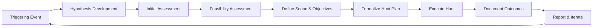
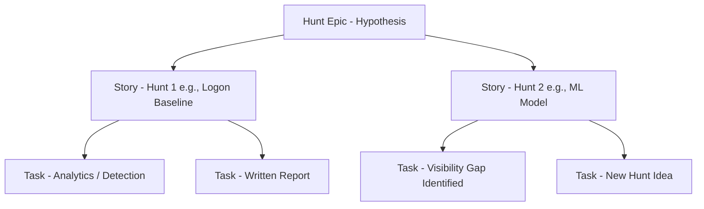

# A Unified Threat Hunting Process

As Lead Threat Hunter, I was tasked with building a Threat Hunt Program from scratch. This involved plenty of thought about what threat hunting actually is and how to translate it into meaningful results. Many hours went into reading various methodologies around threat hunting, detection engineering, Cyber Threat Intelligence (CTI), and even forensics. Even previous experience pulled from my time in the United State Air Force played a role. However, through building a program, I realized I needed one process… a Unified Threat Hunting Process. I developed this process to provide a structured and defined way to hunt and ultimately to provide meaningful outcomes for the organization.

---

## What is Threat Hunting?

To put it simply, threat hunting is the act of proactively searching for and identifying threats that have bypassed security controls. There’s some leeway in this definition, but the core idea is that it is proactive and seeks to identify the unknown.

Now, the real question is: **how** do you accomplish threat hunting?

There are multitudes of frameworks out there including PEAK, TaHiTI, OTHF, AIMOD2 and likely even more that I’ve missed. However, this begs key questions when building a program and defining processes:

- Is one framework more correct than the others?
- Do I just choose one?
- Does one fit our organizational needs better?
- What do our stakeholders actually want?

These questions and many more led me to build a process that works for our organization and, in my view, stays true to what threat hunting is.

This Unified Threat Hunting Process is a combination of many of these frameworks rolled into one. Really, each of these frameworks follows a similar line of thinking but takes a slightly different approach. By comparing key concepts of each, I was able to define a methodology that helps mature the program.

---

## Types of Threat Hunting

There are various methods described for conducting hunt operations: structured, unstructured, TTP-focused, intel-focused, data-driven, etc. While this Unified Threat Hunting Process may seem structured, that doesn’t mean your hypothesis can’t be driven by data in an unstructured manner. This process aims to incorporate various types of threat hunting allowing a modular approach. Really we would use all of these techniques to ensure we are thoroughly testing our hypothesis.

We are aiming on develop a modular approach to threat hunting where there is not a one size fits all. Use all the techniques at your disposal.

Following data science principles and regardless of the hunting type, you should aim to explore and understand the data sources relevant to your hunt. This will be explained more when we begin executing the hunt.

**Note** While typically you want to focus on behaviors or TTPs, sometimes IoCs have their merit if they are truely actionable and timely. While I do not beleive hunting IoCs across an envionrment is really threat hunting they could still provide useful information and another starting point. They can be a part of the cycle of your hunt but not the entire hunt itself.

---

## The Trigger

Borrowing from the TaHiTI framework, threat hunting begins with a triggering event. These events justify the initiation of a hunt. According to TaHiTI, Triggers can include:

- CTI (Cyber Threat Intelligence)
- Incomplete use cases
- Past incidents
- Red teaming
- MITRE TTPs

For our organization, we use these along with a few additional triggers such as direct requirements from stakeholders.

Some frameworks begin the threat hunt with the initial **Hypothesis** (step 2 here), but I ask: how do you come to that hypothesis in the first place?

There is likely a triggering event that leads to the initial hypothesis. Just as Isaac Newton watched an apple fall before wondering what force pulled it down, _that apple was the triggering event that led to a hypothesis about gravity._ Similarly, we should have a trigger before we even get to a hypothesis.

> **Hunting Triggers** (Source: *Targeted Hunting Integrating Threat Intelligence (TaHiTI)*)

---

## Hypothesis Development

Next and maybe the most important step is building a hunt hypothesis. This step, while critical, can also be the most ambiguous. Your hypothesis can either lead you to gold or down a never-ending rabbit hole.

From data science principles, your hypothesis is about creating testable statements to guide your analysis. Not only that, but you should aim to make your hypothesis **SMART**:

- **Specific**: Clear and unambiguous no room for misinterpretation. Don’t try to hunt for every single TTP in one go.
- **Measurable**: Must have quantifiable criteria to track progress. (We use Jira for this later.)
- **Achievable**: Realistic and within your team’s capabilities. Don’t aim for telemetry you simply don’t have.
- **Relevant**: Should align with organizational goals. Make it meaningful to the mission.
- **Time-bound**: Establish deadlines. No never-ending hunts.

When building a hypothesis you may actually create numerous hypotheses. A book to read regarding this is _Psychology of intelligence_ by Richards J. Heuer which was published by the CIA's Center for the Study of Intelligence. Heuer decribes Competing Hypotheses which is benfical to your hunting efforts. 

The process draws on defining multiple hypothesis and determining the most valid among them. This process provides rigor the hypothesis building which can help define the basis of the hunt. There are 7 steps that describes:

    1. Enumerate all hypotheses
    2. Seeking supporting evidnece for each hypothesis
    3. Compare evidence against the hypotheses. Heuer buidls a matrix to do this.
    4. Remove evidnece that has little value through the matrix.
    5. Prioritize hypthesis by likelyhood
    6. See which conclusion rely on too small amount of evidnece. Also, consdier if evidnece is incorrect.
    7. Document comparison of your hypothesis comparisons.
    
The next two phases lean into this process for defining if a hunt should or should not be executed based on a hypothesis.    

Additionally, a key concept from the AIMOD2 framework is the underlying hypothesis of **assumed breach**. We are focusing on identifying the unknown, under the assumption that an adversary has already bypassed our controls.

---

### Initial Assessment

In the **Initial Assessment** phase, we collect and research data to support our hypothesis. This includes both internal and external sources.

- **Internal sources**: Previous hunts, lessons learned, documentation review of internal applications, network/application diagrams, code repositories, internal threat intel.
- **External sources**: OSINT, vendor blogs, and Request for Information (RFI) to trusted external organizations.

A sub-step to this is identifying and, if necessary, interviewing business or technical owners. Depending on your hunt, you may need to communicate with SMEs for understanding. This isn't always needed you may already know the systems, logging, and applications from experience or past hunts.

The goal is not to become an expert on a system, but to develop sufficient understanding of the environment.

---

### Feasibility Assessment

Before planning our hunt activities, we need to assess feasibility. This includes:

- Constraints and limitations
- Data availability
- Data quality
- Team skillsets
- Timelines

Essentially, we ask: **"Is the juice worth the squeeze?"**

If telemetry isn’t available, ask: can it be made available? What effort is required to do so?

If a limiting factor prevents progress, backlog the idea and develop a plan to obtain the required telemetry while working on new hypotheses or hunts in the meantime.

---

## Defining Scope and Objectives

Here we define the **objectives** of the hunt. These represent the targets of our hunt and what needs to be accomplished to achieve our goal. These objectives will drive the hunt's direction and outcomes.

Since our hunts are SMART, we must clearly define how we will **measure and manage** them.

---

## Formalize Action Plan (Hunt Plan)

Now we’ve arrived at the fun part?...building the Hunt Plan.

A key for any hunt is documenting your actions and findings. This makes reporting much easier, allows us to retain artifacts, and ensures our outcomes are repeatable.

Our team uses **Jira**, but any documentation tool works. The key is: **just document**.

We structure our plan using **Epics**, **Stories**, and **Tasks**:

### Epics (Initiation)

Represents the overarching hypothesis or theme of the hunt. We include:

- Supporting documentation
- Initial research (e.g., CTI, internal documentation)
- Relevance and justification for the hunt

### Stories (Hunts)

These are the discrete investigations or tests aligned to the Epic’s hypothesis. You can have one or more stories under a hypothesis to ultimately **prove or disprove** it. Each story should reflect a single thought process.

Example:  
If my hypothesis is about anomalous logon events from administrative accounts, I might have two stories:

1. One test using Event Codes 4624/4672 and applying known environmental context to a baseline.
2. Another using Machine Learning to model anomalies.

Different subjects, same hypothesis. As we may need various tests to complete the hunt.

---

### Hunt Execution Steps

- **Gather and Analyze Data**  
  - Retrieve from designated sources
  - Understand the Data   
  - Data cleaning, transforming and modeling  

- **Investigate and Validate Threats**  
  - Test hypothesis against data and refine hypothesis as needed
  - Filtering and querying
  - Temporal and trend Data Analysis  
  - Advanced analytics (clustering, statistical methods, ML)
  - Known TTPs   

- **Document Observations and Insights**  
  - Anomalies and insights  
  - Hypothesis changes  
  - Techniques used  

By using tools like Jira, documentation becomes a lightweight playbook. Our team naturally began developing structured playbooks reminiscent of @Cyb3rWard0g that were easy to reference and made reporting more efficient.

---

### Tasks (Outcomes)

Tasks log the **results** of the hunt and are linked to their Epic for tracking purposes. They contain outcomes such as (many pulled from PEAK Framework):

- **New Hunt Ideas** – Future hypotheses or Use Cases to explore
- **Analytics/Detection** – Rules, dashboards, or signatures created
- **Security Incident** – Escalation to IR and/or incidents opened
- **Written Report** – Final hunt report
- **Visibility Gap** – Missing telemetry identified
- **Security Control Issue** – Gaps in existing defenses

Metrics are essential to a hunting program as your management likely thinks in numbers. Quantatifable metrics are essential for measuing the effectiveness of your efforts and prove a level a maturity. Addtionally, we also must consider what metrics actually matter and what could be considered bad metrics. We should shy away from metrics simply tracking work (hours spent) or how many hunts have been executed for more meaningful. The metrics should help as the question **"so what?"**

---

## Automation: Enabling Repeatable Hunts

Now we can talk about automation. This isn’t about automating threat hunting itself hunting will always require human-driven hypothesis testing and analysis. Instead, we focus on automating the **outputs and repeatable components** of successful hunts.

One of the most valuable outcomes from a hunt is a detection or analytic. Detections are straightforward they can be passed through the detection engineering pipeline and operationalized by the SOC. But not every analytic becomes a detection. Some require human review, context, or deeper analysis. Borrowing from Google SecOps’ mindset *analysts should spend less time gathering data and more time analyzing* we can apply automation to streamline those parts of the hunt that are repetitive or data-heavy.

Automation should focus on:
- Automating recurring queries and scheduled hunts
- Enriching data with threat intel automatically
- Re-running validated hypotheses across new time ranges
- Generating structured reports or Jira tickets
- Alerting on baseline deviations or visibility gaps

Ultimately, hunts should not be one-time events. They should be **repeatable, measurable, and improvable**. As hunts mature, we should codify them into automated packages that allow us to scale our efforts without losing depth. This ensures that the value we generate from threat hunting compounds over time and that our analysts stay focused on thinking, not fetching.

#### References:
<https://www.splunk.com/en_us/blog/security/peak-threat-hunting-framework.html>
<https://aimod2.com/>
<https://github.com/TactiKoolSec/OTHF>
<https://threathunterplaybook.com/intro.html>

