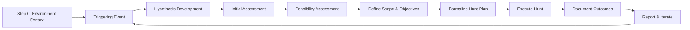
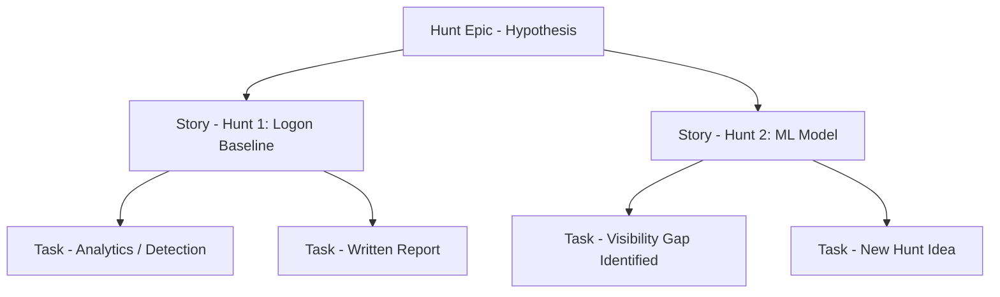

# A Unified Threat Hunting Process

As Lead Threat Hunter, I was tasked with building a Threat Hunt Program from scratch. This involved plenty of thought about what threat hunting actually is and how to translate it into meaningful results. Many hours went into reading various methodologies around threat hunting, detection engineering, Cyber Threat Intelligence (CTI), forensics, and even experience from my time in the United States Air Force. However, through building a program, I realized I needed one process, a Unified Threat Hunting Process. I developed this process to provide a structured and defined way to hunt and ultimately to deliver meaningful outcomes for the organization.

---

```mermaid
graph LR
    Z[Step 0: Environment Context] --> A[Triggering Event]
    A --> B[Hypothesis Development]
    B --> C[Initial Assessment]
    C --> D[Feasibility Assessment]
    D --> E[Define Scope & Objectives]
    E --> F[Formalize Hunt Plan]
    F --> G[Execute Hunt]
    G --> H[Document Outcomes]
    H --> I[Report & Iterate]
    I --> A
```

---

## What is Threat Hunting?

To put it simply, threat hunting is the act of proactively searching for and identifying threats that have bypassed security controls. There's some leeway in this definition, but the core idea is that it is proactive and seeks to identify the unknown.

Now, the real question is: **how do you accomplish threat hunting that is meaningful?**

There are multitudes of frameworks out there including PEAK, TaHiTI, OTHF, AIMOD2, and likely even more that I've missed. However, this begs key questions when building a program and defining processes:

* Is one framework more correct than the others?
* Do I just choose one?
* Does one fit our organizational needs better?
* What do our stakeholders actually want?

These questions and many more led me to build a process that works for our organization and, in my view, stays true to what threat hunting is.

This Unified Threat Hunting Process is a combination of many of these frameworks rolled into one. Really, each of these frameworks follows a similar line of thinking but takes a slightly different approach. By comparing key concepts of each, I was able to define a methodology that helps mature the program.

---

## Types of Threat Hunting

There are various methods described for conducting hunt operations: structured, unstructured, TTP-focused, intel-focused, data-driven, and so on. While this Unified Threat Hunting Process may seem structured, that doesn't mean your hypothesis can't be driven by data in an unstructured manner. This process aims to incorporate various types of threat hunting, allowing a modular approach. We would use all of these techniques to ensure we are thoroughly testing our hypothesis.

The goal is a modular approach to threat hunting where there is no one-size-fits-all. Use all the techniques at your disposal.

In practice, the hunt type you choose depends on where you are starting in the **DAIKI chain** (Data → Information → Knowledge → Insight):

| Hunt Type | Starting Point | Characteristics |
| --- | --- | --- |
| **Exploratory (EDA)** | Raw data | Baselining, understanding data shape, no prior hypothesis |
| **Hypothesis-Based (HBO)** | Situational awareness | Testing credible attack scenarios based on team knowledge |
| **Threat-Informed (TIO)** | Actionable CTI | Intelligence-driven, known actor or TTP focus |
| **Purple Operations (DPO)** | Red team insight | Joint offensive/defensive validation |

Following data science principles, regardless of the hunting type, you should aim to explore and understand the data sources relevant to your hunt. The [/Data_Analysis](https://github.com/sims718718/UnifiedThreatHunting/tree/main/Data_Analysis) folder in this repo contains supporting techniques and notebooks for that exploration phase.

> **Note:** While you typically want to focus on behaviors or TTPs, IoCs have their merit if they are truly actionable and timely. While hunting IoCs across an environment is not really threat hunting, they can still provide useful information and another starting point. They can be a part of the hunt cycle, but not the entire hunt itself.

---

## Step 0: Environment Context

Before any hunt begins, capture the environment so every downstream artifact (queries, field names, scoping decisions) is tailored to where you actually work rather than written generically. I added this as an explicit step because I kept seeing hunt plans that referenced data sources nobody had, or queries written in the wrong dialect entirely. A few minutes here saves hours later.

At a minimum, document:

| Context | Why It Matters |
| --- | --- |
| **SIEM / Data Platform** | Splunk SPL, KQL, Elastic DSL, and Chronicle each shape every query you write |
| **EDR Platform** | CrowdStrike, SentinelOne, Defender for Endpoint each use different telemetry field names |
| **Environment Type** | On-prem, cloud-native (AWS/Azure/GCP), or hybrid changes which logs even exist |
| **Industry Vertical** | Drives which threat actors are realistically relevant |
| **Log Retention Windows** | Determines what time ranges are actually feasible to query |
| **Hunt Maturity Level** | First-time hunters need scaffolding; experienced teams want a skeleton |

Document this as an `Environment Profile` block at the top of the Epic. If you are moving fast, the absolute minimum is **SIEM platform** and **environment type**, anything less and your queries will be generic.

---

## The Trigger

Borrowing from the TaHiTI framework, threat hunting begins with a triggering event. These events justify the initiation of a hunt. According to TaHiTI, triggers can include:

* CTI (Cyber Threat Intelligence)
* Incomplete use cases
* Past incidents
* Red teaming
* MITRE TTPs
* etc.

For our organization, we use these along with a few additional triggers such as direct requirements from stakeholders and vulnerability disclosures affecting the environment.

Some frameworks begin the threat hunt with the initial **Hypothesis** (step 2 here), but I ask: how do you come to that hypothesis in the first place?

There is likely a triggering event that leads to the initial hypothesis. Just as Isaac Newton watched an apple fall before wondering what force pulled it down, *that apple was the triggering event that led to a hypothesis about gravity.* Similarly, we should have a trigger before we even get to a hypothesis.

> **Hunting Triggers** (Source: *Targeted Hunting Integrating Threat Intelligence (TaHiTI)*)

---

## Hypothesis Development

Next, and maybe the most important step, is building a hunt hypothesis. This step, while critical, can also be the most ambiguous. Your hypothesis can either lead you to gold or down a never-ending rabbit hole.

From data science principles, your hypothesis is about creating testable statements to guide your analysis. Not only that, but you should aim to make your hypothesis **SMART**:

* **Specific**: Clear and unambiguous, no room for misinterpretation. Don't try to hunt for every single TTP in one go.
* **Measurable**: Must have quantifiable criteria to track progress. (We use Jira for this later.)
* **Achievable**: Realistic and within your team's capabilities. Don't aim for telemetry you simply don't have.
* **Relevant**: Should align with organizational goals. Make it meaningful to the mission.
* **Time-bound**: Establish deadlines. No never-ending hunts.

### SMART Hypothesis Examples

A useful template:

> We hypothesize that **[threat actor / technique / behavior]** may be present in our environment, evidenced by **[observable indicators]** in **[data sources]**, which we can validate by **[test methodology]** within **[timeframe]**.

**Example 1 (CTI-driven, TIO):**
> We hypothesize that an adversary using AS-REP Roasting (T1558.004) against accounts with Kerberos pre-authentication disabled may be present in our environment, evidenced by Event ID 4768 with pre-auth type 0 from non-Domain Controller sources in our Splunk Windows Security logs, which we can validate by querying the past 30 days of authentication events and correlating against our service account inventory by end of sprint.

**Example 2 (Behavior-driven, HBO):**
> We hypothesize that anomalous interactive logons by privileged accounts outside business hours may indicate credential misuse, evidenced by Event IDs 4624 (type 2 or 10) and 4672 in CrowdStrike telemetry for accounts in the Domain Admins group, which we can validate by baselining 60 days of logon history and flagging deviations greater than 2 standard deviations within two weeks.

When building a hypothesis you may actually develop numerous competing hypotheses. A book worth reading on this is *Psychology of Intelligence Analysis* by Richards J. Heuer, published by the CIA's Center for the Study of Intelligence. Heuer describes Competing Hypotheses, which is beneficial to your hunting efforts.

The process involves defining multiple hypotheses and determining the most valid among them, providing rigor to the hypothesis-building phase that can help define the basis of the hunt. The 7-step process is described as follows:

1. Enumerate all hypotheses
2. Seek supporting evidence for each hypothesis
3. Compare evidence against the hypotheses, Heuer builds a matrix to do this
4. Remove evidence that has little diagnostic value through the matrix
5. Prioritize hypotheses by likelihood
6. Identify which conclusions rely on too little evidence, and consider whether that evidence could be incorrect
7. Document the comparison of your hypotheses

The next two phases lean into this process for defining whether a hunt should or should not be executed based on a hypothesis.

Additionally, a key concept from the AIMOD2 framework is the underlying hypothesis of **assumed breach**, we are focusing on identifying the unknown, under the assumption that an adversary has already bypassed our controls.

---

### Initial Assessment

In the **Initial Assessment** phase, we collect and research data to support our hypothesis. This includes both internal and external sources.

* **Internal sources**: Previous hunts, lessons learned, documentation review of internal applications, network and application diagrams, code repositories, internal threat intel.
* **External sources**: OSINT, vendor blogs, and Requests for Information (RFI) to trusted external organizations.

A sub-step here is identifying and, if necessary, interviewing business or technical owners. Depending on your hunt, you may need to engage SMEs for deeper understanding. This isn't always needed, you may already know the systems, logging, and applications from experience or past hunts.

The goal is not to become an expert on a system, but to develop sufficient understanding of the environment.

---

### Feasibility Assessment

Before planning our hunt activities, we need to assess feasibility. This includes:

* Constraints and limitations
* Data availability
* Data quality
* Team skillsets
* Timelines
* Tooling availability

Essentially, we ask: **"Is the juice worth the squeeze?"**

If telemetry isn't available, ask: can it be made available? What effort is required to do so?

Each feasibility assessment should produce a clear decision:

| Decision | Meaning |
| --- | --- |
| ✅ **GO** | All criteria met, proceed to planning |
| ❌ **NO-GO** | Critical blockers exist, backlog with a remediation plan |
| ⚠️ **CONDITIONAL** | Minor gaps, document assumptions and proceed with caveats |

#### Worked Feasibility Example

Using the AS-REP Roasting hypothesis above:

| Criterion | Status | Notes |
| --- | --- | --- |
| Data Availability | ✅ GO | Windows Security 4768 events ingested into Splunk from all DCs |
| Data Quality | ⚠️ CONDITIONAL | Pre-auth type field parsed on 4 of 5 DCs, one DC has a broken sourcetype |
| Skillset | ✅ GO | Team has SPL and Active Directory experience |
| Timeline | ✅ GO | Estimated 3 days, fits in current sprint |
| Tooling | ✅ GO | Splunk Enterprise Security plus internal AD inventory |
| **Overall** | ⚠️ **CONDITIONAL** | Proceed with documented caveat that one DC has a parsing gap. Open a parallel ticket to fix the sourcetype before re-running the hunt for full coverage. |

If a limiting factor prevents progress, backlog the idea and develop a plan to obtain the required telemetry while working on new hypotheses or hunts in the meantime.

---

## Defining Scope and Objectives

Here we define the **objectives** of the hunt. These represent the targets of our hunt and what needs to be accomplished to achieve our goal. These objectives will drive the hunt's direction and outcomes.

Since our hunts are SMART, we must clearly define how we will **measure and manage** them. This includes specifying the target environment segments, the analysis time window, in-scope systems and assets, and any explicit exclusions.

---

## Formalize Action Plan (Hunt Plan)

Now we've arrived at the fun part, building the Hunt Plan.

A key principle for any hunt is documenting your actions and findings. This makes reporting much easier, allows us to retain artifacts, and ensures our outcomes are repeatable.

Our team uses **Jira**, but any documentation tool works. The key is: **just document**.

We structure our plan using **Epics**, **Stories**, and **Tasks**:

### Epics (Initiation)

Represents the overarching hypothesis or theme of the hunt. We include:

* Environment Profile (from Step 0)
* Supporting documentation
* Initial research (e.g., CTI, internal documentation)
* Relevance and justification for the hunt
* MITRE ATT&CK technique mappings
* Data sources required with field-level detail

### Stories (Hunts)

These are the discrete investigations or tests aligned to the Epic's hypothesis. You can have one or more stories under a hypothesis to ultimately **prove or disprove** it. Each story should reflect a single thought process and function as a test. The idea of developing multiple tests is not only to thoroughly investigate your hypothesis, but to also challenge initial assumptions. We should be **challenging what we already know.** Remember, threat hunting is about chasing the unknown, and while you should cover the basics for a simple test (e.g., a string search for encoded commands), we should strive to think harder and deeper if we really want to find the unknown. I believe there should be some level of struggle in the hunting process; otherwise you are probably not learning and are likely implementing something that already exists as a detection. If that is the case, ask yourself: what is the point?

**Example:**
If my hypothesis is about anomalous logon events from administrative accounts, I might have two stories:

1. One test using Event Codes 4624/4672 and applying known environmental context to establish a baseline.
2. Another using machine learning to model anomalies.

Different methods, same hypothesis. Various tests may be needed to fully complete the hunt.

---

### Hunt Execution Steps

* **Gather and Analyze Data**
  + Retrieve data from designated sources
  + Understand the data shape and coverage
  + Data cleaning, transformation, and modeling
* **Investigate and Validate Threats**
  + Test hypothesis against data and refine as needed
  + Filtering and querying
  + Temporal and trend data analysis
  + Advanced analytics (clustering, statistical methods, ML)
  + Known TTPs as reference anchors
* **Document Observations and Insights**
  + Anomalies and insights surfaced
  + Hypothesis changes made during the hunt
  + Techniques used
  + Data sources accessed
  + TTP coverage validated

By using tools like Jira, documentation becomes a lightweight playbook. Our team naturally began developing structured playbooks reminiscent of <https://threathunterplaybook.com/intro.html> that were easy to reference and made reporting more efficient. These stories and playbooks also served as a hunt repository where we could reference previous hunts.

---

### Tasks (Outcomes)

Tasks log the **results** of the hunt and are linked to their parent Epic for tracking purposes. They contain outcomes such as (drawn primarily from the PEAK and AIMOD2 frameworks):

* **New Hunt Ideas**, future hypotheses or use cases to explore
* **Analytics/Detection**, rules, dashboards, or signatures created
* **Security Incident**, escalation to IR and/or incidents opened
* **Written Report**, final hunt report
* **Visibility Gap**, missing telemetry identified
* **Security Control Issue**, gaps in existing defenses discovered

Metrics are essential to a hunting program, as your management likely thinks in numbers. Quantifiable metrics are essential for measuring the effectiveness of your efforts and demonstrating program maturity. We must also consider what metrics actually matter versus what could be considered bad metrics. We should shy away from metrics that simply track activity (hours spent, number of hunts executed) in favor of something more impactful. The metrics should help answer the question **"so what?"** for your organization.

---

```mermaid
graph TD
    A[Hunt Epic - Hypothesis]
    A --> B1[Story - Hunt 1: Logon Baseline]
    A --> B2[Story - Hunt 2: ML Model]
    B1 --> C1[Task - Analytics / Detection]
    B1 --> C2[Task - Written Report]
    B2 --> C3[Task - Visibility Gap Identified]
    B2 --> C4[Task - New Hunt Idea]
```

---

## Worked Example: End-to-End Hunt

To make the process concrete, here is a full walk-through using a single hypothesis from trigger to outcome. Field names and tools assume the Environment Profile shown.

### Environment Profile
* **SIEM:** Splunk Enterprise Security
* **EDR:** CrowdStrike Falcon
* **Environment:** Hybrid (on-prem AD plus Azure AD)
* **Vertical:** Financial services
* **Retention:** 90 days hot, 1 year cold
* **Maturity:** Intermediate

### Step 1: Trigger
CISA advisory on a financially motivated actor abusing AS-REP Roasting against service accounts at peer institutions. Received from CTI feed, relevance is high given matching vertical.

### Step 2: Hypothesis (SMART)
> We hypothesize that an actor performing AS-REP Roasting (T1558.004) may be probing accounts with Kerberos pre-authentication disabled in our domain, evidenced by Event ID 4768 with pre-authentication type 0 originating from non-Domain Controller hosts in Splunk Windows Security logs, which we can validate by querying the last 30 days and cross-referencing the requesting host against our asset inventory within one sprint (10 business days).

### Step 3: Initial Assessment
* **Internal:** Pull current list of accounts with `DONT_REQ_PREAUTH` set from AD. Review last AD audit for service account hygiene.
* **External:** MITRE ATT&CK T1558.004, the CISA advisory, Sigma rule `win_susp_rasp_roasting`.
* **SME:** Identity team confirms three legacy service accounts intentionally have pre-auth disabled and should be excluded as known-good.

### Step 4: Feasibility
GO with one caveat: one DC has a broken sourcetype (CONDITIONAL on parsing fix, see worked example above). Proceed and flag.

### Step 5: Scope
* **In-scope:** All on-prem Windows Domain Controllers, all Tier 0 and Tier 1 service accounts.
* **Time window:** Last 30 days.
* **Exclusions:** The three documented legacy accounts identified by the Identity team.
* **Primary objective:** Determine whether AS-REP Roasting activity has occurred.
* **Secondary objective:** Identify any service account that should be remediated to require pre-authentication.

### Step 6: Jira Plan

**Epic:** `HUNT-042 AS-REP Roasting Detection Hunt`
* Links: CISA advisory, MITRE T1558.004, Sigma rule reference
* Data sources: `wineventlog:security` (4768), AD inventory lookup
* MITRE: T1558.004 (Credential Access)

**Story `HUNT-042-S1`:** Baseline 4768 pre-auth-type-0 events
* Methodology: SPL query against 30 days, group by `src_host`, `account_name`, exclude known-good list, rank by frequency.
* Expected outcome (malicious): Requests originating from non-DC hosts targeting multiple roastable accounts.
* Expected outcome (benign): Only legacy known-good accounts appear, all from expected service hosts.

**Story `HUNT-042-S2`:** Cross-reference roastable accounts against current AD state
* Methodology: Compare hunt findings against current `DONT_REQ_PREAUTH` flag in AD. Identify accounts that should be remediated regardless of hunt finding.

**Tasks (outcome placeholders):**
* `HUNT-042-T1` Analytics/Detection: Convert validated query into a scheduled Splunk ES correlation rule.
* `HUNT-042-T2` Visibility Gap: Sourcetype parsing broken on `DC05`, ticket opened with platform team.
* `HUNT-042-T3` Security Control Issue: Two service accounts found with pre-auth disabled that should not have it. Remediation handed to Identity team.
* `HUNT-042-T4` Written Report: Final hunt report attached to Epic.
* `HUNT-042-T5` New Hunt Idea: Kerberoasting (T1558.003) follow-up hunt against the same service account population.

This is what a single hunt looks like end-to-end. The same structure scales to larger campaigns by adding more Stories under one Epic.

---

## Automation/AI: Enabling Repeatable Hunts

Now we can talk about automation. This isn't about automating threat hunting itself, hunting will always require human-driven hypothesis testing and analysis. Instead, we focus on automating the **outputs and repeatable components** of successful hunts.

One of the most valuable outcomes from a hunt is a detection or analytic. Detections are straightforward, they can be passed through the detection engineering pipeline and operationalized by the SOC. But not every analytic becomes a detection. Some require human review, context, or deeper analysis. Borrowing from Google SecOps' mindset (*analysts should spend less time gathering data and more time analyzing*), we can apply automation to streamline the parts of the hunt that are repetitive or data-heavy.

Automation and AI should focus on:

* Automating recurring queries and scheduled hunts
* Enriching data with threat intel automatically
* Re-running validated hypotheses across new time ranges
* Generating structured reports or Jira tickets
* Alerting on baseline deviations or visibility gaps
* Developing **and** challenging initial hypotheses

I have helped automate the hunt planning process by developing a **threat-hunt-planner skill**. This does not automate hunting per se, but gives you an initial hunt plan grounded in this Unified Hunting Process. The goal is to get analysts into hunting faster while also making the process more repeatable. This skill should be treated as a draft, challenge it to ensure it meets the objectives you set. → [threat-hunt-planner user guide](https://github.com/sims718718/UnifiedThreatHunting/blob/main/Theat_Hunt_Planner_Skill/threat_hunt_planner_user_guide.md)

For data exploration techniques that feed the execution phase of any hunt, see [/Data_Analysis](https://github.com/sims718718/UnifiedThreatHunting/tree/main/Data_Analysis).

Ultimately, hunts should not be one-time events. They should be **repeatable, measurable, and improvable** (see [Signal-Based Threat Hunting](https://github.com/sims718718/UnifiedThreatHunting/blob/main/Detection_Engineering_Meets_ThreatHunting/Signal-Based_Threat_Hunting.md)). As hunts mature, we should codify them into automated packages that allow us to scale our efforts without losing depth. This ensures that the value generated from threat hunting compounds over time, keeping us focused on thinking, not fetching. Use automation to save time across many steps of the threat hunting process. Use AI to help build your hunt plan or even your initial hypothesis. However, never take this at face value. Challenge it, research it, understand it.

Finally, thanks for reading, and shoutout to all the authors behind the references that informed this process. Have fun hunting!

---

#### References

* <https://www.splunk.com/en_us/blog/security/peak-threat-hunting-framework.html>
* <https://aimod2.com/>
* <https://github.com/TactiKoolSec/OTHF>
* <https://threathunterplaybook.com/intro.html>
* <https://cloud.google.com/transform/how-google-does-it-modernizing-threat-detection>
