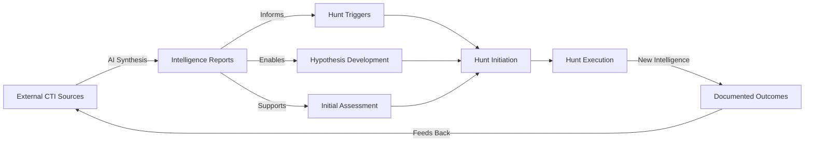

# AI-Enhanced Threat Intelligence for Threat Hunting

## Table of Contents
- [Introduction](#introduction)
- [The AI Advantage in Threat Intelligence](#the-ai-advantage-in-threat-intelligence)
- [The PTCF Prompting Framework](#the-ptcf-prompting-framework)
- [Ready-to-Use Prompts: Structured Reports](#ready-to-use-prompts-structured-reports)
- [Ready-to-Use Prompts: Hunt Plan Generation](#ready-to-use-prompts-hunt-plan-generation)
- [Ready-to-Use Prompts: Advanced Workflows](#ready-to-use-prompts-advanced-workflows)
- [Optimization Techniques](#optimization-techniques)
- [Common Pitfalls and Solutions](#common-pitfalls-and-solutions)
- [Conclusion](#conclusion)
- [References](#references)

---

## Introduction

Modern threat hunters face an overwhelming challenge: drowning in data while racing against time. The traditional approach to threat intelligence gathering requires hours of manual research across multiple sources, parsing lengthy reports, correlating disparate indicators, and synthesizing findings into actionable intelligence. By the time this manual research is complete, the threat landscape has often already shifted.

Artificial Intelligence transforms this paradigm. What once took hours of manual correlation and analysis can now be accomplished in minutes through structured prompting. AI acts as a force multiplier for threat hunters, not by replacing human expertise, but by accelerating the intelligence gathering and synthesis that informs hunt operations.

This guide provides practical, platform-agnostic approaches to leveraging AI for threat intelligence in support of the [Unified Threat Hunting Process](https://github.com/sims718718/UnifiedThreatHunting). As outlined in our [Cyber Threat Intelligence guide](link-to-cti-guide), quality intelligence is the foundation of effective threat hunting. AI enables threat hunters to:

- **Generate comprehensive threat intelligence reports in minutes** instead of hours
- **Develop data-driven hunt hypotheses** based on current adversary TTPs
- **Accelerate multi-step investigations** through automated correlation and pivoting
- **Maintain situational awareness** of the evolving threat landscape
- **Focus cognitive effort on analysis and decision-making** rather than data gathering

This guide focuses exclusively on using AI to gather and synthesize threat intelligence that informs hunt operations. It is not about automating threat hunting itself; human-driven hypothesis testing and analysis remain central to the hunting process. Instead, AI becomes your intelligence research assistant, dramatically reducing the time spent on data collection so you can spend more time hunting.

**What This Guide Provides:**

1. A structured prompting framework (PTCF) for consistent, high-quality outputs
2. Copy-paste ready prompts for common threat intelligence tasks
3. Advanced workflows for hypothesis generation and investigation
4. Best practices for optimizing AI-assisted intelligence gathering

**Important Note:** All prompts in this guide are platform-agnostic and work with major AI systems including Claude, ChatGPT, Gemini, and specialized threat intelligence AI platforms. Where specific threat intelligence databases or tools are referenced, adapt the prompts to your available resources.

---

## the AI Advantage in Threat Intelligence

### From Manual Research to Conversational Intelligence

Traditional threat intelligence gathering follows a predictable but time-consuming pattern:

1. Identify a threat actor, malware family, or technique
2. Search multiple threat intelligence platforms and vendor blogs
3. Read through lengthy reports (often 20-50 pages each)
4. Extract relevant TTPs, IOCs, and targeting information
5. Cross-reference findings across multiple sources
6. Synthesize information into actionable intelligence
7. Format findings for different audiences

**Time Investment:** 2-6 hours per intelligence requirement

With AI-assisted intelligence gathering, this transforms into:

1. Craft a structured prompt defining your intelligence requirements
2. AI searches, correlates, and synthesizes information from available sources
3. Review and validate the synthesized intelligence
4. Refine through follow-up prompts if needed

**Time Investment:** 15-30 minutes per intelligence requirement

### The Shift in Cognitive Load

AI doesn't eliminate the need for expert analysts. Instead, it shifts where you spend your cognitive effort:

**Before AI:**
- 70% data gathering and correlation
- 20% analysis and synthesis
- 10% decision-making and action

**With AI:**
- 20% prompt engineering and validation
- 40% analysis and synthesis
- 40% decision-making and action

This reallocation means threat hunters spend more time doing what they do best: thinking like adversaries, developing creative hypotheses, and identifying threats that matter.

### Key Capabilities AI Brings to Threat Intelligence

**1. Rapid Synthesis**
AI excels at aggregating information from multiple sources and presenting it in structured formats. What would take hours of reading and note-taking happens in seconds.

**2. Multi-Dimensional Analysis**
AI can simultaneously analyze threat actors, their malware, TTPs, targeting, and infrastructure relationships, building comprehensive threat profiles.

**3. Contextual Adaptation**
Through structured prompts, AI tailors intelligence to your specific needs: technical vs executive audience, industry-specific risks, geographic considerations.

**4. Temporal Analysis**
AI can focus on specific timeframes, helping you understand what adversaries are doing right now, not just what they've done historically.

**5. Iterative Refinement**
Through conversational interaction, you can progressively refine intelligence outputs, drilling deeper into specific areas of interest.

### Where AI Fits in the Unified Threat Hunting Process

While this guide focuses on intelligence gathering rather than the hunt process itself, it's important to understand where AI-assisted intelligence provides the most value:



**Primary Use Cases:**

1. **Pre-Hunt Intelligence Gathering:** Before initiating a hunt, rapidly assemble comprehensive threat intelligence on relevant adversaries, techniques, or campaigns
2. **Hypothesis Generation:** Use AI to develop data-driven, testable hunt hypotheses based on current threat intelligence
3. **Rapid Threat Profiling:** When a new threat actor or campaign emerges, quickly build operational profiles
4. **Investigation Support:** During hunt execution, rapidly pivot and gather additional intelligence on discovered artifacts
5. **Intelligence Synthesis:** After a hunt, synthesize findings into intelligence reports for organizational knowledge

---

## The PTCF Prompting Framework

Effective AI interaction requires structured prompting. The PTCF framework (Persona, Task, Context, Format) provides a consistent approach to crafting prompts that produce high-quality, actionable intelligence. This framework is based on proven prompt engineering practices and ensures your prompts are clear, complete, and produce deterministic outputs.

### Understanding PTCF

| Component | Purpose | Example |
|-----------|---------|---------|
| **Persona** | Assigns a role to the AI, focusing its knowledge and tone | "You are a senior cyber threat intelligence analyst specializing in APT groups" |
| **Task** | Clearly defines the primary goal or action | "Generate a comprehensive threat intelligence report on APT29's activities" |
| **Context** | Provides necessary background, constraints, audience, timeframe | "For a technical SOC audience, covering the last 90 days, focusing on cloud exploitation" |
| **Format** | Specifies the desired structure and presentation | "Output as a markdown document with sections for Executive Summary, TTPs, IOCs, and Recommendations" |

### Why PTCF Works

**Clarity:** Each component serves a distinct purpose, eliminating ambiguity about what you need.

**Consistency:** Following the same structure produces more predictable, repeatable results.

**Completeness:** The framework ensures you don't forget critical elements that affect output quality.

**Flexibility:** Components can be simple or highly detailed based on your needs.

### Building Effective Prompts: The Progression Model

You can craft prompts at different levels of complexity based on your needs:

**Level 1: Basic (Conversational)**
```
Tell me about APT29
```
- Fast for exploration
- Requires follow-up questions
- Less deterministic

**Level 2: Structured (PTCF)**
```
Persona: You are a threat intelligence analyst.
Task: Generate a threat brief on APT29.
Context: For a technical audience, covering the last 90 days.
Format: Structure with Executive Summary, TTPs, and IOCs sections.
```
- Good balance of speed and quality
- Suitable for most intelligence gathering
- Produces consistent structure

**Level 3: Advanced (Detailed Workflow)**
```
Persona: You are a senior CTI analyst with deep APT expertise.
Task: Generate a comprehensive intelligence report on APT29.
Context: For incident responders, covering 180 days, focus on cloud infrastructure targeting.
Format: Detailed markdown report with specific sections.
Workflow: 
1. Identify primary APT29 profile and aliases
2. Extract targeting information (industries, regions)
3. Analyze top 5 TTPs with MITRE ATT&CK mappings
4. List associated malware families with descriptions
5. Identify recent campaigns and infrastructure
6. Synthesize into formatted report
```
- Maximum control and determinism
- Ideal for recurring, mission-critical tasks
- Produces highly consistent outputs

**Recommendation for Threat Hunters:** Start with Level 2 (Structured PTCF) prompts for most tasks. Use Level 3 only when you need highly repeatable, standardized outputs or complex multi-step workflows.

### Key Principles for Effective Prompting

**1. Be Specific About Intent**
Vague: "Tell me about ransomware"
Specific: "Analyze ransomware TTPs used by Russian cybercriminal groups in the financial sector during Q4 2024"

**2. Define Your Audience**
Different stakeholders need different intelligence formats:
- **Technical audience:** Detailed TTPs, code analysis, detection logic
- **Management audience:** Risk assessment, business impact, strategic recommendations
- **Executive audience:** Brief summaries, trends, investment justification

Always specify who will consume the intelligence.

**3. Constrain Timeframes**
Temporal context dramatically improves relevance:
- "Last 30 days" for current threats
- "Last 90 days" for recent trends
- "Last 12 months" for strategic analysis
- "Historical" for comprehensive adversary profiles

**4. Structure Your Output**
Always define the desired format. Common structures for threat intelligence:
- Executive Summary + Detailed Sections
- Markdown with headers and tables
- Bulleted lists for quick reference
- MITRE ATT&CK technique tables
- Timeline of events

**5. Iterate and Refine**
Don't expect perfection on the first try. Use follow-up prompts:
- "Expand the section on lateral movement techniques"
- "Provide more detail on the malware capabilities"
- "Reformat this as a table"
- "Add IOCs for each malware family"

### Variables and Reusability

For recurring intelligence tasks, use variable placeholders to create reusable prompt templates:

**Template Structure:**
```
## User Inputs
- THREAT_ACTOR: [Specify the threat actor to analyze]
- TIMEFRAME: [Specify timeframe in days, default to 90 if not provided]
- FOCUS_AREA: [Specify focus area, e.g., "cloud infrastructure", "ransomware operations"]

Persona: You are a senior threat intelligence analyst.
Task: Generate a threat intelligence report on THREAT_ACTOR.
Context: For a technical audience, covering the last TIMEFRAME days, focusing on FOCUS_AREA.
Format: [Specify structure]
```

When using the template, replace bracketed variables with specific values.

### Validation and Quality Checks

After receiving AI-generated intelligence, always validate:

**Factual Accuracy:**
- Cross-reference key claims with known sources
- Verify attribution and dates
- Check MITRE ATT&CK technique IDs

**Completeness:**
- Ensure all requested sections are present
- Verify that context and constraints were followed
- Confirm appropriate level of detail

**Relevance:**
- Intelligence applies to your threat model
- TTPs are applicable to your environment
- Timeframe is appropriate

**Citation:**
- Sources are identified (when available)
- Claims can be verified
- Attribution is appropriate

If output quality is poor, refine your prompt rather than accepting substandard intelligence.

---

## Ready-to-Use Prompts: Structured Reports

This section provides copy-paste ready prompts for generating three types of threat intelligence reports: Tactical, Operational, and Strategic. Each serves a different purpose in threat hunting operations.

### Report Type Overview

| Report Type | Primary Audience | Focus | Hunt Value |
|------------|------------------|-------|-----------|
| **Tactical** | SOC Analysts, Hunters executing hunts | IOCs, signatures, immediate actions | Direct hunt execution support |
| **Operational** | Threat Hunters, IR Teams | TTPs, campaigns, malware analysis | Hypothesis development, investigation |
| **Strategic** | Hunt Lead, CISO, Management | Trends, adversary landscape, risk | Program direction, hunt prioritization |

---

### Tactical Threat Intelligence Report

**Purpose:** Generate actionable intelligence for immediate use in threat hunting operations. Focuses on indicators, detection opportunities, and tactical recommendations.

**Use Case:** You've identified a threat actor or campaign relevant to your environment and need tactical intelligence to hunt for their presence.

**Copy-Paste Ready Prompt:**

```
## Persona
You are a tactical threat intelligence analyst supporting active threat hunting operations.

## Task
Generate a tactical threat intelligence brief on [THREAT_ACTOR or CAMPAIGN_NAME].

## Context
This brief is for threat hunters actively searching for evidence of [THREAT_ACTOR or CAMPAIGN_NAME] in our environment. The audience is technical security analysts. Focus on the last [TIMEFRAME, e.g., "60 days"] of activity. Our primary concerns are [FOCUS_AREAS, e.g., "initial access vectors, persistence mechanisms, and lateral movement techniques"].

## Format
Structure the output as a markdown document with the following sections:

### Executive Summary
- 2-3 sentence overview of the threat
- Current threat level assessment (Active, Emerging, Monitoring)

### Threat Overview
- Primary threat actor or campaign identifier
- Known aliases
- First observed / most recent activity
- Targeting profile (industries, regions, organization types)

### Indicators of Compromise (IOCs)
Present as a table with columns: Indicator Type | Value | Confidence | Context
Include: File hashes, IP addresses, domains, URLs, email indicators
Prioritize high-confidence IOCs from the specified timeframe

### Tactics, Techniques, and Procedures (TTPs)
Present as a table with columns: MITRE Tactic | Technique ID | Technique Name | Description | Detection Opportunity
Focus on TTPs most relevant to threat hunting
Emphasize behavioral detection over signature-based

### Detection Opportunities
For each major TTP, provide:
- Data sources required (e.g., Sysmon Event IDs, network logs)
- Specific hunt queries or search patterns
- Baseline considerations
- Expected false positive rate

### Associated Malware and Tools
Present as a table with columns: Malware/Tool Name | Type | Primary Function | Key Capabilities
Include both custom and publicly available tools

### Recommended Hunt Actions
Numbered list of specific actions hunters should take:
1. [Specific hunt action with data source]
2. [Specific hunt action with data source]
3. [etc.]

### References
List primary intelligence sources used
```

**Variables to Customize:**
- `[THREAT_ACTOR or CAMPAIGN_NAME]`: APT29, Scattered Spider, Akira Ransomware, etc.
- `[TIMEFRAME]`: 30 days, 60 days, 90 days
- `[FOCUS_AREAS]`: Initial access, ransomware, data exfiltration, cloud attacks, etc.

---

### Operational Threat Intelligence Report

**Purpose:** Provide in-depth analysis of adversary operations, campaigns, and TTPs to inform hunt hypothesis development and investigation expansion.

**Use Case:** You're developing hunt hypotheses and need comprehensive understanding of how an adversary operates, their campaigns, and technical capabilities.

**Copy-Paste Ready Prompt:**

```
## Persona
You are an operational threat intelligence analyst with expertise in adversary behavior analysis and campaign tracking.

## Task
Generate a comprehensive operational intelligence report on [THREAT_ACTOR or MALWARE_FAMILY].

## Context
This report will inform threat hunting hypothesis development and investigation planning. The audience includes threat hunters, incident responders, and forensic analysts. Cover activity from the last [TIMEFRAME, e.g., "180 days"]. We are particularly interested in understanding [SPECIFIC_FOCUS, e.g., "their lateral movement techniques and credential theft methods"].

Our organization operates in the [INDUSTRY] sector in [GEOGRAPHIC_REGION]. Highlight intelligence most relevant to our profile.

## Format
Structure the output as a detailed markdown document with the following sections:

### Executive Summary
- 3-5 sentence overview suitable for technical management
- Key findings and implications for our organization
- Overall threat assessment

### Threat Actor/Malware Profile
- Full name and known aliases
- Attribution (if available): Nation-state, cybercriminal, hacktivist, etc.
- Motivation: Financial, espionage, disruption, etc.
- Origin/affiliation (if known)
- First observed and evolution timeline

### Targeting and Victimology
- Primary target industries (with emphasis on [INDUSTRY])
- Geographic focus (with emphasis on [GEOGRAPHIC_REGION])
- Organization profiles typically targeted (size, revenue, etc.)
- Attack objectives and desired outcomes

### Campaign Analysis
For significant campaigns in the timeframe:
- Campaign name and dates
- Attack narrative and flow
- Notable victims or incidents
- Key innovations or changes in TTPs

### Detailed TTP Analysis
For each stage of the attack chain, provide:

#### Initial Access
- Primary vectors used
- Social engineering tactics
- Exploited vulnerabilities
- Success rates and detection challenges

#### Execution
- Malware deployment methods
- Scripting languages and tools used
- Anti-analysis techniques

#### Persistence
- Mechanisms employed
- Timelines for establishing persistence
- Redundancy tactics

#### Privilege Escalation
- Techniques observed
- Tools utilized
- Success patterns

#### Defense Evasion
- Anti-detection measures
- Obfuscation techniques
- Living-off-the-land binaries (LOLBins) used

#### Credential Access
- Credential theft methods
- Tools employed (e.g., Mimikatz variants)
- Targeted credential types

#### Discovery
- Reconnaissance activities
- Network mapping techniques
- Information gathering patterns

#### Lateral Movement
- Primary lateral movement methods
- Tools and protocols used
- Movement patterns and timelines

#### Collection
- Data of interest
- Collection tools and techniques
- Staging locations

#### Command and Control (C2)
- C2 infrastructure characteristics
- Communication protocols
- Beacon patterns and timing

#### Exfiltration
- Exfiltration methods
- Data volumes and patterns
- External destinations

### Malware Arsenal
Present as a table with columns: Malware Name | Type | Primary Purpose | Key Capabilities | Persistence Mechanisms | Detection Challenges

### Infrastructure Analysis
- Hosting providers commonly used
- Domain registration patterns
- IP address characteristics
- SSL/TLS certificate patterns
- Infrastructure rotation timelines

### Behavioral Patterns
- Operational timing (days of week, hours of day)
- Dwell time statistics
- Attack velocity and timelines
- Seasonal variations in activity

### Attribution Confidence
- Assessment of attribution confidence (High/Medium/Low)
- Key evidence supporting attribution
- Alternative hypotheses (if confidence is not high)

### Threat Hunting Implications
- High-priority hunt hypotheses based on this intelligence
- Data sources required for effective hunting
- Expected prevalence in typical environments
- Baseline establishment recommendations

### Defense and Detection Recommendations
- Detection strategies by attack stage
- Network and host-based monitoring priorities
- Security control effectiveness against observed TTPs
- Specific detection rules or signatures (if applicable)

### Open Questions and Intelligence Gaps
- What is not well understood about this threat
- Areas requiring additional intelligence collection
- Emerging or evolving TTPs that need monitoring

### References and Sources
- Primary intelligence sources
- Notable technical analyses
- Community reporting
```

**Variables to Customize:**
- `[THREAT_ACTOR or MALWARE_FAMILY]`: APT28, FIN7, Emotet, BazarLoader, etc.
- `[TIMEFRAME]`: 90 days, 180 days, 12 months
- `[SPECIFIC_FOCUS]`: Lateral movement, credential theft, ransomware deployment, etc.
- `[INDUSTRY]`: Financial services, healthcare, manufacturing, critical infrastructure, etc.
- `[GEOGRAPHIC_REGION]`: North America, Europe, APAC, specific countries

---

### Strategic Threat Intelligence Report

**Purpose:** Provide high-level analysis of threat landscape, trends, and risk assessment to inform program direction and hunt prioritization.

**Use Case:** Planning your threat hunting program roadmap, justifying resources, or briefing leadership on the threat landscape.

**Copy-Paste Ready Prompt:**

```
## Persona
You are a strategic threat intelligence analyst who advises security leadership on threat landscape trends and organizational risk.

## Task
Generate a strategic threat intelligence assessment for [ORGANIZATION_TYPE] organizations in the [INDUSTRY] sector.

## Context
This assessment will inform threat hunting program planning and resource allocation for the next [PLANNING_HORIZON, e.g., "quarter" or "fiscal year"]. The primary audience is the CISO, security management, and threat hunt program leadership. 

Our organization profile:
- Industry: [INDUSTRY]
- Geographic presence: [REGIONS]
- Organization size: [SMALL/MEDIUM/LARGE/ENTERPRISE]
- Key assets: [e.g., "customer PII, intellectual property, financial data"]
- Technology environment: [e.g., "hybrid cloud, primarily Microsoft stack, OT/ICS systems"]

## Format
Structure the output as an executive-focused markdown document with the following sections:

### Executive Summary
- 4-6 sentence overview of the current threat landscape
- Top 3 threats to organizations like ours
- Key strategic recommendations
- Overall risk assessment

### Threat Landscape Overview
- Current state of cyber threats affecting [INDUSTRY]
- Significant shifts in the last [TIMEFRAME, e.g., "6 months"]
- Emerging threat actors and groups
- Geopolitical factors influencing the threat environment

### Threat Actor Landscape
For each significant threat actor category:

#### Nation-State Threats
- Primary nation-state actors targeting [INDUSTRY]
- Motivations and objectives
- Observed tactics and campaigns
- Likelihood of targeting our organization (High/Medium/Low)

#### Cybercriminal Groups
- Major cybercriminal groups operating in our sector
- Monetization strategies (ransomware, data theft, etc.)
- Attack economics and targeting criteria
- Risk to our organization

#### Hacktivist Activity
- Relevant hacktivist movements
- Current campaigns and targets
- Potential organizational exposure

### Industry-Specific Threat Analysis
- Attacks specifically targeting [INDUSTRY] organizations
- Sector-specific vulnerabilities being exploited
- Regulatory and compliance implications
- Industry collaboration and information sharing

### Regional Threat Analysis
For each region where we operate:
- Region-specific threat actors
- Local threat landscape characteristics
- Regulatory environment
- Regional cooperation and response capabilities

### Technology-Specific Threats
Analyze threats to our technology environment:
- Cloud infrastructure threats (AWS, Azure, GCP)
- Endpoint threats (Windows, macOS, Linux, mobile)
- Network infrastructure threats
- Application-layer threats
- OT/ICS threats (if applicable)
- Supply chain risks

### Attack Trend Analysis
- Trending attack techniques and TTPs
- Evolution in adversary capabilities
- Emerging attack vectors
- Declining or deprecated techniques

### Ransomware Threat Assessment
- Current ransomware landscape affecting [INDUSTRY]
- Major ransomware families and operators
- Average ransom demands in our sector
- Payment vs recovery considerations
- Trend analysis (increasing/decreasing threat)

### Data Theft and Extortion
- Prevalence of data theft in [INDUSTRY]
- Common exfiltration targets
- Extortion tactics and trends
- Data exposure risks

### Vulnerability and Exploitation Trends
- Most exploited vulnerabilities in [INDUSTRY]
- Zero-day vs N-day exploitation trends
- Vulnerability disclosure and exploitation timelines
- Patch prioritization recommendations

### Supply Chain and Third-Party Risk
- Supply chain attack trends
- Third-party compromise incidents
- Vendor risk considerations
- Software supply chain threats

### Threat Hunting Program Implications

#### Priority Hunt Themes for [NEXT_PERIOD]
Ranked list of hunt themes based on threat intelligence:
1. [Hunt theme with justification]
2. [Hunt theme with justification]
3. [Hunt theme with justification]
...

#### Resource Allocation Recommendations
- Hunt team focus areas
- Required skillsets and training
- Tool and technology investments
- Data source requirements

#### Detection Gap Analysis
- TTPs not currently covered by detection
- Visibility gaps in the environment
- Recommended detection engineering priorities

### Risk Assessment and Recommendations

#### Organizational Risk Posture
- Overall risk level (Critical/High/Moderate/Low)
- Risk factors specific to our organization
- Comparative risk vs industry peers

#### Strategic Recommendations
Numbered list of actionable recommendations:
1. [Strategic recommendation with expected impact]
2. [Strategic recommendation with expected impact]
3. [Strategic recommendation with expected impact]
...

#### Investment Justification
- Security control gaps based on threat intelligence
- ROI considerations for recommended investments
- Risk reduction potential

### Intelligence Gaps and Future Focus
- Areas where intelligence is lacking
- Emerging threats requiring monitoring
- Recommended intelligence collection priorities

### Outlook and Forecast
- Expected threat landscape evolution over [PLANNING_HORIZON]
- Predicted adversary developments
- Anticipated targeting shifts
- Preparedness recommendations

### Appendix: Threat Actor Summary
Table format: Threat Actor | Category | Motivation | Industries Targeted | Geographic Focus | Risk to Organization (H/M/L) | Key TTPs

### References and Methodology
- Intelligence sources consulted
- Analysis methodology
- Confidence assessments
- Date of assessment
```

**Variables to Customize:**
- `[ORGANIZATION_TYPE]`: Enterprise, mid-market, government, critical infrastructure, etc.
- `[INDUSTRY]`: Financial services, healthcare, energy, manufacturing, retail, technology, etc.
- `[PLANNING_HORIZON]`: Quarter, fiscal year, 6 months, 12 months
- `[REGIONS]`: North America, Europe, APAC, specific countries
- `[TIMEFRAME]`: 6 months, 12 months, 18 months

---

## Ready-to-Use Prompts: Hunt Plan Generation

This section provides prompts for generating structured hunt plans following the Epic/Story format used in the [Unified Threat Hunting Process](https://github.com/sims718718/UnifiedThreatHunting). These prompts help translate threat intelligence into actionable hunt plans with clear objectives and test cases.

### Hunt Plan Structure Overview

Following the Unified Threat Hunting Process:
- **Epics:** Represent the overarching hypothesis or theme
- **Stories:** Discrete investigations or tests that prove or disprove the hypothesis
- **Tasks:** Outcomes (created after hunt execution, not part of planning)

### Complete Hunt Plan (Epic + Stories)

**Purpose:** Generate a comprehensive hunt plan with a primary hypothesis (Epic) and multiple discrete test approaches (Stories) to thoroughly investigate the threat.

**Use Case:** You have threat intelligence about a specific adversary TTP and need to translate it into a structured hunt plan for your team.

**Copy-Paste Ready Prompt:**

```
## Persona
You are a lead threat hunter with extensive experience designing hypothesis-driven hunt operations.

## Task
Generate a complete threat hunt plan (Epic and Stories) based on the following threat intelligence: [INTELLIGENCE_INPUT]

## Context
We are planning a threat hunt following the Unified Threat Hunting Process. The hunt plan should be structured for use in Jira (or similar project management tools) with an Epic representing the overall hypothesis and multiple Stories representing discrete investigative approaches.

Our environment characteristics:
- Organization type: [e.g., "Enterprise financial services"]
- Technology stack: [e.g., "Windows-heavy, Microsoft 365, AWS cloud"]
- Available data sources: [e.g., "Sysmon, EDR telemetry, network flow logs, authentication logs"]
- Team capabilities: [e.g., "Strong in log analysis, moderate scripting skills"]

The hunt should be:
- **Specific:** Clear and unambiguous, focused on a narrow scope
- **Measurable:** Quantifiable criteria for success
- **Achievable:** Realistic given our telemetry and skills
- **Relevant:** Aligned with organizational threat model
- **Time-bound:** Completable within [HUNT_DURATION, e.g., "2-3 weeks"]

## Format
Structure the output as follows:

### Epic: [Hypothesis Title]

#### Epic Description
**Hypothesis Statement:**
[Clear, testable hypothesis about adversary presence or activity]

**Trigger:**
[What threat intelligence triggered this hunt? CTI report, incident, vulnerability, etc.]

**Justification:**
[Why this hunt is important and relevant to our organization]

**Supporting Intelligence:**
- Key threat actor(s) or malware families involved
- Relevant MITRE ATT&CK technique(s)
- Recent campaigns or incidents
- Any specific targeting of our industry/region

**Hunt Objectives:**
[What we aim to accomplish with this hunt]
1. [Objective 1]
2. [Objective 2]
3. [Objective 3]

**Scope:**
- **In Scope:** [Systems, timeframes, users, etc.]
- **Out of Scope:** [What we are NOT hunting for]

**Required Data Sources:**
- [Data source 1 with specific log types]
- [Data source 2 with specific log types]
- [Data source 3 with specific log types]

**Feasibility Assessment:**
- Data availability: [Available/Partially Available/Not Available]
- Data quality: [High/Medium/Low]
- Team capability: [Existing skills/Training required]
- Estimated effort: [Hours/days]

---

### Story 1: [Test Approach Title]

#### Story Description
**Test Objective:**
[What specific aspect of the hypothesis this story tests]

**Approach:**
[High-level description of the investigative method]

**Rationale:**
[Why this approach will help prove or disprove the hypothesis]

#### Detailed Investigation Steps

**1. Data Gathering**
- Data sources: [Specific sources]
- Timeframe: [Specific dates or relative time]
- Query/search criteria: [Initial filters]
- Expected data volume: [Estimate if possible]

**2. Baseline Development**
- Baseline approach: [Statistical, historical, rule-based]
- Baseline period: [Timeframe]
- Key metrics: [What defines "normal"]
- Expected baseline behavior: [Description]

**3. Analysis Methodology**
- Analysis type: [Frequency analysis, anomaly detection, pattern matching, ML, etc.]
- Tools/techniques: [Splunk, ELK, Python, etc.]
- Success criteria: [What would indicate positive findings]

**4. Hunt Queries/Analytics**
Provide specific hunt queries (pseudo-code or actual syntax):
```
[Example query 1]
```
Expected results: [Description]

```
[Example query 2]
```
Expected results: [Description]

**5. Investigation and Validation**
- How to validate findings as true positives
- Expected false positive scenarios
- Escalation criteria
- Documentation requirements

**6. MITRE ATT&CK Coverage**
- Primary technique: [TID and name]
- Related techniques: [List]
- Detection coverage: [What this hunt detects]

**Estimated Effort:** [Hours]

---

### Story 2: [Alternative Test Approach Title]

#### Story Description
**Test Objective:**
[Different aspect or methodology to test the same hypothesis]

**Approach:**
[Alternative investigative method]

**Rationale:**
[Why this complementary approach is valuable]

**Note:** This story takes a different analytical approach than Story 1 to ensure comprehensive testing of the hypothesis. It may use different data sources, different time periods, or different analytical methods.

[Repeat same structure as Story 1 with different approach]

---

### Story 3: [Advanced/Alternative Test Approach Title]

[Optional third story for complex hypotheses]

---

### Hunt Execution Considerations

**Sequencing:**
[Should stories be executed in order or parallel?]

**Dependencies:**
[Any dependencies between stories]

**Risk Mitigation:**
[Any risks to consider during execution]

**Team Assignments:**
[Suggested skill requirements for each story]

---

### Expected Outcomes (Examples)

After hunt execution, the following outcomes may be documented as Tasks:
- New hunt ideas discovered
- Detection analytics created
- Security incidents identified
- Visibility gaps found
- Security control issues identified
- Written hunt report completed

Note: Actual outcomes will be determined during hunt execution and documented as Tasks linked to this Epic.

---

### Success Criteria

The hunt is successful if we:
1. [Criterion 1, e.g., "Definitively prove or disprove hypothesis"]
2. [Criterion 2, e.g., "Create actionable detections for identified TTPs"]
3. [Criterion 3, e.g., "Identify visibility gaps for future improvement"]

---

### References
- [CTI sources used]
- [MITRE ATT&CK techniques]
- [Vendor blogs or reports]
```

**Variables to Customize:**
- `[INTELLIGENCE_INPUT]`: Paste threat intelligence, describe a TTP, reference a CTI report, etc.
- `[HUNT_DURATION]`: 1 week, 2 weeks, 1 month
- Environment characteristics (organization type, tech stack, data sources, capabilities)

---

### Hypothesis-Focused Hunt Epic

**Purpose:** Generate just the Epic (overarching hypothesis and justification) without the detailed Stories, useful for initial hunt planning and approval.

**Use Case:** You need to document and get approval for a hunt concept before investing time in detailed planning.

**Copy-Paste Ready Prompt:**

```
## Persona
You are a threat hunting lead responsible for proposing and justifying new hunt operations.

## Task
Generate a threat hunt Epic (hypothesis) based on the following information: [INTELLIGENCE_OR_TRIGGER]

## Context
I need to document a proposed hunt hypothesis for review and approval. The Epic should clearly articulate the hypothesis, justify its importance, and outline the scope without diving into specific test methodologies yet.

Environment context:
- Organization: [TYPE and INDUSTRY]
- Primary concerns: [e.g., "ransomware, data theft, insider threats"]
- Recent incidents or trends: [If applicable]

## Format
Structure as follows:

### Epic Title
[Concise, descriptive title of the hunt]

### Hypothesis Statement
[One clear, testable statement following SMART criteria]

### Trigger
**Trigger Type:** [CTI, Incomplete Use Case, Past Incident, Red Team Finding, MITRE TTP, Stakeholder Requirement]

**Trigger Details:**
[Specific description of what initiated this hunt idea]

### Justification and Relevance

**Why This Matters:**
[Explanation of importance to the organization]

**Risk Assessment:**
- Likelihood of threat presence: [High/Medium/Low]
- Potential impact if undetected: [Critical/High/Medium/Low]
- Alignment with organizational risk: [Description]

**Threat Intelligence Summary:**
- Primary adversaries associated with this TTP
- Recent campaigns or incidents
- Targeting of our industry or region
- MITRE ATT&CK technique(s): [IDs and names]

### Scope Definition

**In Scope:**
- Systems: [e.g., "All Windows endpoints", "Cloud infrastructure"]
- User populations: [e.g., "Administrative accounts", "All users"]
- Timeframe: [e.g., "Last 90 days", "Ongoing"]
- Geographic locations: [If relevant]

**Out of Scope:**
[Explicitly state what is NOT being hunted]

### Required Resources

**Data Sources Required:**
- [Source 1: availability and quality]
- [Source 2: availability and quality]
- [Source 3: availability and quality]

**Team Requirements:**
- Skills needed: [e.g., "Log analysis, scripting, network analysis"]
- Estimated total effort: [Hours or days]
- Proposed team members: [If known]

**Tools and Access:**
- [Tool 1]
- [Tool 2]
- [Special access requirements]

### Feasibility Assessment

**Data Availability:**
[Assessment of whether we have necessary telemetry]

**Team Capability:**
[Assessment of whether team has required skills]

**Technical Challenges:**
[Known difficulties or obstacles]

**Constraints:**
[Time, resource, or technical constraints]

**Feasibility Verdict:** [Go / Go with Modifications / No-Go / Backlog]

### Expected Value

**If hypothesis is TRUE (threat is present):**
- [Expected outcome]
- [Detection opportunity]
- [Response capability improvement]

**If hypothesis is FALSE (threat is not present):**
- [Confidence gained]
- [Detection gap closed]
- [Visibility improvement]

**Regardless of findings:**
- [Learning and improvement]
- [Process refinement]
- [Knowledge gained]

### Success Criteria

This hunt will be successful if:
1. [Criterion 1]
2. [Criterion 2]
3. [Criterion 3]

### Next Steps

If approved:
1. Develop detailed hunt Stories (investigation approaches)
2. [Other preparation steps]
3. Schedule hunt execution for [proposed timeframe]

### References and Supporting Materials
- [CTI reports]
- [MITRE ATT&CK links]
- [Previous hunt findings]
- [Vendor advisories]
```

**Variables to Customize:**
- `[INTELLIGENCE_OR_TRIGGER]`: Threat intelligence, TTP, incident, vulnerability, etc.
- `[TYPE and INDUSTRY]`: Organization context
- Environment and resource details

---

### Quick Hunt Story Template

**Purpose:** Generate a single Hunt Story (discrete investigation) when you already have an Epic defined and need to add additional test approaches.

**Use Case:** During hunt planning, you realize you need an additional investigative approach or want to refine an existing Story.

**Copy-Paste Ready Prompt:**

```
## Persona
You are a threat hunter designing specific investigation methodologies.

## Task
Generate a detailed Hunt Story (investigative test) for the following hunt hypothesis: [EPIC_HYPOTHESIS]

## Context
We are developing additional investigative approaches for an existing hunt Epic. This Story should represent a discrete, focused test that helps prove or disprove the hypothesis.

Existing Epic context:
- Hypothesis: [HYPOTHESIS_STATEMENT]
- Threat actor/TTP: [ADVERSARY_OR_TECHNIQUE]
- Primary MITRE technique: [TID]

Available data sources:
- [List available sources]

This Story should use the following analytical approach: [APPROACH_TYPE, e.g., "baseline deviation analysis", "anomaly detection", "behavioral pattern matching", "machine learning classification"]

## Format
Structure as follows:

### Story Title
[Concise title describing the specific test approach]

### Test Objective
[What specific aspect of the hypothesis this story tests]

### Investigative Approach
[2-3 sentence description of the methodology]

### Rationale
[Why this approach will effectively test the hypothesis]

### Prerequisites
- Required data sources: [Specific sources]
- Required tools: [Tools needed]
- Required access: [System or data access]
- Required skills: [Analytical capabilities]

### Investigation Workflow

#### Phase 1: Data Collection
**Data Sources:**
[Specific sources with log types]

**Collection Query:**
```
[Pseudo-code or actual query to gather data]
```

**Timeframe:** [Specific period]

**Expected Volume:** [Estimate if possible]

#### Phase 2: Baseline Establishment
**Baseline Approach:**
[How to determine "normal" behavior]

**Baseline Period:**
[Timeframe for baseline]

**Baseline Metrics:**
- [Metric 1 that defines normal]
- [Metric 2 that defines normal]
- [Metric 3 that defines normal]

**Baseline Query/Process:**
```
[How to establish baseline]
```

#### Phase 3: Hunt Analysis
**Analytical Method:**
[Specific analysis technique]

**Hunt Query/Logic:**
```
[Primary hunt query or analytical process]
```

**Filtering Criteria:**
[How to reduce noise and focus on anomalies]

**Expected Findings:**
[What positive findings would look like]

#### Phase 4: Investigation and Validation
**Validation Steps:**
1. [How to confirm findings are malicious]
2. [What context to gather]
3. [How to distinguish true vs false positives]

**Common False Positives:**
- [Scenario 1]
- [Scenario 2]

**Escalation Criteria:**
[When to escalate to IR]

#### Phase 5: Documentation
**Required Documentation:**
- Analysis methodology
- Queries executed
- Findings (positive or negative)
- False positive patterns
- Recommendations

### TTP Coverage
**Primary MITRE Technique:** [TID and Name]

**Related Techniques:** [List]

**Detection Coverage:** [What this detects]

**Detection Gaps:** [What this doesn't detect]

### Estimated Effort
- Data collection: [Hours]
- Analysis: [Hours]
- Validation: [Hours]
- Documentation: [Hours]
**Total:** [Hours]

### Success Criteria
This Story is successful if:
1. [Criterion 1]
2. [Criterion 2]
3. [Criterion 3]

### Potential Outcomes
- Detection analytic created
- New hunt hypothesis identified
- Visibility gap discovered
- False positive pattern documented
- Clean finding (no threat present)

### Notes and Considerations
[Any special considerations, risks, or dependencies]
```

**Variables to Customize:**
- `[EPIC_HYPOTHESIS]`: The overarching hunt hypothesis
- `[ADVERSARY_OR_TECHNIQUE]`: Specific threat or TTP being hunted
- `[TID]`: MITRE ATT&CK Technique ID
- `[APPROACH_TYPE]`: The analytical methodology for this Story
- Data sources and tools available

---

## Ready-to-Use Prompts: Advanced Workflows

This section provides prompts for complex, multi-step intelligence workflows including automated hypothesis generation and multi-step investigation processes.

### Advanced Workflow 1: CTI-Driven Hypothesis Generation

**Purpose:** Automatically generate multiple hunt hypotheses from threat intelligence, enabling rapid conversion of CTI into actionable hunt plans.

**Use Case:** You receive new threat intelligence (report, blog, MITRE update) and need to quickly identify relevant hunt opportunities for your environment.

**Copy-Paste Ready Prompt:**

```
## Persona
You are a senior threat hunter specializing in translating threat intelligence into actionable, testable hunt hypotheses.

## Task
Analyze the following threat intelligence and generate multiple SMART hunt hypotheses relevant to our environment:

[PASTE_THREAT_INTELLIGENCE_HERE]

## Context
We need to convert this threat intelligence into specific, testable hunt hypotheses following the Unified Threat Hunting Process. Each hypothesis should be actionable with our available telemetry and relevant to our threat model.

**Our Environment Profile:**
- Organization type: [e.g., "Enterprise financial services company"]
- Industry: [e.g., "Banking and financial services"]
- Geographic presence: [e.g., "North America, Europe"]
- Technology stack: [e.g., "Windows-heavy endpoints, Microsoft 365, AWS and Azure cloud, Cisco networking"]
- Available telemetry: [e.g., "Sysmon, CrowdStrike EDR, Zeek network logs, Microsoft 365 audit logs, CloudTrail"]
- Crown jewels: [e.g., "Customer PII, financial transaction data, proprietary trading algorithms"]

**Hypothesis Requirements:**
Each hypothesis must be SMART:
- **Specific:** Narrow, focused scope
- **Measurable:** Quantifiable detection criteria
- **Achievable:** Feasible with our telemetry and skills
- **Relevant:** Aligned with our threat model
- **Time-bound:** Can be tested within 2-3 weeks

## Workflow
Execute the following steps:

1. **Extract Key TTPs:**
   - Identify all MITRE ATT&CK techniques mentioned or implied
   - Extract specific adversary behaviors and procedures
   - Note any tool usage or infrastructure patterns

2. **Assess Environmental Relevance:**
   - Determine which TTPs apply to our technology stack
   - Identify techniques targeting our industry or region
   - Evaluate likelihood of techniques succeeding in our environment

3. **Map to Available Telemetry:**
   - For each relevant TTP, identify which of our data sources can detect it
   - Note any visibility gaps
   - Prioritize TTPs with strong telemetry coverage

4. **Generate Hunt Hypotheses:**
   - Create 5-7 distinct hunt hypotheses
   - Each hypothesis should target different stages of the attack chain
   - Prioritize hypotheses by detectability and organizational risk

5. **Validate and Prioritize:**
   - Rank hypotheses by priority (1=highest)
   - Assess feasibility for each
   - Recommend hunt sequencing

## Format
Structure your output as follows:

### Intelligence Summary
**Source:** [Title/source of the intelligence]

**Key Findings:**
- [Finding 1]
- [Finding 2]
- [Finding 3]

**Threat Actor/Campaign:** [Name if applicable]

**Relevance to Our Organization:** [High/Medium/Low] - [Brief explanation]

---

### TTP Extraction

| MITRE Technique | Technique Name | Environmental Applicability | Data Sources Available | Detection Difficulty |
|-----------------|----------------|---------------------------|----------------------|---------------------|
| [TID] | [Name] | [High/Med/Low + reason] | [Yes/Partial/No] | [Easy/Medium/Hard] |

---

### Generated Hunt Hypotheses

#### Hypothesis 1: [Title]
**Priority:** [1-7, where 1 is highest]

**SMART Hypothesis Statement:**
[One clear, testable statement that is Specific, Measurable, Achievable, Relevant, and Time-bound]

**Target MITRE Technique(s):**
- Primary: [TID - Name]
- Related: [TID - Name]

**Trigger Justification:**
[Why this hypothesis matters based on the threat intelligence]

**Detection Approach:**
[High-level approach to test this hypothesis]

**Required Data Sources:**
- [Source 1]
- [Source 2]

**Expected Indicators:**
[What would we see if hypothesis is true]

**Feasibility Assessment:** [High/Medium/Low]

**Estimated Effort:** [Hours/Days]

**Organizational Risk if Undetected:** [Critical/High/Medium/Low]

---

[Repeat for Hypotheses 2-7]

---

### Prioritized Hunt Roadmap

Recommended hunt execution order:

**Phase 1 (Immediate - Next 2 Weeks):**
1. Hypothesis [#]: [Title] - Reason: [Why first]

**Phase 2 (Short-term - Weeks 3-4):**
2. Hypothesis [#]: [Title] - Reason: [Why second]
3. Hypothesis [#]: [Title] - Reason: [Why third]

**Phase 3 (Medium-term - Month 2):**
4. Hypothesis [#]: [Title] - Reason: [Why fourth]
5. Hypothesis [#]: [Title] - Reason: [Why fifth]

**Backlog (Requires Additional Telemetry):**
- Hypothesis [#]: [Title] - Blocker: [What's needed]

---

### Visibility Gaps Identified

Based on this intelligence, we have gaps in the following areas:
1. [Gap 1] - Impact: [High/Med/Low] - Recommendation: [How to address]
2. [Gap 2] - Impact: [High/Med/Low] - Recommendation: [How to address]

---

### Detection Engineering Opportunities

Beyond threat hunting, this intelligence suggests opportunities for:
1. [Detection 1] - Type: [Signature/Behavioral/Anomaly]
2. [Detection 2] - Type: [Signature/Behavioral/Anomaly]

---

### Additional Intelligence Requirements

To improve our hunt effectiveness, we need additional intelligence on:
1. [Intelligence need 1]
2. [Intelligence need 2]

---

### References
- [Original intelligence source]
- [MITRE ATT&CK technique references]
```

**Variables to Customize:**
- `[PASTE_THREAT_INTELLIGENCE_HERE]`: Copy-paste CTI report, blog post, or intelligence summary
- Environment profile details (organization type, industry, tech stack, telemetry, crown jewels)

**Advanced Usage Note:** This prompt can be saved as a reusable template with variables. When new threat intelligence arrives, simply paste it into the designated section.

---

### Advanced Workflow 2: Multi-Step Investigation Process

**Purpose:** Guide a comprehensive, multi-stage investigation from initial indicator to complete threat profile, automating the pivot and correlation process.

**Use Case:** You've identified a suspicious indicator (file hash, IP, domain, behavior) and need to conduct a thorough investigation, pivoting through related intelligence to build a complete picture.

**Copy-Paste Ready Prompt:**

```
## Persona
You are an expert threat hunter and incident investigator skilled in multi-step threat analysis and intelligence correlation.

## Task
Conduct a comprehensive, multi-step investigation starting from this initial indicator or observation:

**Initial Indicator/Observation:** [STARTING_POINT]

**Indicator Type:** [File Hash / IP Address / Domain / URL / Behavioral Pattern / Alert / User Activity]

**Context:** [Any additional context about how this was discovered]

## Context
We need a thorough investigation that progressively pivots through related intelligence to build a complete understanding of this potential threat. The investigation should follow a methodical process that uncovers related indicators, attributes the activity, identifies TTPs, and produces actionable intelligence.

**Our Environment:**
- Technology stack: [Your environment]
- Available threat intelligence sources: [e.g., "VirusTotal, AlienVault OTX, MITRE ATT&CK, internal TIP, vendor feeds"]
- Investigation tools: [e.g., "SIEM, EDR, network analysis tools"]

**Investigation Objectives:**
1. Determine if the indicator is malicious
2. Understand the broader threat context
3. Identify related indicators and infrastructure
4. Attribute to threat actor or campaign (if possible)
5. Map observed TTPs to MITRE ATT&CK
6. Produce actionable hunt and detection guidance

## Workflow
Execute this investigation in the following phases. Document findings at each phase before proceeding to the next.

### Phase 1: Initial Triage and Enrichment
1. Assess the indicator's reputation and risk score
2. Gather basic metadata (registration, creation date, etc.)
3. Identify any immediate threat classification
4. Determine investigation priority
5. Initial verdict: Malicious / Suspicious / Benign / Unknown

### Phase 2: Deep Technical Analysis
(Adapt based on indicator type)

**For File Hashes:**
- Static analysis results
- Dynamic/behavioral analysis
- Code characteristics and capabilities
- Extraction of embedded IOCs (IPs, domains, URLs)

**For Network Indicators (IPs/Domains/URLs):**
- WHOIS registration data
- Passive DNS history
- SSL certificate information
- Historical threat associations
- Hosting infrastructure analysis

**For Behavioral Patterns:**
- Frequency analysis
- Baseline comparison
- Pattern characteristics
- Similar observed behaviors

### Phase 3: Relationship Mapping and Pivoting
1. Identify related indicators (same campaign/actor)
2. Cluster analysis to find similar infrastructure
3. Map relationships between discovered indicators
4. Expand indicator set through pivoting

### Phase 4: Attribution and Threat Actor Analysis
1. Identify associated threat actor(s) or campaign(s)
2. Gather threat actor profile (motivation, targeting, TTPs)
3. Assess confidence in attribution
4. Historical activity and evolution

### Phase 5: TTP Extraction and MITRE Mapping
1. Extract all observed TTPs
2. Map to MITRE ATT&CK framework
3. Identify attack chain progression
4. Note any novel or interesting techniques

### Phase 6: Threat Hunting and Detection Guidance
1. Develop hunt hypotheses based on findings
2. Provide specific hunt queries or detection logic
3. Recommend data sources for detection
4. Identify gaps in current detection coverage

### Phase 7: Impact Assessment and Recommendations
1. Assess threat to our specific environment
2. Evaluate likelihood of presence
3. Recommend immediate actions
4. Suggest long-term defensive improvements

## Format
Structure the output as a comprehensive investigation report:

---

# Multi-Step Threat Investigation Report

**Investigation ID:** [Auto-generate or assign]
**Date:** [Current date]
**Investigator:** [Your name/team]
**Initial Indicator:** [STARTING_POINT]

---

## Executive Summary
[3-4 sentence summary of key findings and conclusions]

**Verdict:** [Confirmed Malicious / Likely Malicious / Suspicious / Benign]

**Threat Level:** [Critical / High / Medium / Low]

**Attribution Confidence:** [High / Medium / Low / Unknown]

**Recommended Action:** [Immediate response recommendation]

---

## Phase 1: Initial Triage

### Indicator Analysis
**Indicator:** [STARTING_POINT]
**Type:** [Hash/IP/Domain/etc.]
**First Seen:** [Date if available]
**Last Seen:** [Date if available]

### Reputation Assessment
- **Reputation Score:** [Score and source]
- **Vendor Detections:** [X/Y vendors flagged as malicious]
- **Community Reports:** [Any threat intel reports]

### Initial Classification
[Detailed analysis from triage]

**Initial Verdict:** [Malicious/Suspicious/Benign/Unknown]
**Investigation Priority:** [High/Medium/Low]
**Justification:** [Why this priority]

---

## Phase 2: Deep Technical Analysis

[Adapt section based on indicator type]

### Technical Characteristics
[Detailed technical analysis]

### Embedded Indicators
If applicable, extract additional IOCs found:

| IOC Type | Value | Context |
|----------|-------|---------|
| [Type] | [Value] | [Where found] |

### Behavioral Analysis
[For files: sandbox behavior]
[For network: communication patterns]
[For behavioral: observed activities]

### Key Findings from Technical Analysis
- [Finding 1]
- [Finding 2]
- [Finding 3]

---

## Phase 3: Relationship Mapping

### Related Indicators Discovered

#### Via Infrastructure Overlap
| Indicator Type | Value | Relationship | Confidence |
|---------------|-------|--------------|------------|
| [Type] | [Value] | [How related] | [H/M/L] |

#### Via Campaign Association
[Indicators linked through common campaigns]

#### Via Threat Actor Linkage
[Indicators linked to same actor]

### Infrastructure Cluster Analysis
[Analysis of related infrastructure]

### Expanded IOC Set
Total indicators identified: [#]
- File Hashes: [#]
- IP Addresses: [#]
- Domains: [#]
- URLs: [#]

---

## Phase 4: Attribution

### Threat Actor/Campaign Identification
**Primary Attribution:** [Actor name or "Unknown"]
**Attribution Confidence:** [High/Medium/Low]
**Alternative Hypotheses:** [If confidence not high]

### Threat Actor Profile
**Actor Name:** [Name and aliases]
**Category:** [Nation-state/Cybercriminal/Hacktivist/Unknown]
**Origin:** [Country/region if known]
**Motivation:** [Financial/Espionage/Disruption/etc.]

**Historical Activity:**
[Summary of past campaigns and operations]

**Typical Targeting:**
- Industries: [List]
- Regions: [List]
- Organization types: [List]

**Known Associations:**
[Related groups or operations]

### Attribution Evidence
1. [Evidence point 1]
2. [Evidence point 2]
3. [Evidence point 3]

**Attribution Confidence Justification:**
[Detailed explanation of confidence assessment]

---

## Phase 5: TTP Analysis and MITRE ATT&CK Mapping

### Observed TTPs

| MITRE Tactic | Technique ID | Technique Name | Implementation Details | Data Source for Detection |
|--------------|--------------|----------------|----------------------|-------------------------|
| [Tactic] | [TID] | [Name] | [How executed] | [Source] |

### Attack Chain Visualization

```
Initial Access → Execution → Persistence → Privilege Escalation → Defense Evasion → Credential Access → Discovery → Lateral Movement → Collection → Command & Control → Exfiltration → Impact
     ↓              ↓             ↓                  ↓                      ↓                    ↓                ↓              ↓                    ↓                ↓                    ↓             ↓
  [Tech]        [Tech]        [Tech]             [Tech]                 [Tech]              [Tech]           [Tech]         [Tech]              [Tech]           [Tech]              [Tech]        [Tech]
```

### Novel or Notable Techniques
[Any interesting or uncommon techniques observed]

### TTP Evolution
[How these TTPs compare to historical actor behavior]

---

## Phase 6: Threat Hunting Guidance

### Hunt Hypotheses Generated

#### Hypothesis 1: [Title]
**Statement:** [SMART hypothesis statement]

**Hunt Approach:**
[How to hunt for this in your environment]

**Required Data Sources:**
- [Source 1]
- [Source 2]

**Hunt Query:**
```
[Pseudo-code or actual query]
```

**Expected Indicators:**
[What you'd see if present]

---

[Repeat for additional hypotheses]

---

### Detection Opportunities

#### Behavioral Detection
**Detection Name:** [Name]
**Logic:** [Detection logic]
**Data Sources:** [Required sources]
**Expected False Positive Rate:** [Low/Medium/High]

#### Signature-Based Detection
**Signatures:** [File hashes, YARA rules, Snort signatures]

#### Anomaly Detection
**Anomalies to Monitor:** [Unusual patterns to detect]

### Current Detection Coverage Assessment
- Techniques we can detect: [List with TIDs]
- Techniques we cannot detect: [List with TIDs]
- Visibility gaps: [Where we lack telemetry]

---

## Phase 7: Impact Assessment and Recommendations

### Threat Assessment for Our Environment
**Likelihood of Presence:** [High/Medium/Low]
**Reasoning:** [Why this assessment]

**Potential Impact if Present:** [Critical/High/Medium/Low]
**Impact Areas:**
- [Area 1, e.g., "Customer data exposure"]
- [Area 2, e.g., "Financial systems disruption"]

**Environmental Risk Factors:**
- [Factor 1 making us vulnerable]
- [Factor 2 making us vulnerable]

**Mitigation Factors:**
- [Control 1 that reduces risk]
- [Control 2 that reduces risk]

### Immediate Actions Required

**Priority 1 (Immediate):**
1. [Action with timeframe]
2. [Action with timeframe]

**Priority 2 (Short-term: 1-7 days):**
1. [Action]
2. [Action]

**Priority 3 (Medium-term: 1-4 weeks):**
1. [Action]
2. [Action]

### Long-term Recommendations
1. [Strategic recommendation]
2. [Strategic recommendation]
3. [Strategic recommendation]

### Detection Engineering Priorities
Based on this investigation:
1. [Detection to build - Priority 1]
2. [Detection to build - Priority 2]
3. [Detection to build - Priority 3]

---

## Intelligence Gaps and Follow-up Actions

### Unanswered Questions
1. [Question 1]
2. [Question 2]

### Additional Intelligence Needed
1. [Intelligence requirement 1]
2. [Intelligence requirement 2]

### Recommended Follow-up Investigations
1. [Follow-up 1]
2. [Follow-up 2]

---

## Appendix

### Complete IOC List

#### File Hashes
```
[Hash 1] - [Description]
[Hash 2] - [Description]
```

#### Network Indicators
```
[IP/Domain 1] - [Description]
[IP/Domain 2] - [Description]
```

### MITRE ATT&CK Navigator JSON
[Technique IDs for import into ATT&CK Navigator]

### References and Sources
- [Source 1]
- [Source 2]
- [Source 3]

### Investigation Timeline
| Timestamp | Action Taken | Finding |
|-----------|-------------|---------|
| [Time] | [Action] | [Result] |

---

**Investigation Status:** [Complete / Ongoing / Requires Follow-up]
**Next Review Date:** [If ongoing]
```

**Variables to Customize:**
- `[STARTING_POINT]`: The initial indicator or observation (file hash, IP, domain, suspicious behavior, alert)
- `[Indicator Type]`: Specify what type of indicator you're starting with
- `[Context]`: How the indicator was discovered
- Environment and tools available

**Advanced Usage Notes:**
- This prompt creates a comprehensive investigation workflow
- Can be used iteratively: start investigation, use findings to inform next questions
- Particularly valuable for complex incidents or unknown threats
- Produces documentation suitable for incident reports or intelligence sharing

---

### Advanced Workflow 3: Rapid CTI Briefing Generation

**Purpose:** Quickly generate executive or technical briefings from raw threat intelligence for stakeholder communication.

**Use Case:** New threat intelligence has dropped and you need to brief leadership or technical teams within hours, not days.

**Copy-Paste Ready Prompt:**

```
## Persona
You are a strategic threat intelligence analyst who translates complex technical intelligence into clear, actionable briefings for various audiences.

## Task
Generate a threat intelligence briefing based on the following intelligence:

[PASTE_RAW_INTELLIGENCE_HERE]

## Context
This briefing will be delivered to: [AUDIENCE_TYPE: "Executive Leadership" / "CISO and Security Management" / "Technical Security Team" / "SOC Analysts"]

The briefing should be:
- Clear and concise (appropriate for 10-15 minute presentation)
- Focused on actionable intelligence
- Tailored to the audience's perspective and concerns
- Professional and well-structured

**Our Organization:**
- Industry: [YOUR_INDUSTRY]
- Size: [Enterprise/Large/Medium/Small]
- Geographic presence: [REGIONS]
- Key concerns: [e.g., "ransomware, data theft, cloud security"]

**Briefing Context:**
- Time sensitivity: [e.g., "Immediate threat", "Emerging concern", "Strategic awareness"]
- Purpose: [e.g., "Inform threat hunting priorities", "Justify security investment", "Update on current threat"]

## Format

[Choose ONE based on audience]

### For Executive Leadership:

# Threat Intelligence Brief: [Threat Name]

**Date:** [Current date]
**Classification:** [TLP level if applicable]
**Briefing For:** Executive Leadership

---

## Bottom Line Up Front (BLUF)
[2-3 sentences summarizing the threat and why it matters to the business]

## Threat Overview
**What is it:** [1-2 sentences]

**Who's behind it:** [Attribution if known]

**What they want:** [Objectives]

## Impact to Our Organization
**Relevance:** [High/Medium/Low] - [Why]

**Risk Assessment:**
- Likelihood of targeting: [High/Medium/Low]
- Potential business impact: [Critical/High/Medium/Low]

**What could happen:**
- [Impact scenario 1]
- [Impact scenario 2]

## Current Status
**Active Threat:** [Yes/No/Monitoring]

**Industry Impact:** [Current victims or campaigns]

**Trending:** [Increasing/Stable/Decreasing]

## Our Defenses
**Current Protection:** [Summary of existing controls]

**Gaps Identified:** [Any weaknesses]

**Recommended Actions:**
1. [Action 1 - Owner - Timeframe]
2. [Action 2 - Owner - Timeframe]
3. [Action 3 - Owner - Timeframe]

## Investment Implications
[Any budget, resource, or strategic decisions needed]

## Questions for Discussion
1. [Question 1]
2. [Question 2]

---

### For CISO and Security Management:

# Threat Intelligence Brief: [Threat Name]

**Date:** [Current date]
**Prepared By:** [Your name/team]
**Classification:** [TLP level]
**Briefing For:** CISO and Security Management

---

## Executive Summary
[3-4 sentences covering threat, risk, and recommended response]

## Threat Analysis

### Threat Overview
**Threat Name:** [Name and aliases]
**Category:** [Nation-state/Cybercriminal/Hacktivist]
**First Observed:** [Date]
**Current Status:** [Active/Emerging/Monitoring]

### Attribution
**Actor:** [Name or "Unknown"]
**Confidence:** [High/Medium/Low]
**Motivation:** [Espionage/Financial/Disruption/etc.]

### Targeting Profile
**Industries:** [List with emphasis on ours]
**Regions:** [List with emphasis on ours]
**Organization types:** [Size, revenue, etc.]

### Attack Characteristics
**Initial Access:** [Primary vectors]
**Objectives:** [What they're after]
**Dwell Time:** [How long they remain undetected]
**Success Rate:** [If known]

## Technical Analysis

### Tactics, Techniques, and Procedures
| MITRE Tactic | Key Techniques | Our Detection Capability |
|-------------|---------------|------------------------|
| [Tactic] | [Techniques] | [Strong/Moderate/Weak/None] |

### Malware and Tools
- [Tool 1]: [Description]
- [Tool 2]: [Description]

### Indicators of Compromise
**High-Confidence IOCs Available:** [Yes/No]
**IOC Types:** [File hashes, IPs, domains, etc.]
**IOC Freshness:** [Current/Recent/Historical]

## Risk Assessment

### Relevance to Our Organization
**Risk Level:** [Critical/High/Medium/Low]

**Factors Increasing Risk:**
- [Factor 1]
- [Factor 2]

**Factors Mitigating Risk:**
- [Factor 1]
- [Factor 2]

### Potential Impact Scenarios
**If Successfully Targeted:**
- **Data/Systems at Risk:** [What could be compromised]
- **Business Impact:** [Operational, financial, reputational]
- **Recovery Time:** [Estimated]
- **Recovery Cost:** [Estimated if available]

## Defense Posture Assessment

### Current Detection Capabilities
**Can Detect:** [Which stages/techniques]
**Cannot Detect:** [Visibility gaps]
**Detection Confidence:** [High/Medium/Low]

### Current Prevention Capabilities
**Effective Controls:** [What would stop/slow the attack]
**Ineffective Controls:** [What wouldn't help]
**Control Gaps:** [Missing protections]

### Recommended Actions

#### Immediate (24-48 hours)
1. [Action with owner and outcome]
2. [Action with owner and outcome]

#### Short-term (1-2 weeks)
1. [Action with owner and outcome]
2. [Action with owner and outcome]

#### Strategic (1-3 months)
1. [Action with owner and outcome]
2. [Action with owner and outcome]

### Resource Requirements
**People:** [Staffing needs]
**Technology:** [Tool or capability gaps]
**Budget:** [Estimated investment if applicable]

## Threat Hunting and Investigation

### Recommended Hunt Operations
1. [Hunt hypothesis 1]
2. [Hunt hypothesis 2]

### Detection Engineering Priorities
1. [Detection to build]
2. [Detection to build]

## Intelligence Gaps
[What we don't know and need to find out]

## Conclusion and Next Steps
[Summary and clear next actions]

---

### For Technical Security Teams:

# Threat Intelligence Technical Brief: [Threat Name]

**Date:** [Current date]
**Prepared By:** [Your name/team]
**Classification:** [TLP level]
**Audience:** SOC, Threat Hunters, Incident Responders

---

## Technical Summary
[2-3 sentence technical overview of the threat]

**Key Take away:** [Most important thing for technical teams to know]

## Threat Profile

**Threat Actor/Campaign:** [Name]
**Aliases:** [List]
**Active:** [Yes/No/Sporadic]
**Typical Targets:** [Industries and organization profiles]

## Detailed TTP Analysis

### Kill Chain Breakdown

#### Initial Access (Tactic TA0001)
**Primary Techniques:**
- [T-ID]: [Technique Name]
  - **Implementation:** [How they do it]
  - **Indicators:** [What to look for]
  - **Detection:** [How to detect]
  - **Data Sources:** [Required logs/telemetry]

#### Execution (Tactic TA0002)
[Same structure]

#### Persistence (Tactic TA0003)
[Same structure]

[Continue for all relevant tactics]

### Attack Flow Diagram
```
[Visual representation of typical attack sequence]
Initial Access (Phishing) → Execution (Malicious Macro) → Persistence (Scheduled Task) → etc.
```

## Malware Analysis

### [Malware Name 1]
**Type:** [Trojan/RAT/Ransomware/etc.]
**Function:** [Purpose]
**Language:** [Programming language]

**Capabilities:**
- [Capability 1]
- [Capability 2]

**IOCs:**
- File Hashes: [MD5/SHA1/SHA256]
- Mutexes: [If applicable]
- Registry Keys: [If applicable]
- File Paths: [If applicable]

**C2 Communication:**
- Protocol: [HTTP/HTTPS/DNS/etc.]
- Ports: [Ports used]
- Domains/IPs: [C2 infrastructure]
- Beaconing: [Pattern]

**Detection Opportunities:**
- [Detection 1]
- [Detection 2]

---

[Repeat for each significant malware]

---

## Network Infrastructure

### C2 Infrastructure
| Type | Value | First Seen | Last Seen | Status |
|------|-------|-----------|-----------|--------|
| Domain | [domain] | [date] | [date] | Active/Sinkholed |
| IP | [IP] | [date] | [date] | Active/Blocked |

**Infrastructure Patterns:**
- Hosting providers: [Common providers]
- Registrars: [Common registrars]
- SSL certificates: [Certificate patterns]
- IP ranges: [Patterns]

### Network Signatures
```
[Snort/Suricata rules if available]
```

## Indicators of Compromise

### File-Based IOCs
```
# SHA256 Hashes
[hash] - [Description]
[hash] - [Description]

# MD5 Hashes
[hash] - [Description]
```

### Network IOCs
```
# Malicious Domains
[domain] - [Context]

# IP Addresses
[IP] - [Context]

# URLs
[URL] - [Context]
```

### Host-Based IOCs
```
# Registry Keys
[Key] - [Purpose]

# File Paths
[Path] - [Description]

# Scheduled Tasks
[Task name] - [Purpose]

# Services
[Service name] - [Description]
```

### Behavioral IOCs
- [Behavior 1]: [Description]
- [Behavior 2]: [Description]

## Detection and Hunting Guidance

### SIEM Detection Rules

#### Rule 1: [Detection Name]
```
[Pseudo-code or actual SIEM query]
```
**Expected Volume:** [Low/Medium/High]
**False Positive Rate:** [Low/Medium/High]

[Repeat for each rule]

### EDR Detection Queries

#### Query 1: [Detection Name]
```
[EDR-specific query]
```

### Network Detection

#### IDS Signatures
```
[Snort/Suricata rules]
```

#### NetFlow Analysis
[Flow patterns to look for]

### Hunt Hypotheses

#### Hunt 1: [Title]
**Hypothesis:** [SMART hypothesis statement]

**Data Sources:** [Required sources]

**Hunt Query:**
```
[Actual query]
```

**Validation Steps:**
[How to confirm findings]

---

[Repeat for each hunt]

---

## Incident Response Playbook

### If You Detect This Threat:

#### Immediate Actions (0-1 hour)
1. [Action]
2. [Action]

#### Containment (1-4 hours)
1. [Action]
2. [Action]

#### Eradication (4-24 hours)
1. [Action]
2. [Action]

#### Recovery (24+ hours)
1. [Action]
2. [Action]

### Investigation Checklist
- [ ] Check for IOCs across environment
- [ ] Review authentication logs
- [ ] Analyze network traffic
- [ ] Examine endpoint processes
- [ ] [Additional checks]

### Evidence Collection
[What to preserve for forensics]

## Defensive Recommendations

### Immediate Mitigations
1. [Mitigation with implementation steps]
2. [Mitigation with implementation steps]

### Detection Improvements
1. [Detection gap to address]
2. [Detection gap to address]

### Long-term Hardening
1. [Strategic defensive improvement]
2. [Strategic defensive improvement]

## YARA Rules
```yara
[YARA rule if applicable]
```

## Sigma Rules
```yaml
[Sigma rule if applicable]
```

## MITRE ATT&CK Navigator Layer
```json
[JSON for ATT&CK Navigator import]
```

## References and Attribution
- [Source 1]
- [Source 2]
- [Source 3]

## Questions and Clarifications
[Contact information for follow-up]

---
```

**Variables to Customize:**
- `[PASTE_RAW_INTELLIGENCE_HERE]`: Your source intelligence
- `[AUDIENCE_TYPE]`: Select appropriate audience
- `[YOUR_INDUSTRY]`: Your organization's industry
- `[REGIONS]`: Your geographic presence
- Organizational context and concerns

**Usage Notes:**
- Generate separate briefings for different audiences from the same intelligence
- Briefings can be delivered as slides, documents, or verbal presentations
- Update regularly as new intelligence emerges
- Archive briefings for historical reference and trend analysis

---

## Optimization Techniques

### Iterative Refinement Strategy

AI-generated intelligence often requires refinement to meet specific needs. Use this iterative approach:

**Initial Generation → Review → Refine → Validate → Deploy**

#### Refinement Prompts

After receiving initial output, use these follow-up prompts to improve quality:

**For More Detail:**
```
Expand the [SECTION_NAME] section with more technical detail. Include specific examples and implementation guidance.
```

**For Simplification:**
```
Simplify the language in this report for a non-technical audience. Remove jargon and explain concepts in business terms.
```

**For Format Changes:**
```
Reformat the TTPs section as a table with columns for Tactic, Technique ID, Technique Name, Description, and Detection Method.
```

**For Missing Content:**
```
This report is missing information about [TOPIC]. Please add a section covering [SPECIFIC_REQUIREMENTS].
```

**For Audience Adjustment:**
```
Rewrite this brief for [NEW_AUDIENCE]. Adjust the technical depth and focus accordingly.
```

### Prompt Chaining for Complex Outputs

For very complex intelligence requirements, break the task into multiple prompts:

**Example: Comprehensive Threat Actor Profile**

**Prompt 1:** Generate operational profile (TTPs, campaigns, malware)
**Prompt 2:** Using the previous response, generate detection and hunting guidance
**Prompt 3:** Using both previous responses, create an executive risk assessment

This approach:
- Produces higher quality outputs for each component
- Allows review and correction between stages
- Reduces cognitive load on the AI
- Enables parallel processing by multiple team members

### Variable Templates for Efficiency

Create reusable prompt templates with variables for recurring intelligence tasks:

**Template Structure:**
```
## Standard Intelligence Brief Template

Variables:
- THREAT_NAME: [To be filled]
- TIMEFRAME: [To be filled]
- FOCUS_AREA: [To be filled]

[Rest of structured prompt using variables]
```

Save these templates in a prompt library for quick access.

### Quality Validation Checklist

After generating intelligence, validate using this checklist:

**Accuracy:**
- [ ] Facts are correct and verifiable
- [ ] MITRE ATT&CK IDs are valid
- [ ] Attribution is appropriately caveated
- [ ] Dates and timelines are accurate

**Completeness:**
- [ ] All requested sections are present
- [ ] Appropriate level of detail provided
- [ ] No obvious gaps in logic or coverage
- [ ] References and sources included

**Relevance:**
- [ ] Intelligence applies to your threat model
- [ ] Appropriate for your environment
- [ ] Timeframe is suitable
- [ ] Audience-appropriate language and depth

**Actionability:**
- [ ] Clear recommendations provided
- [ ] Detection guidance is specific
- [ ] Hunt hypotheses are testable
- [ ] Next steps are defined

### Enhancing Output Quality

**Technique 1: Provide Examples**
Include examples of desired output format in your prompt:

```
Format the TTP analysis like this:

| MITRE Technique | Detection Method | Data Source |
|-----------------|------------------|-------------|
| T1059.001 PowerShell | Monitor for unusual parent processes | Sysmon Event ID 1 |
```

**Technique 2: Specify Constraints**
Be explicit about what NOT to include:

```
Do not include:
- Generic security advice
- TTPs not observed with this threat actor
- IOCs older than 90 days
- Theoretical attack scenarios
```

**Technique 3: Request Confidence Scoring**
Ask the AI to indicate confidence in its assessments:

```
For each attribution claim, provide a confidence level (High/Medium/Low) and explain the basis for that confidence.
```

**Technique 4: Demand Citations**
When accuracy is critical, require source citations:

```
For all factual claims, provide citations to the specific source. Use footnote format: [1], [2], etc.
```

---

## Common Pitfalls and Solutions

### Pitfall 1: Vague or Generic Outputs

**Problem:** AI produces generic threat intelligence that could apply to any organization or lacks specific actionable detail.

**Example:**
*"This threat actor targets organizations worldwide and uses common techniques like phishing and malware."*

**Solutions:**
- **Provide specific context** about your environment in the prompt
- **Request specific TTPs** rather than general descriptions  
- **Use follow-up prompts** to drill into details:
  ```
  That response was too generic. Provide specific details about how this threat actor implements T1059.001 (PowerShell), including actual command examples and detection opportunities.
  ```

### Pitfall 2: Hallucinations or Inaccurate Information

**Problem:** AI generates plausible-sounding but incorrect information, especially about attribution, specific incidents, or technical details.

**Example:**
*"APT99 was responsible for the 2023 SolarWinds attack..." (when APT99 doesn't exist)*

**Solutions:**
- **Always validate** critical facts against known sources
- **Request confidence levels** and sources:
  ```
  For each attribution claim and technical detail, provide your confidence level (High/Medium/Low) and the source of the information.
  ```
- **Cross-reference** MITRE ATT&CK technique IDs
- **Use follow-up prompts** to challenge suspicious claims:
  ```
  What is the source for the claim that APT99 was involved in this incident? Provide specific references.
  ```

### Pitfall 3: Wrong Audience Level

**Problem:** Technical depth doesn't match the intended audience.

**Example:**
*Executive briefing filled with technical jargon and MITRE ATT&CK technique IDs*

**Solutions:**
- **Explicitly state audience** in the Persona and Context sections
- **Provide examples** of appropriate tone:
  ```
  This is for executive leadership who are not technical. Avoid jargon, explain impacts in business terms, and focus on risk and decisions rather than technical implementation.
  ```
- **Request revision** if output misses the mark:
  ```
  Rewrite this brief for a CISO who has moderate technical knowledge. Reduce technical jargon but retain some technical specificity in the TTP section.
  ```

### Pitfall 4: Outdated or Irrelevant Intelligence

**Problem:** AI pulls from old threat intelligence or includes information not relevant to your environment.

**Example:**
*Including TTPs from 2018 campaigns when you requested last 90 days*

**Solutions:**
- **Be explicit about timeframes**:
  ```
  Only include intelligence from the last [TIMEFRAME]. Clearly label historical context if included.
  ```
- **Specify environmental constraints**:
  ```
  Our environment is Windows-based. Exclude TTPs specific to Linux or macOS unless there's a strong reason to include them.
  ```
- **Request current activity focus**:
  ```
  Prioritize current active campaigns and recent observations over historical threat actor profiles.
  ```

### Pitfall 5: Missing Context or Incomplete Analysis

**Problem:** AI provides indicators or TTPs without sufficient context for threat hunters to act on them.

**Example:**
*Lists 50 file hashes with no explanation of what they are or how to use them*

**Solutions:**
- **Require context** in your format specification:
  ```
  For each IOC, provide: Type, Value, Confidence Level, Context (what it is), and How to Use It (detection or hunt guidance).
  ```
- **Ask for narrative** alongside data:
  ```
  Don't just list TTPs. For each technique, explain how this threat actor implements it, why it's effective, and how defenders can detect it.
  ```

### Pitfall 6: Overly Complex or Unstructured Output

**Problem:** AI produces long, unstructured responses that are difficult to parse and use.

**Example:**
*10 paragraphs of narrative with no clear sections or tables*

**Solutions:**
- **Be very specific** about format in your prompt
- **Request specific structures**:
  ```
  Use tables for TTPs, IOCs, and malware. Use bulleted lists for recommendations. Use headers and subheaders to organize sections clearly.
  ```
- **Provide a template** or example of desired structure
- **Use follow-up prompts** to restructure:
  ```
  Reformat that response as a structured report with clear sections, tables for data, and executive summary at the top.
  ```

### Pitfall 7: Insufficient Actionability

**Problem:** Intelligence is interesting but doesn't translate to concrete actions for threat hunters.

**Example:**
*Detailed threat actor profile with no hunt hypotheses or detection guidance*

**Solutions:**
- **Explicitly request actionable outputs**:
  ```
  Based on this intelligence, provide:
  1. Three specific hunt hypotheses (SMART format)
  2. Detection queries for each major TTP
  3. Recommended data sources for detection
  4. Immediate actions to take
  ```
- **Ask "so what?"** questions:
  ```
  Based on this threat intelligence, what should threat hunters DO? Provide specific, actionable steps.
  ```

### Pitfall 8: Ignoring Your Environment Constraints

**Problem:** AI recommends actions or hunts that aren't feasible with your available telemetry or tools.

**Example:**
*"Hunt for this using Zeek network logs" when you don't have Zeek deployed*

**Solutions:**
- **List available resources** in Context:
  ```
  Available data sources: Sysmon, Windows Event Logs, CrowdStrike EDR
  Available tools: Splunk, Python
  NOT available: Full PCAP, Zeek, specialized malware sandboxes
  ```
- **Request feasibility checks**:
  ```
  For each hunt hypothesis, assess feasibility given our available telemetry. Flag any hunts that require data sources we don't have.
  ```

### Pitfall 9: No Prioritization

**Problem:** AI provides 10 hunt hypotheses but doesn't prioritize them, leaving you unsure where to start.

**Example:**
*List of hunt ideas with no ranking or priority*

**Solutions:**
- **Request prioritization** in your prompt:
  ```
  Generate 5-7 hunt hypotheses and rank them by priority (1=highest). For each, explain the prioritization rationale based on: likelihood of detection, risk if undetected, and feasibility.
  ```
- **Ask for sequence**:
  ```
  In what order should these hunts be executed? Provide a recommended hunt roadmap.
  ```

### Pitfall 10: Static One-Time Outputs

**Problem:** Treating AI-generated intelligence as a one-time deliverable rather than a starting point for iteration.

**Example:**
*Using the first response without refinement or follow-up*

**Solutions:**
- **Embrace iteration**:
  - Review initial output
  - Identify gaps or weaknesses
  - Use follow-up prompts to refine
  - Validate and adjust
- **Use conversational approach**:
  ```
  Follow-up: "That hunt hypothesis for PowerShell abuse is good, but how would we distinguish malicious PowerShell from legitimate admin scripts? Provide specific filtering criteria."
  ```
- **Build on previous responses**:
  ```
  Based on the threat profile you just generated, now create a detection strategy specifically for the persistence mechanisms this actor uses.
  ```

---

## Conclusion

Artificial Intelligence represents a paradigm shift in how threat hunters gather and synthesize threat intelligence. What once required hours of manual research, reading lengthy reports, and correlating disparate information can now be accomplished in minutes through structured prompting.

### The True Value of AI in Threat Intelligence

AI doesn't replace threat hunters; it amplifies their capabilities by:

1. **Accelerating Intelligence Gathering:** From hours to minutes
2. **Enabling Comprehensive Analysis:** Multi-dimensional threat profiling at scale
3. **Supporting Rapid Response:** Immediate briefings when threats emerge
4. **Facilitating Hypothesis Generation:** Data-driven hunt ideas from current intelligence
5. **Improving Consistency:** Structured outputs every time
6. **Freeing Cognitive Resources:** More time for analysis and hunting, less time gathering data

### Integration with the Unified Threat Hunting Process

As outlined in the [Unified Threat Hunting Process](https://github.com/sims718718/UnifiedThreatHunting), effective threat hunting begins with quality threat intelligence. AI enhances this process at multiple points:

**Before the Hunt:**
- Rapid synthesis of threat intelligence for triggering events
- Automated hypothesis generation from CTI
- Comprehensive threat profiling to inform initial assessment
- Feasibility analysis of potential hunt targets

**During the Hunt:**
- Multi-step investigation workflows
- Real-time intelligence gathering on discovered artifacts
- Rapid pivoting and correlation
- On-demand context for findings

**After the Hunt:**
- Synthesis of hunt findings into intelligence reports
- Generation of new hunt hypotheses from discoveries
- Documentation and knowledge capture
- Intelligence sharing with peer organizations

### Key Principles to Remember

**1. Prompt Engineering is a Skill**
Effective AI-assisted intelligence gathering requires practice. Use the PTCF framework consistently, refine your prompts based on results, and build a library of templates for recurring tasks.

**2. AI Augments, Not Replaces**
Human expertise remains essential. AI gathers and synthesizes; humans validate, contextualize, and make decisions. Always apply critical thinking to AI-generated intelligence.

**3. Quality Depends on Input**
"Garbage in, garbage out" applies to AI as much as any system. Provide clear context, specific requirements, and detailed environmental information to get quality outputs.

**4. Iteration Improves Outcomes**
Don't settle for the first response. Use follow-up prompts to refine, expand, or restructure outputs. The best intelligence often comes from conversational iteration.

**5. Validation is Critical**
Always validate key facts, especially attribution claims, MITRE ATT&CK mappings, and specific technical details. AI can hallucinate; verification is your responsibility.

**6. Context is Everything**
Generic intelligence has limited value. Always customize prompts with your environment, threat model, industry, and organizational context.

**7. Documentation Enables Reuse**
Save successful prompts as templates. Build a prompt library for your team. Document refinements and lessons learned.

### Getting Started

If you're new to AI-assisted threat intelligence:

1. **Start Simple:** Begin with basic structured reports using Level 2 (PTCF) prompts
2. **Practice Iteration:** Generate an output, refine it, learn what works
3. **Build Templates:** Create reusable prompts for common tasks
4. **Validate Everything:** Cross-check AI outputs against known sources
5. **Measure Impact:** Track time savings and quality improvements
6. **Share and Collaborate:** Share successful prompts with your team

### The Future of Threat Intelligence

As AI capabilities continue to advance, expect even more powerful applications:
- Real-time intelligence synthesis during active hunts
- Predictive threat intelligence based on environmental risk factors
- Automated hypothesis generation from security telemetry
- Natural language interaction with threat intelligence platforms
- Continuous intelligence updates as the threat landscape evolves

The organizations that embrace AI-assisted threat intelligence gathering today will have a significant advantage tomorrow. They'll hunt faster, more comprehensively, and more effectively than those stuck in manual research mode.

### Final Thoughts

The prompts and workflows in this guide are starting points, not endpoints. Customize them for your environment, refine them based on your needs, and continuously improve your prompting techniques. The goal is not to become dependent on AI but to leverage it as a force multiplier that enables your threat hunting program to operate at a scale and speed previously impossible.

Remember: the best threat hunters don't just use AI; they use it strategically to spend more time doing what AI cannot: thinking creatively, developing innovative hypotheses, and identifying threats that others miss.

Happy hunting, and may your prompts always return actionable intelligence.

---

## References

1. **Operationalizing Google Agentic Threat Intelligence: Transforming Defense Workflows** - Google Cloud Security Community - Comprehensive overview of agentic AI applications in threat intelligence

2. **Agentic Threat Intelligence: Your Security Team Just Grew** - Google Cloud Security Community - Introduction to AI-powered threat intelligence capabilities

3. **Agentic GTI Prompting** - Google Cloud Security Community - Detailed guide to prompt engineering for threat intelligence

4. **Unified Threat Hunting Process** - https://github.com/sims718718/UnifiedThreatHunting - Structured methodology for hypothesis-driven threat hunting

5. **Cyber Threat Intelligence: A Practical Guide for Threat Hunters** - Companion guide on CTI fundamentals and application to threat hunting

6. **MITRE ATT&CK Framework** - https://attack.mitre.org/ - Comprehensive knowledge base of adversary TTPs

7. **The PTCF Framework** - Industry standard for structured prompt engineering (Persona, Task, Context, Format)

---

*This guide is platform-agnostic and works with any major AI system capable of processing structured prompts. Adapt the specific references to threat intelligence platforms, tools, and data sources based on your available resources. As AI capabilities evolve, update your prompting strategies accordingly.*

*Version 1.0 - January 2026*
