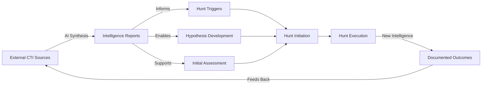

# AI-Enhanced Threat Intelligence for Threat Hunting

## Table of Contents
- [Introduction](#introduction)
- [The AI Advantage in Threat Intelligence](#the-ai-advantage-in-threat-intelligence)
- [The PTCF Prompting Framework](#the-ptcf-prompting-framework)
- [Ready-to-Use Prompts: Structured Reports](#ready-to-use-prompts-structured-reports)
- [Common Pitfalls and Solutions](#common-pitfalls-and-solutions)
- [Conclusion](#conclusion)
- [References](#references)

---

## Introduction

Modern threat hunters face an overwhelming challenge: drowning in data while racing against time. The traditional approach to threat intelligence gathering requires hours of manual research across multiple sources, parsing lengthy reports, correlating disparate indicators, and synthesizing findings into actionable intelligence. By the time this manual research is complete, the threat landscape has often already shifted.

Artificial Intelligence transforms this paradigm. What once took hours of manual correlation and analysis can now be accomplished in minutes through structured prompting. AI acts as a force multiplier for threat hunters, not by replacing human expertise, but by accelerating the intelligence gathering and synthesis that informs hunt operations.

This guide provides practical, platform-agnostic approaches to leveraging AI for threat intelligence in support of the [Unified Threat Hunting Process](https://github.com/sims718718/UnifiedThreatHunting). As outlined in our [Cyber Threat Intelligence guide](link-to-cti-guide), quality intelligence is the foundation of effective threat hunting. AI enables threat hunters to:

- **Generate comprehensive threat intelligence reports in minutes** instead of hours
- **Develop data-driven hunt hypotheses** based on current adversary TTPs
- **Accelerate multi-step investigations** through automated correlation and pivoting
- **Maintain situational awareness** of the evolving threat landscape
- **Focus cognitive effort on analysis and decision-making** rather than data gathering

This guide focuses exclusively on using AI to gather and synthesize threat intelligence that informs hunt operations. It is not about automating threat hunting itself; human-driven hypothesis testing and analysis remain central to the hunting process. Instead, AI becomes your intelligence research assistant, dramatically reducing the time spent on data collection so you can spend more time hunting.

**What This Guide Provides:**

1. A structured prompting framework (PTCF) for consistent, high-quality outputs
2. Copy-paste ready prompts for common threat intelligence tasks
3. Advanced workflows for hypothesis generation and investigation
4. Best practices for optimizing AI-assisted intelligence gathering

**Important Note:** All prompts in this guide are platform-agnostic and work with major AI systems including Claude, ChatGPT, Gemini, and specialized threat intelligence AI platforms. Where specific threat intelligence databases or tools are referenced, adapt the prompts to your available resources.

---

## The AI Advantage in Threat Intelligence

### From Manual Research to Conversational Intelligence

Traditional threat intelligence gathering follows a predictable but time-consuming pattern:

1. Identify a threat actor, malware family, or technique
2. Search multiple threat intelligence platforms and vendor blogs
3. Read through lengthy reports (often 20-50 pages each)
4. Extract relevant TTPs, IOCs, and targeting information
5. Cross-reference findings across multiple sources
6. Synthesize information into actionable intelligence
7. Format findings for different audiences

**Time Investment:** 2-6 hours per intelligence requirement

With AI-assisted intelligence gathering, this transforms into:

1. Craft a structured prompt defining your intelligence requirements
2. AI searches, correlates, and synthesizes information from available sources
3. Review and validate the synthesized intelligence
4. Refine through follow-up prompts if needed

**Time Investment:** 15-30 minutes per intelligence requirement

### The Shift in Cognitive Load

AI doesn't eliminate the need for expert analysts. Instead, it shifts where you spend your cognitive effort:

**Before AI:**
- 70% data gathering and correlation
- 20% analysis and synthesis
- 10% decision-making and action

**With AI:**
- 20% prompt engineering and validation
- 40% analysis and synthesis
- 40% decision-making and action

This reallocation means threat hunters spend more time doing what they do best: thinking like adversaries, developing creative hypotheses, and identifying threats that matter.

### Key Capabilities AI Brings to Threat Intelligence

**1. Rapid Synthesis**
AI excels at aggregating information from multiple sources and presenting it in structured formats. What would take hours of reading and note-taking happens in seconds.

**2. Multi-Dimensional Analysis**
AI can simultaneously analyze threat actors, their malware, TTPs, targeting, and infrastructure relationships, building comprehensive threat profiles.

**3. Contextual Adaptation**
Through structured prompts, AI tailors intelligence to your specific needs: technical vs executive audience, industry-specific risks, geographic considerations.

**4. Temporal Analysis**
AI can focus on specific timeframes, helping you understand what adversaries are doing right now, not just what they've done historically.

**5. Iterative Refinement**
Through conversational interaction, you can progressively refine intelligence outputs, drilling deeper into specific areas of interest.

### Where AI Fits in the Unified Threat Hunting Process

While this guide focuses on intelligence gathering rather than the hunt process itself, it's important to understand where AI-assisted intelligence provides the most value:


```mermaid
graph LR
    A[External CTI Sources] -->|AI Synthesis| B[Intelligence Reports]
    B -->|Informs| C[Hunt Triggers]
    B -->|Enables| D[Hypothesis Development]
    B -->|Supports| E[Initial Assessment]
    C --> F[Hunt Initiation]
    D --> F
    E --> F
    F --> G[Hunt Execution]
    G -->|New Intelligence| H[Documented Outcomes]
    H -->|Feeds Back| A
```

**Primary Use Cases:**

1. **Pre-Hunt Intelligence Gathering:** Before initiating a hunt, rapidly assemble comprehensive threat intelligence on relevant adversaries, techniques, or campaigns
2. **Hypothesis Generation:** Use AI to develop data-driven, testable hunt hypotheses based on current threat intelligence
3. **Rapid Threat Profiling:** When a new threat actor or campaign emerges, quickly build operational profiles
4. **Investigation Support:** During hunt execution, rapidly pivot and gather additional intelligence on discovered artifacts
5. **Intelligence Synthesis:** After a hunt, synthesize findings into intelligence reports for organizational knowledge

---

## The PTCF Prompting Framework

Effective AI interaction requires structured prompting. The PTCF framework (Persona, Task, Context, Format) provides a consistent approach to crafting prompts that produce high-quality, actionable intelligence. This framework is based on proven prompt engineering practices and ensures your prompts are clear, complete, and produce deterministic outputs.

### Understanding PTCF

| Component | Purpose | Example |
|-----------|---------|---------|
| **Persona** | Assigns a role to the AI, focusing its knowledge and tone | "You are a senior cyber threat intelligence analyst specializing in APT groups" |
| **Task** | Clearly defines the primary goal or action | "Generate a comprehensive threat intelligence report on APT29's activities" |
| **Context** | Provides necessary background, constraints, audience, timeframe | "For a technical SOC audience, covering the last 90 days, focusing on cloud exploitation" |
| **Format** | Specifies the desired structure and presentation | "Output as a markdown document with sections for Executive Summary, TTPs, IOCs, and Recommendations" |

### Why PTCF Works

**Clarity:** Each component serves a distinct purpose, eliminating ambiguity about what you need.

**Consistency:** Following the same structure produces more predictable, repeatable results.

**Completeness:** The framework ensures you don't forget critical elements that affect output quality.

**Flexibility:** Components can be simple or highly detailed based on your needs.

### Building Effective Prompts: The Progression Model

You can craft prompts at different levels of complexity based on your needs:

**Level 1: Basic (Conversational)**
```
Tell me about APT29
```
- Fast for exploration
- Requires follow-up questions
- Less deterministic

**Level 2: Structured (PTCF)**
```
Persona: You are a threat intelligence analyst.
Task: Generate a threat brief on APT29.
Context: For a technical audience, covering the last 90 days.
Format: Structure with Executive Summary, TTPs, and IOCs sections.
```
- Good balance of speed and quality
- Suitable for most intelligence gathering
- Produces consistent structure

**Level 3: Advanced (Detailed Workflow)**
```
Persona: You are a senior CTI analyst with deep APT expertise.
Task: Generate a comprehensive intelligence report on APT29.
Context: For incident responders, covering 180 days, focus on cloud infrastructure targeting.
Format: Detailed markdown report with specific sections.
Workflow: 
1. Identify primary APT29 profile and aliases
2. Extract targeting information (industries, regions)
3. Analyze top 5 TTPs with MITRE ATT&CK mappings
4. List associated malware families with descriptions
5. Identify recent campaigns and infrastructure
6. Synthesize into formatted report
```
- Maximum control and determinism
- Ideal for recurring, mission-critical tasks
- Produces highly consistent outputs

**Recommendation for Threat Hunters:** Start with Level 2 (Structured PTCF) prompts for most tasks. Use Level 3 only when you need highly repeatable, standardized outputs or complex multi-step workflows.

### Key Principles for Effective Prompting

**1. Be Specific About Intent**
Vague: "Tell me about ransomware"
Specific: "Analyze ransomware TTPs used by Russian cybercriminal groups in the financial sector during Q4 2024"

**2. Define Your Audience**
Different stakeholders need different intelligence formats:
- **Technical audience:** Detailed TTPs, code analysis, detection logic
- **Management audience:** Risk assessment, business impact, strategic recommendations
- **Executive audience:** Brief summaries, trends, investment justification

Always specify who will consume the intelligence.

**3. Constrain Timeframes**
Temporal context dramatically improves relevance:
- "Last 30 days" for current threats
- "Last 90 days" for recent trends
- "Last 12 months" for strategic analysis
- "Historical" for comprehensive adversary profiles

**4. Structure Your Output**
Always define the desired format. Common structures for threat intelligence:
- Executive Summary + Detailed Sections
- Markdown with headers and tables
- Bulleted lists for quick reference
- MITRE ATT&CK technique tables
- Timeline of events

**5. Iterate and Refine**
Don't expect perfection on the first try. Use follow-up prompts:
- "Expand the section on lateral movement techniques"
- "Provide more detail on the malware capabilities"
- "Reformat this as a table"
- "Add IOCs for each malware family"

### Variables and Reusability

For recurring intelligence tasks, use variable placeholders to create reusable prompt templates:

**Template Structure:**
```
## User Inputs
- THREAT_ACTOR: [Specify the threat actor to analyze]
- TIMEFRAME: [Specify timeframe in days, default to 90 if not provided]
- FOCUS_AREA: [Specify focus area, e.g., "cloud infrastructure", "ransomware operations"]

Persona: You are a senior threat intelligence analyst.
Task: Generate a threat intelligence report on THREAT_ACTOR.
Context: For a technical audience, covering the last TIMEFRAME days, focusing on FOCUS_AREA.
Format: [Specify structure]
```

When using the template, replace bracketed variables with specific values.

### Validation and Quality Checks

After receiving AI-generated intelligence, always validate:

**Factual Accuracy:**
- Cross-reference key claims with known sources
- Verify attribution and dates
- Check MITRE ATT&CK technique IDs

**Completeness:**
- Ensure all requested sections are present
- Verify that context and constraints were followed
- Confirm appropriate level of detail

**Relevance:**
- Intelligence applies to your threat model
- TTPs are applicable to your environment
- Timeframe is appropriate

**Citation:**
- Sources are identified (when available)
- Claims can be verified
- Attribution is appropriate

If output quality is poor, refine your prompt rather than accepting substandard intelligence.

---

## Ready-to-Use Prompts: Structured Reports

This section provides copy-paste ready prompts for generating three types of threat intelligence reports: Tactical, Operational, and Strategic. Each serves a different purpose in threat hunting operations.

### Report Type Overview

| Report Type | Primary Audience | Focus | Hunt Value |
|------------|------------------|-------|-----------|
| **Tactical** | SOC Analysts, Hunters executing hunts | IOCs, signatures, immediate actions | Direct hunt execution support |
| **Operational** | Threat Hunters, IR Teams | TTPs, campaigns, malware analysis | Hypothesis development, investigation |
| **Strategic** | Hunt Lead, CISO, Management | Trends, adversary landscape, risk | Program direction, hunt prioritization |

---

### Tactical Threat Intelligence Report

**Purpose:** Generate actionable intelligence for immediate use in threat hunting operations. Focuses on indicators, detection opportunities, and tactical recommendations.

**Use Case:** You've identified a threat actor or campaign relevant to your environment and need tactical intelligence to hunt for their presence.

**Copy-Paste Ready Prompt:**

```
## Persona
You are a tactical threat intelligence analyst supporting active threat hunting operations.

## Task
Generate a tactical threat intelligence brief on [THREAT_ACTOR or CAMPAIGN_NAME].

## Context
This brief is for threat hunters actively searching for evidence of [THREAT_ACTOR or CAMPAIGN_NAME] in our environment. The audience is technical security analysts. Focus on the last [TIMEFRAME, e.g., "60 days"] of activity. Our primary concerns are [FOCUS_AREAS, e.g., "initial access vectors, persistence mechanisms, and lateral movement techniques"].

## Format
Structure the output as a markdown document with the following sections:

### Executive Summary
- 2-3 sentence overview of the threat
- Current threat level assessment (Active, Emerging, Monitoring)

### Threat Overview
- Primary threat actor or campaign identifier
- Known aliases
- First observed / most recent activity
- Targeting profile (industries, regions, organization types)

### Indicators of Compromise (IOCs)
Present as a table with columns: Indicator Type | Value | Confidence | Context
Include: File hashes, IP addresses, domains, URLs, email indicators
Prioritize high-confidence IOCs from the specified timeframe

### Tactics, Techniques, and Procedures (TTPs)
Present as a table with columns: MITRE Tactic | Technique ID | Technique Name | Description | Detection Opportunity
Focus on TTPs most relevant to threat hunting
Emphasize behavioral detection over signature-based

### Detection Opportunities
For each major TTP, provide:
- Data sources required (e.g., Sysmon Event IDs, network logs)
- Specific hunt queries or search patterns
- Baseline considerations
- Expected false positive rate

### Associated Malware and Tools
Present as a table with columns: Malware/Tool Name | Type | Primary Function | Key Capabilities
Include both custom and publicly available tools

### Recommended Hunt Actions
Numbered list of specific actions hunters should take:
1. [Specific hunt action with data source]
2. [Specific hunt action with data source]
3. [etc.]

### References
List primary intelligence sources used
```

**Variables to Customize:**
- `[THREAT_ACTOR or CAMPAIGN_NAME]`: APT29, Scattered Spider, Akira Ransomware, etc.
- `[TIMEFRAME]`: 30 days, 60 days, 90 days
- `[FOCUS_AREAS]`: Initial access, ransomware, data exfiltration, cloud attacks, etc.

---

### Operational Threat Intelligence Report

**Purpose:** Provide in-depth analysis of adversary operations, campaigns, and TTPs to inform hunt hypothesis development and investigation expansion.

**Use Case:** You're developing hunt hypotheses and need comprehensive understanding of how an adversary operates, their campaigns, and technical capabilities.

**Copy-Paste Ready Prompt:**

```
## Persona
You are an operational threat intelligence analyst with expertise in adversary behavior analysis and campaign tracking.

## Task
Generate a comprehensive operational intelligence report on [THREAT_ACTOR or MALWARE_FAMILY].

## Context
This report will inform threat hunting hypothesis development and investigation planning. The audience includes threat hunters, incident responders, and forensic analysts. Cover activity from the last [TIMEFRAME, e.g., "180 days"]. We are particularly interested in understanding [SPECIFIC_FOCUS, e.g., "their lateral movement techniques and credential theft methods"].

Our organization operates in the [INDUSTRY] sector in [GEOGRAPHIC_REGION]. Highlight intelligence most relevant to our profile.

## Format
Structure the output as a detailed markdown document with the following sections:

### Executive Summary
- 3-5 sentence overview suitable for technical management
- Key findings and implications for our organization
- Overall threat assessment

### Threat Actor/Malware Profile
- Full name and known aliases
- Attribution (if available): Nation-state, cybercriminal, hacktivist, etc.
- Motivation: Financial, espionage, disruption, etc.
- Origin/affiliation (if known)
- First observed and evolution timeline

### Targeting and Victimology
- Primary target industries (with emphasis on [INDUSTRY])
- Geographic focus (with emphasis on [GEOGRAPHIC_REGION])
- Organization profiles typically targeted (size, revenue, etc.)
- Attack objectives and desired outcomes

### Campaign Analysis
For significant campaigns in the timeframe:
- Campaign name and dates
- Attack narrative and flow
- Notable victims or incidents
- Key innovations or changes in TTPs

### Detailed TTP Analysis
For each stage of the attack chain, provide:

#### Initial Access
- Primary vectors used
- Social engineering tactics
- Exploited vulnerabilities
- Success rates and detection challenges

#### Execution
- Malware deployment methods
- Scripting languages and tools used
- Anti-analysis techniques

#### Persistence
- Mechanisms employed
- Timelines for establishing persistence
- Redundancy tactics

#### Privilege Escalation
- Techniques observed
- Tools utilized
- Success patterns

#### Defense Evasion
- Anti-detection measures
- Obfuscation techniques
- Living-off-the-land binaries (LOLBins) used

#### Credential Access
- Credential theft methods
- Tools employed (e.g., Mimikatz variants)
- Targeted credential types

#### Discovery
- Reconnaissance activities
- Network mapping techniques
- Information gathering patterns

#### Lateral Movement
- Primary lateral movement methods
- Tools and protocols used
- Movement patterns and timelines

#### Collection
- Data of interest
- Collection tools and techniques
- Staging locations

#### Command and Control (C2)
- C2 infrastructure characteristics
- Communication protocols
- Beacon patterns and timing

#### Exfiltration
- Exfiltration methods
- Data volumes and patterns
- External destinations

### Malware Arsenal
Present as a table with columns: Malware Name | Type | Primary Purpose | Key Capabilities | Persistence Mechanisms | Detection Challenges

### Infrastructure Analysis
- Hosting providers commonly used
- Domain registration patterns
- IP address characteristics
- SSL/TLS certificate patterns
- Infrastructure rotation timelines

### Behavioral Patterns
- Operational timing (days of week, hours of day)
- Dwell time statistics
- Attack velocity and timelines
- Seasonal variations in activity

### Attribution Confidence
- Assessment of attribution confidence (High/Medium/Low)
- Key evidence supporting attribution
- Alternative hypotheses (if confidence is not high)

### Threat Hunting Implications
- High-priority hunt hypotheses based on this intelligence
- Data sources required for effective hunting
- Expected prevalence in typical environments
- Baseline establishment recommendations

### Defense and Detection Recommendations
- Detection strategies by attack stage
- Network and host-based monitoring priorities
- Security control effectiveness against observed TTPs
- Specific detection rules or signatures (if applicable)

### Open Questions and Intelligence Gaps
- What is not well understood about this threat
- Areas requiring additional intelligence collection
- Emerging or evolving TTPs that need monitoring

### References and Sources
- Primary intelligence sources
- Notable technical analyses
- Community reporting
```

**Variables to Customize:**
- `[THREAT_ACTOR or MALWARE_FAMILY]`: APT28, FIN7, Emotet, BazarLoader, etc.
- `[TIMEFRAME]`: 90 days, 180 days, 12 months
- `[SPECIFIC_FOCUS]`: Lateral movement, credential theft, ransomware deployment, etc.
- `[INDUSTRY]`: Financial services, healthcare, manufacturing, critical infrastructure, etc.
- `[GEOGRAPHIC_REGION]`: North America, Europe, APAC, specific countries

---

### Strategic Threat Intelligence Report

**Purpose:** Provide high-level analysis of threat landscape, trends, and risk assessment to inform program direction and hunt prioritization.

**Use Case:** Planning your threat hunting program roadmap, justifying resources, or briefing leadership on the threat landscape.

**Copy-Paste Ready Prompt:**

```
## Persona
You are a strategic threat intelligence analyst who advises security leadership on threat landscape trends and organizational risk.

## Task
Generate a strategic threat intelligence assessment for [ORGANIZATION_TYPE] organizations in the [INDUSTRY] sector.

## Context
This assessment will inform threat hunting program planning and resource allocation for the next [PLANNING_HORIZON, e.g., "quarter" or "fiscal year"]. The primary audience is the CISO, security management, and threat hunt program leadership. 

Our organization profile:
- Industry: [INDUSTRY]
- Geographic presence: [REGIONS]
- Organization size: [SMALL/MEDIUM/LARGE/ENTERPRISE]
- Key assets: [e.g., "customer PII, intellectual property, financial data"]
- Technology environment: [e.g., "hybrid cloud, primarily Microsoft stack, OT/ICS systems"]

## Format
Structure the output as an executive-focused markdown document with the following sections:

### Executive Summary
- 4-6 sentence overview of the current threat landscape
- Top 3 threats to organizations like ours
- Key strategic recommendations
- Overall risk assessment

### Threat Landscape Overview
- Current state of cyber threats affecting [INDUSTRY]
- Significant shifts in the last [TIMEFRAME, e.g., "6 months"]
- Emerging threat actors and groups
- Geopolitical factors influencing the threat environment

### Threat Actor Landscape
For each significant threat actor category:

#### Nation-State Threats
- Primary nation-state actors targeting [INDUSTRY]
- Motivations and objectives
- Observed tactics and campaigns
- Likelihood of targeting our organization (High/Medium/Low)

#### Cybercriminal Groups
- Major cybercriminal groups operating in our sector
- Monetization strategies (ransomware, data theft, etc.)
- Attack economics and targeting criteria
- Risk to our organization

#### Hacktivist Activity
- Relevant hacktivist movements
- Current campaigns and targets
- Potential organizational exposure

### Industry-Specific Threat Analysis
- Attacks specifically targeting [INDUSTRY] organizations
- Sector-specific vulnerabilities being exploited
- Regulatory and compliance implications
- Industry collaboration and information sharing

### Regional Threat Analysis
For each region where we operate:
- Region-specific threat actors
- Local threat landscape characteristics
- Regulatory environment
- Regional cooperation and response capabilities

### Technology-Specific Threats
Analyze threats to our technology environment:
- Cloud infrastructure threats (AWS, Azure, GCP)
- Endpoint threats (Windows, macOS, Linux, mobile)
- Network infrastructure threats
- Application-layer threats
- OT/ICS threats (if applicable)
- Supply chain risks

### Attack Trend Analysis
- Trending attack techniques and TTPs
- Evolution in adversary capabilities
- Emerging attack vectors
- Declining or deprecated techniques

### Ransomware Threat Assessment
- Current ransomware landscape affecting [INDUSTRY]
- Major ransomware families and operators
- Average ransom demands in our sector
- Payment vs recovery considerations
- Trend analysis (increasing/decreasing threat)

### Data Theft and Extortion
- Prevalence of data theft in [INDUSTRY]
- Common exfiltration targets
- Extortion tactics and trends
- Data exposure risks

### Vulnerability and Exploitation Trends
- Most exploited vulnerabilities in [INDUSTRY]
- Zero-day vs N-day exploitation trends
- Vulnerability disclosure and exploitation timelines
- Patch prioritization recommendations

### Supply Chain and Third-Party Risk
- Supply chain attack trends
- Third-party compromise incidents
- Vendor risk considerations
- Software supply chain threats

### Threat Hunting Program Implications

#### Priority Hunt Themes for [NEXT_PERIOD]
Ranked list of hunt themes based on threat intelligence:
1. [Hunt theme with justification]
2. [Hunt theme with justification]
3. [Hunt theme with justification]
...

#### Resource Allocation Recommendations
- Hunt team focus areas
- Required skillsets and training
- Tool and technology investments
- Data source requirements

#### Detection Gap Analysis
- TTPs not currently covered by detection
- Visibility gaps in the environment
- Recommended detection engineering priorities

### Risk Assessment and Recommendations

#### Organizational Risk Posture
- Overall risk level (Critical/High/Moderate/Low)
- Risk factors specific to our organization
- Comparative risk vs industry peers

#### Strategic Recommendations
Numbered list of actionable recommendations:
1. [Strategic recommendation with expected impact]
2. [Strategic recommendation with expected impact]
3. [Strategic recommendation with expected impact]
...

#### Investment Justification
- Security control gaps based on threat intelligence
- ROI considerations for recommended investments
- Risk reduction potential

### Intelligence Gaps and Future Focus
- Areas where intelligence is lacking
- Emerging threats requiring monitoring
- Recommended intelligence collection priorities

### Outlook and Forecast
- Expected threat landscape evolution over [PLANNING_HORIZON]
- Predicted adversary developments
- Anticipated targeting shifts
- Preparedness recommendations

### Appendix: Threat Actor Summary
Table format: Threat Actor | Category | Motivation | Industries Targeted | Geographic Focus | Risk to Organization (H/M/L) | Key TTPs

### References and Methodology
- Intelligence sources consulted
- Analysis methodology
- Confidence assessments
- Date of assessment
```

**Variables to Customize:**
- `[ORGANIZATION_TYPE]`: Enterprise, mid-market, government, critical infrastructure, etc.
- `[INDUSTRY]`: Financial services, healthcare, energy, manufacturing, retail, technology, etc.
- `[PLANNING_HORIZON]`: Quarter, fiscal year, 6 months, 12 months
- `[REGIONS]`: North America, Europe, APAC, specific countries
- `[TIMEFRAME]`: 6 months, 12 months, 18 months

---

```
## Standard Intelligence Brief Template

Variables:
- THREAT_NAME: [To be filled]
- TIMEFRAME: [To be filled]
- FOCUS_AREA: [To be filled]

[Rest of structured prompt using variables]
```

Save these templates in a prompt library for quick access.

### Quality Validation Checklist

After generating intelligence, validate using this checklist:

**Accuracy:**
- [ ] Facts are correct and verifiable
- [ ] MITRE ATT&CK IDs are valid
- [ ] Attribution is appropriately caveated
- [ ] Dates and timelines are accurate

**Completeness:**
- [ ] All requested sections are present
- [ ] Appropriate level of detail provided
- [ ] No obvious gaps in logic or coverage
- [ ] References and sources included

**Relevance:**
- [ ] Intelligence applies to your threat model
- [ ] Appropriate for your environment
- [ ] Timeframe is suitable
- [ ] Audience-appropriate language and depth

**Actionability:**
- [ ] Clear recommendations provided
- [ ] Detection guidance is specific
- [ ] Hunt hypotheses are testable
- [ ] Next steps are defined

### Enhancing Output Quality

**Technique 1: Provide Examples**
Include examples of desired output format in your prompt:

```
Format the TTP analysis like this:

| MITRE Technique | Detection Method | Data Source |
|-----------------|------------------|-------------|
| T1059.001 PowerShell | Monitor for unusual parent processes | Sysmon Event ID 1 |
```

**Technique 2: Specify Constraints**
Be explicit about what NOT to include:

```
Do not include:
- Generic security advice
- TTPs not observed with this threat actor
- IOCs older than 90 days
- Theoretical attack scenarios
```

**Technique 3: Request Confidence Scoring**
Ask the AI to indicate confidence in its assessments:

```
For each attribution claim, provide a confidence level (High/Medium/Low) and explain the basis for that confidence.
```

**Technique 4: Demand Citations**
When accuracy is critical, require source citations:

```
For all factual claims, provide citations to the specific source. Use footnote format: [1], [2], etc.
```

---

## Common Pitfalls and Solutions

### Pitfall 1: Vague or Generic Outputs

**Problem:** AI produces generic threat intelligence that could apply to any organization or lacks specific actionable detail.

**Example:**
*"This threat actor targets organizations worldwide and uses common techniques like phishing and malware."*

**Solutions:**
- **Provide specific context** about your environment in the prompt
- **Request specific TTPs** rather than general descriptions  
- **Use follow-up prompts** to drill into details:
  ```
  That response was too generic. Provide specific details about how this threat actor implements T1059.001 (PowerShell), including actual command examples and detection opportunities.
  ```

### Pitfall 2: Hallucinations or Inaccurate Information

**Problem:** AI generates plausible-sounding but incorrect information, especially about attribution, specific incidents, or technical details.

**Example:**
*"APT99 was responsible for the 2023 SolarWinds attack..." (when APT99 doesn't exist)*

**Solutions:**
- **Always validate** critical facts against known sources
- **Request confidence levels** and sources:
  ```
  For each attribution claim and technical detail, provide your confidence level (High/Medium/Low) and the source of the information.
  ```
- **Cross-reference** MITRE ATT&CK technique IDs
- **Use follow-up prompts** to challenge suspicious claims:
  ```
  What is the source for the claim that APT99 was involved in this incident? Provide specific references.
  ```

### Pitfall 3: Wrong Audience Level

**Problem:** Technical depth doesn't match the intended audience.

**Example:**
*Executive briefing filled with technical jargon and MITRE ATT&CK technique IDs*

**Solutions:**
- **Explicitly state audience** in the Persona and Context sections
- **Provide examples** of appropriate tone:
  ```
  This is for executive leadership who are not technical. Avoid jargon, explain impacts in business terms, and focus on risk and decisions rather than technical implementation.
  ```
- **Request revision** if output misses the mark:
  ```
  Rewrite this brief for a CISO who has moderate technical knowledge. Reduce technical jargon but retain some technical specificity in the TTP section.
  ```

### Pitfall 4: Outdated or Irrelevant Intelligence

**Problem:** AI pulls from old threat intelligence or includes information not relevant to your environment.

**Example:**
*Including TTPs from 2018 campaigns when you requested last 90 days*

**Solutions:**
- **Be explicit about timeframes**:
  ```
  Only include intelligence from the last [TIMEFRAME]. Clearly label historical context if included.
  ```
- **Specify environmental constraints**:
  ```
  Our environment is Windows-based. Exclude TTPs specific to Linux or macOS unless there's a strong reason to include them.
  ```
- **Request current activity focus**:
  ```
  Prioritize current active campaigns and recent observations over historical threat actor profiles.
  ```

### Pitfall 5: Missing Context or Incomplete Analysis

**Problem:** AI provides indicators or TTPs without sufficient context for threat hunters to act on them.

**Example:**
*Lists 50 file hashes with no explanation of what they are or how to use them*

**Solutions:**
- **Require context** in your format specification:
  ```
  For each IOC, provide: Type, Value, Confidence Level, Context (what it is), and How to Use It (detection or hunt guidance).
  ```
- **Ask for narrative** alongside data:
  ```
  Don't just list TTPs. For each technique, explain how this threat actor implements it, why it's effective, and how defenders can detect it.
  ```

### Pitfall 6: Overly Complex or Unstructured Output

**Problem:** AI produces long, unstructured responses that are difficult to parse and use.

**Example:**
*10 paragraphs of narrative with no clear sections or tables*

**Solutions:**
- **Be very specific** about format in your prompt
- **Request specific structures**:
  ```
  Use tables for TTPs, IOCs, and malware. Use bulleted lists for recommendations. Use headers and subheaders to organize sections clearly.
  ```
- **Provide a template** or example of desired structure
- **Use follow-up prompts** to restructure:
  ```
  Reformat that response as a structured report with clear sections, tables for data, and executive summary at the top.
  ```

### Pitfall 7: Insufficient Actionability

**Problem:** Intelligence is interesting but doesn't translate to concrete actions for threat hunters.

**Example:**
*Detailed threat actor profile with no hunt hypotheses or detection guidance*

**Solutions:**
- **Explicitly request actionable outputs**:
  ```
  Based on this intelligence, provide:
  1. Three specific hunt hypotheses (SMART format)
  2. Detection queries for each major TTP
  3. Recommended data sources for detection
  4. Immediate actions to take
  ```
- **Ask "so what?"** questions:
  ```
  Based on this threat intelligence, what should threat hunters DO? Provide specific, actionable steps.
  ```

### Pitfall 8: Ignoring Your Environment Constraints

**Problem:** AI recommends actions or hunts that aren't feasible with your available telemetry or tools.

**Example:**
*"Hunt for this using Zeek network logs" when you don't have Zeek deployed*

**Solutions:**
- **List available resources** in Context:
  ```
  Available data sources: Sysmon, Windows Event Logs, CrowdStrike EDR
  Available tools: Splunk, Python
  NOT available: Full PCAP, Zeek, specialized malware sandboxes
  ```
- **Request feasibility checks**:
  ```
  For each hunt hypothesis, assess feasibility given our available telemetry. Flag any hunts that require data sources we don't have.
  ```

### Pitfall 9: No Prioritization

**Problem:** AI provides 10 hunt hypotheses but doesn't prioritize them, leaving you unsure where to start.

**Example:**
*List of hunt ideas with no ranking or priority*

**Solutions:**
- **Request prioritization** in your prompt:
  ```
  Generate 5-7 hunt hypotheses and rank them by priority (1=highest). For each, explain the prioritization rationale based on: likelihood of detection, risk if undetected, and feasibility.
  ```
- **Ask for sequence**:
  ```
  In what order should these hunts be executed? Provide a recommended hunt roadmap.
  ```

### Pitfall 10: Static One-Time Outputs

**Problem:** Treating AI-generated intelligence as a one-time deliverable rather than a starting point for iteration.

**Example:**
*Using the first response without refinement or follow-up*

**Solutions:**
- **Embrace iteration**:
  - Review initial output
  - Identify gaps or weaknesses
  - Use follow-up prompts to refine
  - Validate and adjust
- **Use conversational approach**:
  ```
  Follow-up: "That hunt hypothesis for PowerShell abuse is good, but how would we distinguish malicious PowerShell from legitimate admin scripts? Provide specific filtering criteria."
  ```
- **Build on previous responses**:
  ```
  Based on the threat profile you just generated, now create a detection strategy specifically for the persistence mechanisms this actor uses.
  ```

---

## Conclusion

Artificial Intelligence represents a paradigm shift in how threat hunters gather and synthesize threat intelligence. What once required hours of manual research, reading lengthy reports, and correlating disparate information can now be accomplished in minutes through structured prompting.

### The True Value of AI in Threat Intelligence

AI doesn't replace threat hunters; it amplifies their capabilities by:

1. **Accelerating Intelligence Gathering:** From hours to minutes
2. **Enabling Comprehensive Analysis:** Multi-dimensional threat profiling at scale
3. **Supporting Rapid Response:** Immediate briefings when threats emerge
4. **Facilitating Hypothesis Generation:** Data-driven hunt ideas from current intelligence
5. **Improving Consistency:** Structured outputs every time
6. **Freeing Cognitive Resources:** More time for analysis and hunting, less time gathering data

### Integration with the Unified Threat Hunting Process

As outlined in the [Unified Threat Hunting Process](https://github.com/sims718718/UnifiedThreatHunting), effective threat hunting begins with quality threat intelligence. AI enhances this process at multiple points:

**Before the Hunt:**
- Rapid synthesis of threat intelligence for triggering events
- Automated hypothesis generation from CTI
- Comprehensive threat profiling to inform initial assessment
- Feasibility analysis of potential hunt targets

**During the Hunt:**
- Multi-step investigation workflows
- Real-time intelligence gathering on discovered artifacts
- Rapid pivoting and correlation
- On-demand context for findings

**After the Hunt:**
- Synthesis of hunt findings into intelligence reports
- Generation of new hunt hypotheses from discoveries
- Documentation and knowledge capture
- Intelligence sharing with peer organizations

### Key Principles to Remember

**1. Prompt Engineering is a Skill**
Effective AI-assisted intelligence gathering requires practice. Use the PTCF framework consistently, refine your prompts based on results, and build a library of templates for recurring tasks.

**2. AI Augments, Not Replaces**
Human expertise remains essential. AI gathers and synthesizes; humans validate, contextualize, and make decisions. Always apply critical thinking to AI-generated intelligence.

**3. Quality Depends on Input**
"Garbage in, garbage out" applies to AI as much as any system. Provide clear context, specific requirements, and detailed environmental information to get quality outputs.

**4. Iteration Improves Outcomes**
Don't settle for the first response. Use follow-up prompts to refine, expand, or restructure outputs. The best intelligence often comes from conversational iteration.

**5. Validation is Critical**
Always validate key facts, especially attribution claims, MITRE ATT&CK mappings, and specific technical details. AI can hallucinate; verification is your responsibility.

**6. Context is Everything**
Generic intelligence has limited value. Always customize prompts with your environment, threat model, industry, and organizational context.

**7. Documentation Enables Reuse**
Save successful prompts as templates. Build a prompt library for your team. Document refinements and lessons learned.

### Getting Started

If you're new to AI-assisted threat intelligence:

1. **Start Simple:** Begin with basic structured reports using Level 2 (PTCF) prompts
2. **Practice Iteration:** Generate an output, refine it, learn what works
3. **Build Templates:** Create reusable prompts for common tasks
4. **Validate Everything:** Cross-check AI outputs against known sources
5. **Measure Impact:** Track time savings and quality improvements
6. **Share and Collaborate:** Share successful prompts with your team

### The Future of Threat Intelligence

As AI capabilities continue to advance, expect even more powerful applications:
- Real-time intelligence synthesis during active hunts
- Predictive threat intelligence based on environmental risk factors
- Automated hypothesis generation from security telemetry
- Natural language interaction with threat intelligence platforms
- Continuous intelligence updates as the threat landscape evolves

The organizations that embrace AI-assisted threat intelligence gathering today will have a significant advantage tomorrow. They'll hunt faster, more comprehensively, and more effectively than those stuck in manual research mode.

### Final Thoughts

The prompts and workflows in this guide are starting points, not endpoints. Customize them for your environment, refine them based on your needs, and continuously improve your prompting techniques. The goal is not to become dependent on AI but to leverage it as a force multiplier that enables your threat hunting program to operate at a scale and speed previously impossible.

Remember: the best threat hunters don't just use AI; they use it strategically to spend more time doing what AI cannot: thinking creatively, developing innovative hypotheses, and identifying threats that others miss.

Happy hunting, and may your prompts always return actionable intelligence.

---

## References

1. **Operationalizing Google Agentic Threat Intelligence: Transforming Defense Workflows** - Google Cloud Security Community - Comprehensive overview of agentic AI applications in threat intelligence

2. **Agentic Threat Intelligence: Your Security Team Just Grew** - Google Cloud Security Community - Introduction to AI-powered threat intelligence capabilities

3. **Agentic GTI Prompting** - Google Cloud Security Community - Detailed guide to prompt engineering for threat intelligence

4. **Unified Threat Hunting Process** - https://github.com/sims718718/UnifiedThreatHunting - Structured methodology for hypothesis-driven threat hunting

5. **Cyber Threat Intelligence: A Practical Guide for Threat Hunters** - Companion guide on CTI fundamentals and application to threat hunting

6. **MITRE ATT&CK Framework** - https://attack.mitre.org/ - Comprehensive knowledge base of adversary TTPs

7. **The PTCF Framework** - Industry standard for structured prompt engineering (Persona, Task, Context, Format)

---

*This guide is platform-agnostic and works with any major AI system capable of processing structured prompts. Adapt the specific references to threat intelligence platforms, tools, and data sources based on your available resources. As AI capabilities evolve, update your prompting strategies accordingly.*

*Version 1.0 - January 2026*
