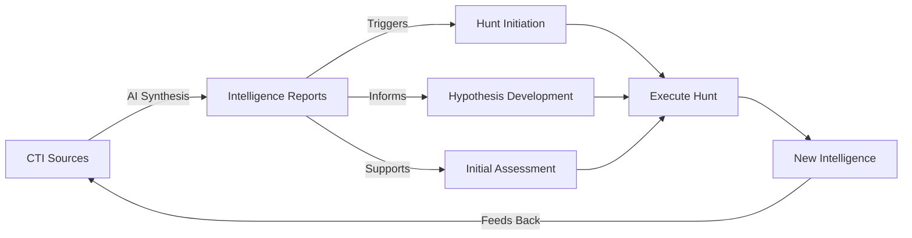

# AI-Enhanced Threat Intelligence for Threat Hunting

## Table of Contents
- [Introduction](#introduction)
- [Why AI Changes the Game](#why-ai-changes-the-game)
- [The PTCF Prompting Framework](#the-ptcf-prompting-framework)
- [Essential Prompts](#essential-prompts)
- [Best Practices](#best-practices)
- [Common Pitfalls](#common-pitfalls)

---

## Introduction

Modern threat hunters face an impossible challenge: too much data, too little time. Traditional threat intelligence gathering requires hours of manual research across vendor blogs, threat reports, MITRE ATT&CK, and countless other sources. By the time you finish researching, the threat landscape has shifted.

**AI changes this equation fundamentally.**

What took hours now takes minutes. This guide shows you how to leverage AI to accelerate threat intelligence gathering in support of the [Unified Threat Hunting Process](https://github.com/sims718718/UnifiedThreatHunting), using platform-agnostic prompting techniques that work with any major AI system (Claude, ChatGPT, Gemini, or specialized threat intelligence platforms).

### What AI Does for Threat Hunters

**Before AI:**
- 70% time gathering and correlating data
- 20% analyzing and synthesizing
- 10% making decisions and hunting

**With AI:**
- 20% prompting and validating AI outputs
- 40% analyzing and synthesizing
- 40% making decisions and hunting

AI doesn't replace threat hunters. It amplifies them by handling the tedious intelligence gathering so you can focus on what matters: hunting threats.

### Key Use Cases

1. **Pre-Hunt Intelligence:** Rapidly assemble comprehensive threat profiles before initiating hunts
2. **Hypothesis Generation:** Convert threat intelligence into testable hunt hypotheses
3. **Investigation Support:** Quickly pivot and gather additional context during active hunts
4. **Reporting:** Synthesize findings into intelligence reports for stakeholders

**Critical Note:** This guide focuses on using AI for intelligence gathering, not automating threat hunting itself. Human expertise remains essential for hypothesis testing, analysis, and decision-making.

---

## Why AI Changes the Game

### The Time Savings

**Traditional Intelligence Gathering:**
```
Identify threat → Search platforms → Read 20-50 page reports → 
Extract TTPs → Cross-reference sources → Synthesize findings → 
Format for audience = 2-6 hours
```

**AI-Assisted Intelligence Gathering:**
```
Craft structured prompt → AI searches and synthesizes → 
Validate output → Refine as needed = 15-30 minutes
```

### What AI Excels At

**Rapid Synthesis:** Aggregating information from multiple sources instantly

**Multi-Dimensional Analysis:** Simultaneously analyzing threat actors, malware, TTPs, targeting, and infrastructure

**Contextual Adaptation:** Tailoring intelligence for different audiences (technical, management, executive)

**Temporal Focus:** Filtering intelligence by timeframe (last 30 days, 90 days, etc.)

**Iterative Refinement:** Progressively refining outputs through conversational interaction

### Integration with Threat Hunting

AI-enhanced intelligence supports multiple phases of the [Unified Threat Hunting Process](https://github.com/sims718718/UnifiedThreatHunting):



**Primary Value Points:**
- **Triggering:** Convert raw CTI into hunt triggers
- **Hypothesis Development:** Generate SMART hunt hypotheses from intelligence
- **Assessment:** Rapidly research threats during feasibility assessment
- **Investigation:** Pivot and gather context during hunt execution

---

## The PTCF Prompting Framework

Effective AI interaction requires structure. The PTCF framework ensures consistent, high-quality outputs every time.

### Framework Components

| Component | Purpose | Example |
|-----------|---------|---------|
| **Persona** | Assigns a role to focus AI's knowledge and tone | "You are a senior cyber threat intelligence analyst" |
| **Task** | Defines the primary goal clearly | "Generate a threat intelligence report on APT29" |
| **Context** | Provides background, constraints, audience | "For threat hunters, covering last 90 days, focus on cloud attacks" |
| **Format** | Specifies desired structure and presentation | "Markdown document with Executive Summary, TTPs, IOCs, and Detections sections" |

### Why PTCF Works

- **Clarity:** Each component eliminates ambiguity
- **Consistency:** Produces predictable results
- **Completeness:** Ensures no critical elements are missed
- **Flexibility:** Can be simple or highly detailed based on needs

### Progression Model

**Level 1: Simple Question**
```
Tell me about APT29
```
*Fast but vague, requires follow-up*

**Level 2: Structured (Recommended)**
```
Persona: You are a threat intelligence analyst.
Task: Generate a threat brief on APT29.
Context: For technical hunters, last 90 days, focus on cloud targeting.
Format: Markdown with Executive Summary, TTPs (MITRE mapped), and Detection sections.
```
*Good balance of speed and quality*

**Level 3: Advanced Workflow**
```
Persona: You are a senior CTI analyst.
Task: Generate comprehensive APT29 intelligence report.
Context: For incident responders, 180 days, cloud infrastructure focus.
Format: Detailed markdown with specific sections.
Workflow:
1. Identify APT29 profile and recent campaigns
2. Extract top 5 TTPs with MITRE mappings
3. Analyze cloud-specific techniques
4. Provide detection opportunities per TTP
5. Synthesize into formatted report
```
*Maximum control for complex, repeatable tasks*

### Key Prompting Principles

**1. Be Specific**
- Vague: "Tell me about ransomware"
- Specific: "Analyze ransomware TTPs used by Russian cybercriminal groups targeting financial services in Q4 2024"

**2. Define Your Audience**
- **Technical:** Detailed TTPs, detection logic, code analysis
- **Management:** Risk assessment, business impact, resource needs
- **Executive:** Brief summaries, trends, strategic recommendations

**3. Constrain Timeframes**
- "Last 30 days" for current threats
- "Last 90 days" for recent trends
- "Last 12 months" for strategic analysis

**4. Specify Output Format**
- Markdown documents
- Tables for structured data
- Bulleted lists for quick reference
- MITRE ATT&CK mappings

**5. Iterate and Refine**
Don't expect perfection on first try. Use follow-up prompts:
- "Expand the lateral movement section with more detail"
- "Provide specific hunt queries for each TTP"
- "Reformat as a table"

---

## Essential Prompts

This section provides three copy-paste ready prompts for the most common threat intelligence tasks.

### Prompt 1: Operational Threat Intelligence Report

**Purpose:** Generate comprehensive threat intelligence for hypothesis development and hunt planning. This is the most versatile prompt for threat hunters.

**Use Case:** You've identified a relevant threat actor or campaign and need detailed intelligence to develop hunt hypotheses and understand adversary behavior.

**Copy-Paste Ready Prompt:**

```text
## Persona
You are an operational threat intelligence analyst with expertise in adversary behavior analysis.

## Task
Generate a comprehensive operational intelligence report on [THREAT_ACTOR or CAMPAIGN_NAME].

## Context
This report will inform threat hunting hypothesis development and investigation planning. The audience includes threat hunters and incident responders. Cover activity from the last [TIMEFRAME, e.g., "90 days"]. 

We operate in the [INDUSTRY] sector in [GEOGRAPHIC_REGION] with a [TECHNOLOGY_STACK, e.g., "Windows-heavy environment, Microsoft 365, AWS cloud"]. Highlight intelligence most relevant to our profile.

## Format
Structure the output as a markdown document with the following sections:

### Executive Summary
- 3-4 sentences covering threat, relevance, and key findings
- Overall threat assessment

### Threat Actor/Campaign Profile
- Full name and known aliases
- Attribution and confidence level
- Motivation and objectives
- Origin/affiliation
- First observed and activity timeline

### Targeting and Victimology
- Primary target industries (emphasize [INDUSTRY])
- Geographic focus (emphasize [GEOGRAPHIC_REGION])
- Typical victim profiles
- Attack objectives

### Detailed TTP Analysis
For each major stage of the attack chain:

#### [Stage Name, e.g., Initial Access]
- Primary techniques used
- MITRE ATT&CK technique IDs
- Specific implementation details
- Detection opportunities
- Required data sources for detection

[Repeat for: Execution, Persistence, Privilege Escalation, Defense Evasion, Credential Access, Discovery, Lateral Movement, Collection, C2, Exfiltration]

### Malware and Tools
Present as table:
| Malware/Tool | Type | Purpose | Key Capabilities | Detection Challenges |

### Infrastructure Analysis
- Hosting patterns
- Domain registration characteristics
- C2 communication patterns
- Infrastructure rotation timelines

### Threat Hunting Implications
- Top 3-5 hunt hypotheses (SMART format)
- Required data sources
- Expected detection difficulty
- Baseline considerations

### Detection Recommendations
- High-priority detection opportunities by attack stage
- Specific detection logic or queries (if applicable)
- Network and host monitoring priorities

### Intelligence Gaps
- What is not well understood
- Areas requiring additional research

### References
- Primary intelligence sources
```

**Variables to Customize:**
- `[THREAT_ACTOR or CAMPAIGN_NAME]`: APT29, FIN7, Akira Ransomware, etc.
- `[TIMEFRAME]`: 30/60/90/180 days
- `[INDUSTRY]`: Financial services, healthcare, manufacturing, etc.
- `[GEOGRAPHIC_REGION]`: North America, Europe, APAC, specific countries
- `[TECHNOLOGY_STACK]`: Your environment specifics

---

### Prompt 2: Hunt Plan Generation (Epic + Stories)

**Purpose:** Transform threat intelligence into a structured hunt plan following the [Unified Threat Hunting Process](https://github.com/sims718718/UnifiedThreatHunting) Epic/Story format.

**Use Case:** You have threat intelligence and need to create a complete, documented hunt plan for your team (suitable for Jira or similar tools).

**Copy-Paste Ready Prompt:**

```text
## Persona
You are a lead threat hunter with extensive experience designing hypothesis-driven hunt operations.

## Task
Generate a complete threat hunt plan (Epic and Stories) based on this threat intelligence: 

[PASTE_INTELLIGENCE_OR_DESCRIBE_TTP]

## Context
Create a hunt plan following the Unified Threat Hunting Process for use in project management tools. The plan needs an Epic (overarching hypothesis) and multiple Stories (discrete investigation approaches).

Our environment:
- Organization: [TYPE, e.g., "Enterprise financial services"]
- Technology: [STACK, e.g., "Windows endpoints, Microsoft 365, AWS"]
- Available data: [SOURCES, e.g., "Sysmon, EDR telemetry, network flow logs, auth logs"]
- Team skills: [CAPABILITIES, e.g., "Strong log analysis, moderate scripting"]

Hunt requirements (SMART criteria):
- **Specific:** Narrow, focused scope
- **Measurable:** Quantifiable success criteria
- **Achievable:** Realistic given our telemetry and skills
- **Relevant:** Aligned with organizational threat model
- **Time-bound:** Completable within [DURATION, e.g., "2-3 weeks"]

## Format

### Epic: [Hypothesis Title]

#### Hypothesis Statement
[One clear, testable statement about adversary presence or activity]

#### Trigger
- **Type:** [CTI Report / Vulnerability / Past Incident / etc.]
- **Details:** [What initiated this hunt]

#### Justification
[Why this matters to our organization]

**Supporting Intelligence:**
- Relevant threat actors or malware
- MITRE ATT&CK techniques involved
- Recent campaigns or targeting
- Industry/regional relevance

**Hunt Objectives:**
1. [What we aim to accomplish]
2. [What we aim to accomplish]
3. [What we aim to accomplish]

**Scope:**
- **In Scope:** [Systems, timeframes, users]
- **Out of Scope:** [What we're NOT hunting]

**Required Data Sources:**
- [Source 1 with specific log types]
- [Source 2 with specific log types]

**Feasibility:**
- Data availability: [Available/Partial/Not Available]
- Team capability: [Existing/Training Needed]
- Estimated effort: [Hours or days]

---

### Story 1: [Test Approach Title]

**Test Objective:**
[What specific aspect this story tests]

**Approach:**
[High-level investigative method]

**Rationale:**
[Why this approach helps prove/disprove hypothesis]

**Investigation Steps:**

1. **Data Gathering**
   - Sources: [Specific sources]
   - Timeframe: [Period]
   - Query criteria: [Filters]

2. **Baseline Development**
   - Baseline approach: [Statistical/Historical/Rule-based]
   - Baseline period: [Timeframe]
   - Key metrics: [What defines "normal"]

3. **Analysis**
   - Method: [Frequency analysis/Anomaly detection/Pattern matching/etc.]
   - Tools: [Splunk/Python/etc.]
   - Success criteria: [What indicates positive findings]

4. **Hunt Queries**
```
[Pseudo-code or actual query example]
```

5. **Validation**
   - How to confirm true positives
   - Expected false positive scenarios
   - Escalation criteria

**MITRE Coverage:**
- Primary: [T-ID and name]
- Related: [List]

**Estimated Effort:** [Hours]

---

### Story 2: [Alternative Approach Title]

**Test Objective:**
[Different aspect or methodology]

**Approach:**
[Alternative investigative method]

**Note:** This story uses a different analytical approach than Story 1 to ensure comprehensive hypothesis testing.

[Same detailed structure as Story 1]

---

### Success Criteria
The hunt succeeds if we:
1. [Criterion, e.g., "Definitively prove or disprove hypothesis"]
2. [Criterion, e.g., "Create actionable detections"]
3. [Criterion, e.g., "Identify visibility gaps"]

### Expected Outcomes
After hunt execution, outcomes documented as Tasks may include:
- New hunt ideas discovered
- Detection analytics created
- Security incidents identified
- Visibility gaps found
- Written hunt report completed

Note: Tasks are outcomes created AFTER hunt execution, not part of initial planning.
```

**Variables to Customize:**
- `[PASTE_INTELLIGENCE_OR_DESCRIBE_TTP]`: Your threat intelligence input
- `[TYPE]`: Organization type
- `[STACK]`: Technology environment
- `[SOURCES]`: Available data sources
- `[CAPABILITIES]`: Team skills
- `[DURATION]`: Hunt timeframe

---

### Prompt 3: Hypothesis Generation from CTI

**Purpose:** Automatically generate multiple hunt hypotheses from threat intelligence, enabling rapid conversion of CTI into hunt opportunities.

**Use Case:** New threat intelligence has arrived (blog post, report, MITRE update) and you need to quickly identify what's worth hunting in your environment.

**Copy-Paste Ready Prompt:**

```text
## Persona
You are a senior threat hunter specializing in translating threat intelligence into actionable hunt hypotheses.

## Task
Analyze the following threat intelligence and generate multiple SMART hunt hypotheses relevant to our environment:

[PASTE_THREAT_INTELLIGENCE_HERE]

## Context
Convert this intelligence into specific, testable hunt hypotheses following the Unified Threat Hunting Process. Each hypothesis must be actionable with our available telemetry.

**Our Environment:**
- Organization: [TYPE and INDUSTRY]
- Geography: [REGIONS]
- Technology: [TECH_STACK]
- Available telemetry: [DATA_SOURCES]
- Crown jewels: [CRITICAL_ASSETS]

**Hypothesis Requirements (SMART):**
- **Specific:** Narrow, focused scope
- **Measurable:** Quantifiable detection criteria
- **Achievable:** Feasible with our telemetry
- **Relevant:** Aligned with our threat model
- **Time-bound:** Testable within 2-3 weeks

## Workflow
1. Extract all MITRE ATT&CK techniques from the intelligence
2. Assess which TTPs apply to our environment
3. Map TTPs to our available data sources
4. Generate 5-7 distinct hunt hypotheses targeting different attack stages
5. Prioritize hypotheses by risk and detectability

## Format

### Intelligence Summary
**Source:** [Title of intelligence]

**Key Findings:**
- [Finding 1]
- [Finding 2]
- [Finding 3]

**Relevance:** [High/Medium/Low] - [Why]

---

### TTP Extraction

| MITRE Technique | Technique Name | Applies to Us? | Data Available? | Detection Difficulty |
|-----------------|----------------|----------------|-----------------|---------------------|
| [T-ID] | [Name] | [Yes/No + reason] | [Yes/Partial/No] | [Easy/Medium/Hard] |

---

### Generated Hunt Hypotheses

#### Hypothesis 1: [Title]
**Priority:** 1 (highest priority)

**SMART Statement:**
[Clear, testable hypothesis meeting all SMART criteria]

**Target Technique(s):**
- Primary: [T-ID - Name]
- Related: [T-ID - Name]

**Justification:**
[Why this matters based on the threat intelligence]

**Detection Approach:**
[High-level method to test this hypothesis]

**Data Sources Required:**
- [Source 1]
- [Source 2]

**Expected Indicators:**
[What we'd see if hypothesis is true]

**Feasibility:** [High/Medium/Low]

**Effort:** [Hours/Days]

**Risk if Undetected:** [Critical/High/Medium/Low]

---

[Repeat for Hypotheses 2-7, with decreasing priority]

---

### Prioritized Hunt Roadmap

**Phase 1 (Immediate):**
1. Hypothesis [#]: [Title] - [Why first]

**Phase 2 (Short-term):**
2. Hypothesis [#]: [Title] - [Why second]
3. Hypothesis [#]: [Title] - [Why third]

**Backlog (Requires Additional Telemetry):**
- Hypothesis [#]: [Title] - [Blocker: what's needed]

---

### Visibility Gaps
Based on this intelligence, we lack visibility in:
1. [Gap] - Impact: [H/M/L] - Recommendation: [How to address]
2. [Gap] - Impact: [H/M/L] - Recommendation: [How to address]

---

### Detection Opportunities
Beyond hunting, create these detections:
1. [Detection name] - [Type: Signature/Behavioral/Anomaly]
2. [Detection name] - [Type: Signature/Behavioral/Anomaly]
```

**Variables to Customize:**
- `[PASTE_THREAT_INTELLIGENCE_HERE]`: Copy-paste the CTI content
- `[TYPE and INDUSTRY]`: Your organization context
- `[REGIONS]`: Geographic locations
- `[TECH_STACK]`: Your technology environment
- `[DATA_SOURCES]`: Available telemetry
- `[CRITICAL_ASSETS]`: Your crown jewels

---

## Best Practices

### Iterative Refinement

Don't accept the first output. Improve it through follow-up prompts:

**For More Detail:**
```
Expand the [SECTION] with more technical detail and specific examples.
```

**For Simplification:**
```
Simplify this for a non-technical audience. Remove jargon and explain in business terms.
```

**For Format Changes:**
```
Reformat the TTPs section as a table with columns for Tactic, Technique ID, Name, Description, and Detection Method.
```

**For Missing Content:**
```
Add a section on [TOPIC] with [SPECIFIC_REQUIREMENTS].
```

### Quality Validation Checklist

After generating intelligence, always validate:

**Accuracy:**
- [ ] Facts are verifiable
- [ ] MITRE ATT&CK IDs are correct
- [ ] Attribution is properly caveated
- [ ] Dates and timelines are accurate

**Completeness:**
- [ ] All requested sections present
- [ ] Appropriate level of detail
- [ ] No obvious gaps
- [ ] References included

**Relevance:**
- [ ] Applies to your threat model
- [ ] Appropriate for your environment
- [ ] Timeframe is suitable
- [ ] Audience-appropriate depth

**Actionability:**
- [ ] Clear recommendations
- [ ] Specific detection guidance
- [ ] Testable hunt hypotheses
- [ ] Defined next steps

### Reusable Templates

For recurring tasks, save prompts with variables:

```text
## User Inputs
- THREAT_ACTOR: [To be filled]
- TIMEFRAME: [To be filled, default 90 days]
- FOCUS: [To be filled]

[Rest of prompt using these variables]
```

Replace bracketed values when using the template.

---

## Common Pitfalls

### Pitfall 1: Vague Outputs
**Problem:** Generic intelligence that could apply to anyone

**Solution:**
- Provide specific environment context in prompts
- Request specific TTPs, not general descriptions
- Use follow-up: "That's too generic. Provide specific implementation details for [TTP] including command examples."

### Pitfall 2: Hallucinations
**Problem:** AI generates plausible but incorrect information

**Solution:**
- Always validate critical facts against known sources
- Request confidence levels: "For each claim, provide confidence (High/Medium/Low) and source."
- Cross-reference MITRE ATT&CK technique IDs
- Challenge suspicious claims: "What's the source for that attribution?"

### Pitfall 3: Wrong Audience Level
**Problem:** Technical depth doesn't match intended audience

**Solution:**
- Explicitly state audience in Persona and Context
- Provide examples of appropriate tone
- Request revision if missed: "Rewrite for [AUDIENCE] who has [KNOWLEDGE_LEVEL]."

### Pitfall 4: Outdated Intelligence
**Problem:** AI includes old or irrelevant information

**Solution:**
- Be explicit about timeframes: "Only include intelligence from last [TIMEFRAME]."
- Specify environment: "Our environment is Windows-based. Exclude Linux TTPs unless strongly relevant."
- Focus on current activity: "Prioritize current active campaigns over historical profiles."

### Pitfall 5: Missing Context
**Problem:** Indicators or TTPs without explanation

**Solution:**
- Require context: "For each IOC, provide: Type, Value, Confidence, Context (what it is), and How to Use It."
- Ask for narrative: "Don't just list TTPs. Explain how adversaries implement each, why it's effective, and how to detect it."

### Pitfall 6: Insufficient Actionability
**Problem:** Interesting intelligence but no clear actions

**Solution:**
- Explicitly request actions: "Based on this intelligence, provide: 1) Three hunt hypotheses (SMART), 2) Detection queries for each TTP, 3) Required data sources, 4) Immediate actions."
- Ask "so what?": "What should threat hunters DO with this intelligence? Provide specific steps."

### Pitfall 7: No Prioritization
**Problem:** Multiple ideas but no guidance on where to start

**Solution:**
- Request prioritization: "Generate 5-7 hunt hypotheses and rank by priority. Explain prioritization based on likelihood of detection, risk if undetected, and feasibility."
- Ask for sequencing: "In what order should these hunts execute? Provide recommended roadmap."

---

### Ongoing: Continuous Improvement

- Build a team prompt library
- Share successful prompts
- Document lessons learned
- Update templates as AI capabilities evolve

### Tips for Success

1. **Start Simple:** Begin with Prompt 1 for basic intelligence gathering
2. **Validate Everything:** Always verify key facts against known sources
3. **Iterate:** Use follow-up prompts to refine outputs
4. **Document:** Save successful prompts as templates
5. **Measure:** Track time savings and quality improvements
6. **Share:** Collaborate with your team on effective prompts
7. **Stay Current:** AI capabilities evolve; update your approaches

### Remember

- AI augments, doesn't replace, threat hunters
- Human validation is always required
- Quality prompts = quality intelligence
- Iteration improves outputs
- Context is everything

The best threat hunters don't just use AI; they use it strategically to spend more time doing what AI cannot: thinking creatively, developing innovative hypotheses, and identifying threats that others miss.

---

## References

1. **Operationalizing Google Agentic Threat Intelligence** - Google Cloud Security Community - Comprehensive agentic AI applications in threat intelligence

2. **Agentic Threat Intelligence: Your Security Team Just Grew** - Google Cloud Security Community - AI-powered threat intelligence introduction

3. **Agentic GTI Prompting** - Google Cloud Security Community - Detailed prompt engineering guide

4. **Unified Threat Hunting Process** - https://github.com/sims718718/UnifiedThreatHunting - Structured methodology for hypothesis-driven threat hunting

5. **Cyber Threat Intelligence: A Practical Guide for Threat Hunters** - Companion guide on CTI fundamentals

6. **MITRE ATT&CK Framework** - https://attack.mitre.org/ - Comprehensive adversary TTP knowledge base

---

*This guide is platform-agnostic and works with any major AI system. Adapt the prompts to your specific threat intelligence platforms, tools, and data sources. As AI capabilities evolve, update your prompting strategies accordingly.*

*Version 2.0 (Condensed) - January 2026*
