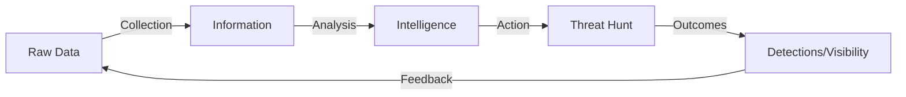
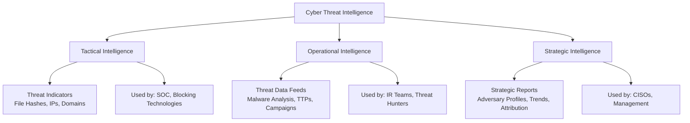
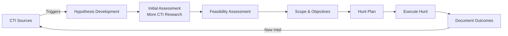
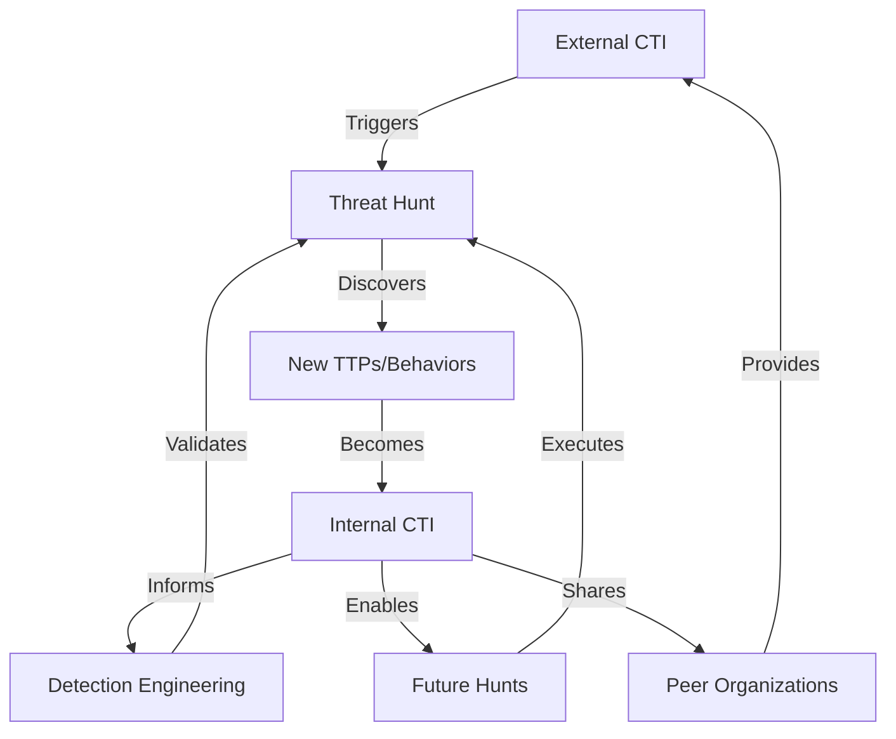

# Cyber Threat Intelligence: A Practical Guide for Threat Hunters

## Table of Contents
- [Introduction](#introduction)
- [What is Cyber Threat Intelligence](#what-is-cyber-threat-intelligence)
- [Good vs Bad Threat Intelligence](#good-vs-bad-threat-intelligence)
- [CTI's Critical Role in Threat Hunting](#ctis-critical-role-in-threat-hunting)
- [Building Value Through CTI](#building-value-through-cti)
- [References](#references)

---

## Introduction

As threat hunters, we operate under the assumption of breach. We proactively search for threats that have bypassed security controls, seeking to identify the unknown before it causes damage. But how do we know what to hunt for? How do we generate meaningful hypotheses that lead to actionable outcomes rather than endless rabbit holes?

The answer lies in effective Cyber Threat Intelligence (CTI).

CTI serves as the foundation for the [Unified Threat Hunting Process](https://github.com/sims718718/UnifiedThreatHunting), providing the critical triggering events and contextual knowledge that drive hypothesis development and hunt execution. Without quality intelligence, threat hunting becomes a shot in the dark. With it, hunters can focus their efforts on real adversary behaviors, tactics, and techniques that pose genuine risk to their organizations.

This guide provides a practical understanding of CTI, how to distinguish quality intelligence from noise, and most importantly, how to leverage CTI to mature your threat hunting program and deliver measurable value to your organization.

---

## What is Cyber Threat Intelligence

### Defining CTI

Cyber Threat Intelligence is **knowledge about adversaries and their motivations, intentions, and methods that is collected, analyzed, and disseminated in ways that help security and business staff at all levels protect the critical assets of the enterprise.**

CTI is not simply data or information. It is analyzed, validated, and contextualized knowledge that enables informed decision-making. Understanding this distinction is fundamental to building an effective threat hunting program.



### Key Characteristics of Quality CTI

**1. Adversary-Based**

Quality CTI focuses on specific threat actors, not generic threats. Just as military intelligence targets specific enemy forces, cyber threat intelligence profiles cybercriminals, cyber espionage agents, hacktivists, and other adversaries relevant to your organization.

Understanding your adversaries enables you to:
- Optimize defenses against likely attack vectors
- Anticipate attacker behaviors and methods
- Focus hunting efforts on realistic threat scenarios

**2. Risk-Focused**

Effective CTI is tailored to your organization's crown jewels. This includes:
- Customer data and personally identifiable information (PII)
- Intellectual property and trade secrets
- Confidential business information
- Critical operational systems and infrastructure
- Credentials and privileged access

Generic threat feeds that treat all organizations equally provide limited value. Quality intelligence considers your industry, geographic location, technology stack, and risk profile.

**3. Actionable and Timely**

Intelligence must support decision-making and action. Stale indicators from attacks six months ago provide limited value. CTI should enable you to:
- Block active threats at tactical levels
- Investigate and respond at operational levels
- Make strategic investments at leadership levels

### The Three Types of Threat Intelligence

CTI operates at three distinct levels, each serving different consumers and use cases:



| Intelligence Type | Content | Primary Consumers | Value to Threat Hunting |
|------------------|---------|-------------------|------------------------|
| **Tactical** | File hashes, IP addresses, domains, URLs, signatures | SOC analysts, network security teams | Provides atomic indicators for validation during hunts; minimal value alone |
| **Operational** | Malware analysis, attack breakdowns, TTPs, campaign details | IR teams, forensic analysts, threat hunters | **Critical** for hypothesis development and understanding adversary behaviors |
| **Strategic** | Adversary profiles, motivations, trends, threat landscape assessments | CISOs, security managers, executives | Drives hunt prioritization and program direction |

### Intelligence Consumers in Your Organization

Different stakeholders require different intelligence formats and levels of detail:

**Tactical Users (SOC Analysts, Network Operations)**
- Need: Validated indicators to improve blocking effectiveness
- Format: Machine-readable feeds, signatures, reputation scores
- Action: Real-time blocking and alert generation

**Operational Users (IR Teams, Threat Hunters, Forensic Analysts)**
- Need: Detailed context on attacks, adversaries, and TTPs
- Format: Technical reports, malware analysis, campaign breakdowns
- Action: Investigation expansion, threat hunting, attribution

**Strategic Users (CISOs, IT Managers, Executives)**
- Need: Trends, risk assessments, investment recommendations
- Format: Executive summaries, threat landscape reports
- Action: Budget allocation, process improvements, strategic planning

---

## Good vs Bad Threat Intelligence

Understanding the difference between quality intelligence and noise is critical for threat hunters. Bad intelligence wastes time, generates false positives, and erodes confidence in your hunting program. Good intelligence focuses your efforts and delivers measurable outcomes.

### The Intelligence vs Information Distinction

At collection time, most threat indicators are:
- **Unvalidated and not prioritized**
- **Isolated and without context**
- **Generic** (not tailored to your organization)

This creates serious operational problems:
- SOC analysts overwhelmed by false positive alerts (studies show only 19% of alerts are reliable, and only 4% can be meaningfully investigated)
- IR teams cannot relate individual alerts to specific campaigns without time-consuming research
- Threat hunters chase irrelevant indicators instead of focusing on real adversary behaviors

**Intelligence** is information that has been:
- **Validated and prioritized**
- **Connected to specific actors and attacks**
- **Customized for your enterprise**
- **Tailored for specific security consumers**

### Comparison: Good vs Bad Threat Intelligence

| Aspect | Bad Intelligence | Good Intelligence |
|--------|-----------------|-------------------|
| **Validation** | Unverified indicators from unknown sources | Validated through multiple sources, confirmed malicious activity |
| **Context** | Standalone indicators with no background | Tagged with adversary, campaign, TTP, and industry relevance |
| **Timeliness** | Stale data (months or years old) | Current and actionable (hours to days old) |
| **Relevance** | Generic feeds covering all threats | Prioritized for your industry, tech stack, and risk profile |
| **Specificity** | Atomic indicators only (IPs, hashes) | Behavioral patterns and TTPs alongside indicators |
| **Source Quality** | Unknown provenance, no confidence scoring | Reputable sources with confidence levels |
| **Actionability** | Cannot determine appropriate response | Clear actions and defensive recommendations |
| **False Positives** | High rate of benign matches | Minimized through validation and context |
| **Format** | Inconsistent, difficult to parse | Standardized (STIX, TAXII, OpenIOC) |
| **Analysis** | Raw data dump | Analyzed with assessments and recommendations |

### Characteristics of Bad Intelligence

**1. Unvalidated Indicators**

Indicators that haven't been verified generate noise and false positives. Common issues:
- Public feeds containing legitimate infrastructure (CDNs, cloud providers, popular domains)
- Outdated indicators from old campaigns where infrastructure has been repurposed
- Low-confidence indicators with no context about severity
- Duplicate or redundant indicators

**Impact on Threat Hunting:** Hunters waste time investigating benign activity, eroding confidence in the hunt program and CTI feeds.

**2. Lack of Context**

Indicators without context cannot answer critical questions:
- What adversary uses this?
- What is their objective?
- What stage of the attack chain is this?
- Is this relevant to my organization?
- What should I look for next?

**Impact on Threat Hunting:** Without context, hunters cannot develop meaningful hypotheses or expand investigations effectively.

**3. Generic and Irrelevant**

Intelligence that treats all organizations the same fails to account for:
- Industry-specific threats (financial vs healthcare vs manufacturing)
- Geographic targeting (threats focused on specific regions)
- Technology-specific exploits (attacks targeting systems you don't use)

**Impact on Threat Hunting:** Resources spent hunting threats that don't apply to your environment.

**4. Atomic Indicators Without Behavioral Context**

Focusing solely on atomic indicators (file hashes, IP addresses) is problematic because:
- Adversaries easily change these low-level indicators
- No understanding of adversary TTPs and behaviors
- Cannot anticipate variations or future attacks
- Limited ability to detect novel attacks

### Characteristics of Good Intelligence

**1. Validated and Prioritized**

Quality intelligence includes:
- Confirmation from multiple sources or analysis methods
- Risk scoring based on severity and relevance
- Confidence levels for each indicator
- Filtering of outdated or benign indicators

**Impact on Threat Hunting:** Hunters can focus on high-confidence, high-priority leads that warrant investigation.

**2. Rich Context and Attribution**

Quality intelligence connects indicators to:
- Specific adversary groups and campaigns
- TTPs (tactics, techniques, and procedures)
- Attack stages and objectives
- Related indicators (cluster of activity)
- Industry and geographic targeting

**Impact on Threat Hunting:** Enables hypothesis development, investigation expansion (pivoting), and understanding of adversary intent.

**3. Tailored to Your Environment**

Effective intelligence considers:
- Your industry vertical and threat landscape
- Your technology stack and critical assets
- Your geographic locations and subsidiaries
- Your regulatory environment and compliance requirements

**Impact on Threat Hunting:** Ensures hunting efforts focus on realistic threats to your organization.

**4. TTPs and Behavioral Indicators**

Moving up the "Pyramid of Pain," quality intelligence includes:
- **Atomic Indicators** (hashes, IPs): Easy for adversaries to change
- **Computed Indicators** (regex patterns, algorithms): Moderate difficulty to change
- **Behavioral Indicators** (TTPs, techniques): Difficult for adversaries to change without complete retooling

**Impact on Threat Hunting:** Focus on behaviors and TTPs enables detection of attacks even when atomic indicators change.

### Red Flags: Indicators of Poor CTI Quality

Watch for these warning signs in your threat intelligence sources:

- No validation process or quality assurance
- No attribution or adversary context
- No confidence scoring or prioritization
- Feeds containing obvious false positives (legitimate services)
- No documentation on collection methods or sources
- No industry or geographic filtering options
- Focus exclusively on atomic indicators
- Infrequent updates or stale data
- No integration with standard formats (STIX, TAXII, OpenIOC)
- Vendor lock-in with no API or export options

---

## CTI's Critical Role in Threat Hunting

Cyber Threat Intelligence is not just a nice-to-have for threat hunting – it is foundational to the entire process. CTI serves multiple critical functions throughout the [Unified Threat Hunting Process](https://github.com/sims718718/UnifiedThreatHunting).

### CTI as the Primary Hunt Trigger

In the Unified Threat Hunting Process, every hunt begins with a triggering event. CTI is the most common and valuable trigger source for proactive hunting.



**CTI Trigger Types:**

1. **New Adversary Campaign Reports**
   - Published reports on active threat groups
   - Industry-targeted campaigns
   - New malware families or tools

2. **TTP Intelligence**
   - Novel attack techniques
   - Updates to MITRE ATT&CK framework
   - Observed adversary behaviors

3. **Vulnerability Intelligence**
   - N-day exploits being actively used
   - Zero-day disclosures affecting your stack
   - Exploitation trends

4. **Strategic Intelligence**
   - Threat landscape shifts
   - Emerging adversary groups
   - Industry-specific threat briefings

### CTI Throughout the Hunt Lifecycle

Let's examine how CTI supports each phase of the Unified Threat Hunting Process:

#### Phase 1: Triggering Event

**CTI Role:** Initiates the hunt with actionable intelligence about adversaries, campaigns, or techniques.

**Examples:**
- Vendor blog post describes new ransomware group targeting your industry
- MITRE ATT&CK update highlights technique you haven't hunted for
- Threat intel feed indicates active exploitation of technology in your environment
- Industry ISAC reports emerging threat patterns

#### Phase 2: Hypothesis Development

**CTI Role:** Provides the knowledge foundation for building SMART hypotheses.

Without CTI, hypotheses are guesses. With CTI, they are informed predictions based on adversary behavior.

**CTI Inputs for Hypothesis Building:**
- Known adversary TTPs and attack chains
- Industry-specific targeting patterns
- Technology-specific exploitation methods
- Historical attack patterns in your environment
- Behavioral indicators from similar organizations

**Example Hypothesis with CTI:**

Poor hypothesis (no CTI):
> "I think there might be some bad stuff happening with PowerShell."

Strong hypothesis (CTI-informed):
> "Based on reports of APT29 targeting organizations in our industry vertical using PowerShell Empire for lateral movement (MITRE T1059.001), I hypothesize that encoded PowerShell commands executed by unusual parent processes (not explorer.exe, services.exe) on endpoints with access to sensitive data may indicate initial access or lateral movement attempts. I can validate this hypothesis using Sysmon Event ID 1 data with CommandLine parameters."

This hypothesis is:
- **Specific**: Encoded PowerShell with unusual parent processes
- **Measurable**: Sysmon Event ID 1 with specific conditions
- **Achievable**: Data sources exist
- **Relevant**: Tied to known adversary TTPs targeting your industry
- **Time-bound**: Current active threat

#### Phase 3: Initial Assessment

**CTI Role:** External research to support and refine the hypothesis.

**CTI Research Activities:**
- Reviewing vendor blogs and threat reports
- Consulting MITRE ATT&CK for technique details
- Checking ISACs and peer organization sharing
- Analyzing related campaigns and adversary profiles
- Validating assumptions against known TTPs

**Tools and Sources:**
- MITRE ATT&CK Navigator
- Vendor threat intelligence portals
- OSINT platforms (Twitter, security blogs)
- Threat intelligence platforms (TIPs)
- ISACs and sharing communities

#### Phase 4: Feasibility Assessment

**CTI Role:** Helps determine if you can actually hunt for the adversary behaviors.

**Key Questions Informed by CTI:**
- What telemetry is needed to hunt these TTPs?
- Do we have visibility into the attack stages?
- Can we distinguish adversary behavior from benign activity?
- What is the expected prevalence (needle vs haystack)?

**CTI Value:** Understanding the adversary's methods helps identify required data sources and assess hunt feasibility.

#### Phase 5-7: Scope, Plan, and Execute

**CTI Role:** Guides hunt execution with specific TTPs, indicators, and behavioral patterns.

**CTI Usage During Execution:**
- Reference TTPs to identify detection opportunities
- Use behavioral indicators to develop analytics
- Leverage known adversary patterns for baselining
- Validate findings against CTI to confirm true positives

#### Phase 8-9: Document and Iterate

**CTI Role:** Outcomes feed back into organizational intelligence.

**CTI Contributions:**
- New TTPs observed in your environment
- Local adversary behaviors and targeting
- Indicator enrichment for future hunts
- Validation or refutation of external intelligence
- Hunt findings shared with peer organizations

### Integration Points: CTI and Threat Hunting

| Hunt Phase | CTI Input | CTI Output |
|-----------|-----------|------------|
| Trigger | External intel reports, campaigns, TTPs | Hunt initiation |
| Hypothesis | Adversary behaviors, known techniques | Informed testable statements |
| Assessment | Research sources, TTP documentation | Validated hunt plan |
| Execution | Behavioral indicators, detection patterns | Discovered activity |
| Outcomes | Validation of intelligence | New organizational intelligence |

### The Continuous Feedback Loop

Effective threat hunting creates new CTI for your organization:



This feedback loop is critical for continuous improvement and organizational learning.

---

## Building Value Through CTI 

A mature CTI program doesn't just collect indicators – it systematically delivers value to threat hunting operations and the broader security organization. This section outlines how to build and mature a CTI capability that directly supports threat hunting objectives.

### Essential Components of a CTI Program

**1. Dedicated Resources**

According to SANS research, 64% of organizations with successful CTI programs have dedicated teams or personnel focused on threat intelligence. For threat hunting specifically, this means:

- Threat intelligence analysts who understand adversary TTPs
- Integration between CTI and threat hunting teams
- Regular intelligence briefings to inform hunt priorities
- Shared tools and platforms (TIPs, SIEM, hunting platforms)

**2. Structured Intelligence Requirements**

Define what intelligence your hunt team actually needs:

**Critical Requirements for Threat Hunters:**
- Industry-specific adversary profiles and TTPs
- Current active campaigns targeting similar organizations
- Behavioral indicators and detection patterns
- Infrastructure and tooling used by relevant adversaries
- Attack chain documentation (reconnaissance through exfiltration)
- Exploited vulnerabilities in your technology stack

**3. Multiple Intelligence Sources**

Don't rely on a single feed or vendor. Mature programs combine:

**External Sources:**
- Commercial threat intelligence vendors
- Open-source intelligence (OSINT)
- ISACs and information sharing communities
- Vendor security research blogs
- Government advisories (CISA, FBI, etc.)

**Internal Sources:**
- Historical incident data
- Previous hunt findings
- Detection and response outcomes
- Vulnerability assessments
- Red team exercises

### From CTI to Hunt Hypotheses: A Practical Framework

Quality CTI directly enables hypothesis generation through three key intelligence types:

#### 1. TTP Intelligence (Tactics, Techniques, and Procedures)

TTPs represent how adversaries accomplish their objectives. They are the most valuable intelligence for threat hunters because they are difficult for adversaries to change.

**TTP Structure (aligned with MITRE ATT&CK):**

```
Tactic: Initial Access
├── Technique: Phishing (T1566)
│   ├── Sub-technique: Spearphishing Attachment (T1566.001)
│   ├── Procedure: APT29 sends macro-enabled documents
│   └── Detection Opportunity: Office spawning unusual child processes
```

**Converting TTPs to Hunt Hypotheses:**

| TTP Component | Hunt Hypothesis Element |
|---------------|------------------------|
| **Tactic** | Attack stage to focus on (e.g., Lateral Movement) |
| **Technique** | Specific behavior to hunt (e.g., Remote Services) |
| **Procedure** | Adversary-specific implementation details |
| **Detection** | How to identify the behavior in your data |

**Example: TTP to Hypothesis Translation**

**CTI Input:** APT28 uses Mimikatz for credential dumping (MITRE T1003.001 - LSASS Memory)

**Hunt Hypothesis:**
> "Processes accessing LSASS.exe memory, particularly those not commonly associated with this activity (excluding legitimate security tools), may indicate credential theft attempts. I can detect this using Sysmon Event ID 10 (ProcessAccess) where TargetImage contains 'lsass.exe' and SourceImage is not a known benign process."

**Hunt Plan:**
1. Baseline normal LSASS access in environment
2. Identify anomalous processes accessing LSASS
3. Investigate process lineage and command-line parameters
4. Correlate with authentication anomalies
5. Document findings and create detection rule

#### 2. Behavioral Indicators

Behavioral indicators describe patterns of activity rather than atomic artifacts. They are more durable and effective for hunting than static indicators.

**Types of Behavioral Indicators:**

| Indicator Type | Example | Hunt Value |
|---------------|---------|------------|
| **Atomic** | File hash: `a3f8d...` | Low (easily changed) |
| **Computed** | Regex: `powershell.*-enc.*-nop` | Medium |
| **Behavioral** | Encoded PowerShell from Office applications | **High** (requires adversary retooling) |

**Behavioral Pattern Examples:**

**Pattern 1: Living Off the Land**
- Behavior: Adversaries use built-in Windows utilities
- Indicators: wmic, certutil, bitsadmin used for non-standard purposes
- Hunt Focus: Unusual command-line parameters, unexpected parent processes

**Pattern 2: Suspicious Scheduling**
- Behavior: Persistence via scheduled tasks
- Indicators: schtasks.exe creating tasks with unusual characteristics
- Hunt Focus: Tasks running at odd hours, tasks with network callbacks

**Pattern 3: Lateral Movement**
- Behavior: Remote execution using legitimate Windows services
- Indicators: Unusual service creation on multiple hosts, psexec-like activity
- Hunt Focus: Service creation events, network logons, process execution

**Building Behavioral Hypotheses:**

Quality behavioral intelligence enables hypotheses that survive indicator changes:

**Weak Hypothesis (Atomic):**
> "Search for file hash X on all endpoints"

**Strong Hypothesis (Behavioral):**
> "Adversaries establishing persistence often create scheduled tasks that execute from user writeable directories. Hunt for schtasks.exe creating tasks where the action path is not in System32 or Program Files, particularly when created by users without administrative job functions."

#### 3. Atomic Indicators (Used Judiciously)

While less valuable for proactive hunting, atomic indicators have specific uses:

**Appropriate Uses of Atomic Indicators in Hunting:**

1. **Validation**: Confirming suspected activity
   - Found suspicious PowerShell? Check if command-line matches known adversary patterns
   - Identified unusual network connection? Validate destination IP against CTI

2. **Pivot Points**: Expanding investigations
   - Confirmed malicious file hash? Search for related hashes from same campaign
   - Known C2 infrastructure? Identify other communications to that infrastructure

3. **Historical Analysis**: Hunting backwards
   - New intelligence released? Search historical data for indicators
   - Adversary infrastructure identified? Check if your organization was targeted

**Critical Note on Atomic Indicators:**

Never build entire hunts around atomic indicators alone. They should support behavioral and TTP-based hunting, not replace it. If your hunt hypothesis is "search for these 50 file hashes," you're not truly threat hunting – you're validating indicators.

### CTI Program Maturity Model for Threat Hunting

Mature your CTI program through progressive capability development:

**Level 1: Ad Hoc**
- No formal CTI program
- Hunters rely on public blogs and OSINT
- Limited intelligence sharing
- Reactive to published threats

**Level 2: Defined Process**
- Documented intelligence requirements
- Subscription to commercial feeds
- Basic threat intelligence platform (TIP)
- Regular threat briefings

**Level 3: Integrated**
- Dedicated CTI analyst(s)
- Integration between CTI and hunt teams
- Automated indicator enrichment
- Participation in sharing communities
- Hunt triggers driven by intelligence

**Level 4: Optimized**
- Proactive intelligence collection
- Custom adversary tracking
- Intelligence-driven hunt calendar
- Continuous feedback loop
- Contributing intelligence to community
- Predictive threat modeling

### Measuring CTI Value in Threat Hunting

Quantify the impact of CTI on your hunting program:

**Key Metrics:**

| Metric | What It Measures | Target |
|--------|-----------------|--------|
| **Hunt Success Rate** | % hunts resulting in findings | 15-25% (improves with quality CTI) |
| **Time to Hypothesis** | Speed of developing hunt hypotheses | Decreases with better CTI |
| **Detection Creation** | Analytics generated from hunts | Should increase with TTP intel |
| **False Positive Rate** | Invalid findings per hunt | Should decrease with quality CTI |
| **CTI-Triggered Hunts** | % hunts initiated by intelligence | Should be 60%+ |
| **TTP Coverage** | MITRE ATT&CK techniques hunted | Expand coverage with CTI |

**Value Outcomes:**

1. **Reduced Dwell Time**: Earlier detection through proactive hunting
2. **Better Prioritization**: Focus on real threats, not theoretical ones
3. **Detection Coverage**: Fill gaps identified by CTI
4. **Incident Prevention**: Stop attacks before damage occurs
5. **Intelligence Sharing**: Contribute findings back to community

### Practical Implementation: Starting Your CTI-Driven Hunt Program

**Week 1-2: Foundation**
- Identify your critical assets and crown jewels
- Determine relevant adversaries (industry, geography, threat model)
- Subscribe to basic intelligence sources (OSINT + 1-2 commercial feeds)
- Set up threat intelligence platform or SIEM integration

**Week 3-4: Process Definition**
- Define intelligence requirements for hunting
- Establish hunt trigger criteria
- Create templates for hypothesis development
- Set up regular intelligence review cadence

**Month 2: First CTI-Driven Hunts**
- Select 2-3 high-priority TTPs from threat intelligence
- Develop hypotheses using the framework in this guide
- Execute hunts following the Unified Threat Hunting Process
- Document outcomes and lessons learned

**Month 3+: Maturity and Optimization**
- Implement continuous feedback loop
- Automate indicator enrichment
- Establish hunt calendar driven by intelligence
- Join information sharing communities
- Contribute findings back to CTI feeds

### Common Pitfalls and How to Avoid Them

**Pitfall 1: Information Overload**
- **Problem**: Too many feeds, unable to process all intelligence
- **Solution**: Focus on quality over quantity; prioritize operational intelligence

**Pitfall 2: Intelligence-Action Gap**
- **Problem**: Consuming intelligence but not translating to hunts
- **Solution**: Establish clear trigger criteria and regular hunt planning sessions

**Pitfall 3: Atomic Indicator Obsession**
- **Problem**: Hunting only for hashes and IPs from threat feeds
- **Solution**: Shift focus to TTPs and behavioral patterns

**Pitfall 4: No Feedback Loop**
- **Problem**: Hunt findings don't inform future intelligence requirements
- **Solution**: Document outcomes and share findings with CTI team and community

**Pitfall 5: Generic Intelligence**
- **Problem**: Hunting threats that don't apply to your environment
- **Solution**: Customize intelligence requirements to your threat model

---

## Conclusion

Cyber Threat Intelligence and threat hunting are inseparable disciplines. Quality CTI transforms hunting from random exploration into focused, hypothesis-driven investigation. It provides the critical knowledge needed to develop meaningful hypotheses, prioritize efforts, and deliver measurable value to your organization.

**Key Takeaways:**

1. **CTI is Knowledge, Not Just Data**: Intelligence is analyzed, validated, and contextualized information that enables action.

2. **Focus on TTPs, Not Just Indicators**: Behavioral intelligence is more valuable than atomic indicators for proactive hunting.

3. **CTI Drives the Hunt Trigger**: The majority of effective hunts should originate from threat intelligence.

4. **Quality Over Quantity**: Better to have a few high-quality intelligence sources than dozens of noisy feeds.

5. **Create a Feedback Loop**: Hunt outcomes should inform future intelligence requirements and be shared with the community.

6. **Mature Progressively**: Build CTI capabilities incrementally, focusing on integration with hunting operations.

As you implement CTI in your threat hunting program, remember that the goal is not perfection but continuous improvement. Start with basic intelligence sources, develop clear requirements, and progressively mature your capabilities. Most importantly, ensure that your intelligence program directly supports and enables your hunters to identify threats that matter to your organization.

The most sophisticated adversaries won't wait for you to detect them. Proactive threat hunting, powered by quality cyber threat intelligence, is your best defense against advanced persistent threats and unknown compromises. Make CTI the foundation of your hunting program, and watch your detection capabilities transform from reactive to proactive, from generic to targeted, and from tactical to strategic.

Happy hunting.

---

## References

1. **Definitive Guide to Cyber Threat Intelligence** - Comprehensive framework for CTI programs and practices

2. **Who's Using Cyberthreat Intelligence and How?** - SANS Institute - Research on CTI adoption and effectiveness

3. **The Threat Hunter's Handbook** - ChaosSearch - Methodology for hypothesis-driven threat hunting

4. **MITRE ATT&CK Framework** - https://attack.mitre.org/ - Comprehensive knowledge base of adversary TTPs

5. **Unified Threat Hunting Process** - https://github.com/sims718718/UnifiedThreatHunting - Structured methodology for threat hunting operations

6. **Cyber Kill Chain** - Lockheed Martin - Framework for understanding attack progression

7. **Pyramid of Pain** - David Bianco - Model for understanding indicator value and adversary difficulty

---

*This guide is designed to be a living document. As threat landscapes evolve and new intelligence sources emerge, update your processes and practices accordingly. Share your learnings with the community and contribute to the collective defense.*
